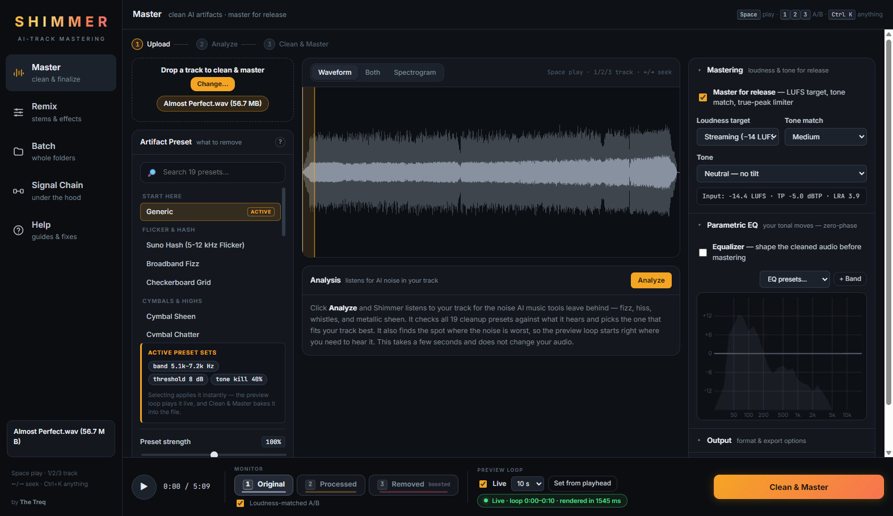

<div align="center">

# Shimmer

### by [The Treq](https://treqmusic.com/)

**Clean up AI music artifacts. Then master for release.**

*A free, offline mastering suite built for tracks made with Suno, Udio, and other AI music tools.*

[](https://github.com/henricksmedia/shimmer/actions/workflows/ci.yml)
[](LICENSE)
[](https://www.python.org/)
[](#your-music-stays-on-your-computer)

</div>

---

## The problem

You generate a track and it sounds great — until you really listen.

There's a thin, fizzy sizzle riding on top of the cymbals. The vocals have a
glassy, plastic sheen. The high end sounds *busy* in a way that real
recordings don't. Turn it up on good speakers and it gets worse.

That noise is a **generation artifact**. AI music models build audio in ways
that leave behind hiss, flicker, and metallic ringing in the high
frequencies — usually between 5 kHz and 12 kHz. It is not in your melody,
your mix, or your performance. It was added by the model.

Normal mastering tools can't fix it. They treat that noise as part of your
music, so they compress it, brighten it, and make it **louder**.

## What Shimmer does

Shimmer does two jobs, in the right order:

1. **Finds and removes the artifacts** — it listens to your track, works out
   which kind of AI noise you have, and strips it out while leaving the music
   alone.
2. **Masters the cleaned track** — loudness targeting, tone shaping, and
   true-peak limiting, so your song is ready to upload.

That order matters. Clean first, master second. If you master first, you
just make the fizz louder.

<div align="center">
  
  <br>
  <sub>The Master screen — pick what to remove, hear it instantly, then master and export.</sub>
</div>

---

## Hear exactly what you're removing

This is the part most cleanup tools don't give you.

Shimmer lets you listen to **three versions of your track**, and switch
between them instantly with the `1` `2` `3` keys while the song plays:

| Key | Track | What you hear |
|:---:|-------|---------------|
| `1` | **Original** | Your untouched upload |
| `2` | **Processed** | Cleaned and mastered |
| `3` | **Removed** | *Only what Shimmer took out* — turned up so you can hear it clearly |

That third one is your safety check. The **Removed** track should sound like
hiss, fizz, and sizzle — nothing else. If you hear vocals, snare hits, or
melody in there, you're cutting too hard. Back the strength off.

Because volume fools your ears, **Loudness-matched A/B** is on by default. It
evens out the levels between versions, so you judge the *sound* instead of
just picking whichever is louder.

---

## Quick start

### Windows

1. **[Download the latest release](https://github.com/henricksmedia/shimmer/releases/latest)**
   → grab `Source code (zip)`, then unzip it somewhere permanent (not your
   Downloads folder).
2. **Double-click `start.bat`.**
3. **Wait.** Your browser opens on its own when Shimmer is ready. Drop a
   track in and go.

**What happens on that first launch:** Shimmer needs a free helper called
[uv](https://docs.astral.sh/uv/) to install itself. If you don't have it,
`start.bat` offers to install it for you — just press Enter. It then builds
its own private Python environment and downloads the audio libraries
(about 200 MB).

Budget **5–10 minutes for the first run**. After that, Shimmer starts in a
few seconds. Nothing is installed system-wide — it all lives in a `.venv`
folder next to the app, and deleting the folder removes everything.

> Windows may warn you about running a downloaded file. Click **More info →
> Run anyway**. You can read every line of `start.bat` in a text editor
> first — it's short and plain.

### macOS / Linux

```bash
git clone https://github.com/henricksmedia/shimmer.git
cd shimmer
./start.sh
```

(Or download the [latest release](https://github.com/henricksmedia/shimmer/releases/latest),
unzip, and run `./start.sh` from that folder.)

That's it. `start.sh` does the same thing as the Windows launcher: it sets up
[uv](https://docs.astral.sh/uv/) if you don't have it (asking first), builds a
private environment, installs the audio libraries, then opens your browser
once the server is actually ready.

Same expectation as Windows — **5–10 minutes the first time**, seconds after
that. Everything lives in a `.venv` folder next to the app; delete the folder
to uninstall.

<details>
<summary>Prefer to do it by hand?</summary>

```bash
python3 -m venv .venv
source .venv/bin/activate
pip install -r requirements.txt
python -m uvicorn shimmer.server:app --port 7860
```

Then open <http://localhost:7860>.
</details>

Everything works the same as on Windows, with two differences worth knowing:

- **Stem separation runs on the CPU.** GPU acceleration currently looks for
  an NVIDIA card, so on Apple Silicon the Remix tab still works — it's just
  slower. Results are cached per track, so you only wait once.
- **The Batch tab's "Browse…" buttons need Tk.** Most Python installs include
  it. If the picker doesn't open, type or paste the folder path into the box
  instead — that works everywhere. (Homebrew users: `brew install python-tk`.)

Windows is the most-tested platform simply because that's what it was built
on. If you hit a macOS or Linux issue,
[please open an issue](https://github.com/henricksmedia/shimmer/issues) — bug
reports from other platforms are genuinely useful.

### One optional extra

WAV, FLAC, and OGG work right away. MP3 and M4A also need
[ffmpeg](https://ffmpeg.org/):

| | |
|---|---|
| Windows | `winget install ffmpeg` |
| macOS | `brew install ffmpeg` |
| Linux | `apt install ffmpeg` |

### If something goes wrong

- **"uv was not found"** → say yes to the install prompt, or install it
  yourself (`winget install --id=astral-sh.uv -e` on Windows,
  `brew install uv` on macOS), then launch again.
- **The window closes instantly** → open a terminal in the Shimmer folder and
  run the launcher from there so you can read the error.
- **macOS: "permission denied"** → run `chmod +x start.sh`, then `./start.sh`
  again. Or just run `bash start.sh`.
- **Browser opens but the page won't load** → give it another few seconds and
  refresh. The first start is the slow one.
- **Still stuck?** [Open an issue](https://github.com/henricksmedia/shimmer/issues)
  and paste what the black window says.

---

## Your first clean master, in 3 steps

**1. Drop your track in.** WAV, MP3, FLAC, OGG, or M4A.

**2. Click Analyze.** Shimmer listens to your song and checks it against all
19 cleanup presets. It picks the one that fits best and tells you *why* — for
example, *"Metallic cymbal-like wash in 4–10 kHz."* It also finds the spot
where the noise is worst and starts the preview loop right there.

**3. Click Clean & Master.** You get a finished file, plus the numbers behind
it: loudness before and after, true peak, and how hard the limiter worked.

While you work, a short section of your song loops in the background. Pick a
different preset and you hear the change in about a second. No waiting for
full renders to compare options.

---

## What's inside

### 19 artifact presets, grouped by what you hear

You don't need to know the science. Pick the group that matches your
complaint, or just hit **Analyze** and let Shimmer choose.

| If your track sounds like this | Try these |
|---|---|
| Fizzy, sparkly hash across the top end | **Suno Hash**, **Broadband Fizz**, **Checkerboard Grid** |
| Glassy or stuttering cymbals | **Cymbal Sheen**, **Cymbal Chatter**, **Phantom Cymbal**, **Brittle Air** |
| Steady whistles or ringing tones | **Laser Whistle**, **Echo Sheen**, **Reverb Flutter** |
| Plastic vocals or rattly "S" sounds | **Vocal Glaze**, **Vocal Glaze + Top End**, **Sibilance Rattle**, **Presence Haze** |
| Harsh and fatiguing all over | **Harsh Veil**, **Deep Scrub** |
| Muddy, boxy, or just dull | **Muddy / Boxy**, **Dark Mix Rescue** |

Every preset has a **strength** control from 0% to 200%. Start at 100%. If a
little sizzle survives, push it up. If your cymbals lose their sparkle, pull
it down.

### Mastering that respects your dynamics

- **Loudness targets** — Streaming (−14 LUFS), Loud (−11), or CD/Club (−9).
  LUFS is how streaming platforms measure loudness. Spotify and Apple Music
  turn everything toward −14, so mastering louder than that just gets turned
  back down.
- **Tone match** — gently pulls your track toward a balanced reference curve.
  Choose how strongly: Low, Medium, or High.
- **Tone tilt** — warmer or brighter, your call. Boosts are capped at +2 dB,
  and the harsh 5–12 kHz band stays limited, so the fizz can't sneak back in.
- **True-peak limiter** — 4× oversampled, so your track won't clip or
  distort after it's converted to MP3 or AAC. Lossless files get −1.0 dBTP of
  headroom; lossy formats get −1.5 dBTP.

Loudness is set with **one steady gain move**, not multiband compression. The
dynamics you generated are the dynamics you keep.

### A real EQ, when you want one

A 12-band parametric EQ with a curve you can drag. Bells, shelves,
high-pass, low-pass, and notch filters. Drag a point to move it, scroll on it
to change the Q (how wide or narrow the move is), double-click to add or
delete.

It runs **zero-phase**, which means it shapes tone without smearing your
transients. Seven starting points are built in — Air Lift, De-Mud, Warmth,
Presence, Vocal Clarity, Rumble Cut, and Lo-Fi Telephone.

### Remix: split the song into stems

Break a finished track into **vocals, drums, bass, and other**, then treat
each part on its own:

- **Formant** — shift vocal character without changing the pitch
- **Saturation** — warmth and drive
- **Doubler** — thickens a part like double-tracking it
- **Reverb** — room and depth
- Plus mute, solo, and a fader for each stem

Mix it, loop it, then render. Stems are cached per track, so you only wait
for the split once. Your mix saves itself automatically.

Separation uses your GPU when you have one. The first run downloads the
separation engine, which is a large one-time install.

### Batch: a whole folder at once

Point Shimmer at a folder and let it work. Use one preset for everything, or
let it auto-detect the right preset for each track. Results stream in file by
file as it goes.

### Signal Chain: see what's actually happening

A map of every stage your audio passes through, in order, in plain language.
Click any stage to read what it does and jump to its controls. No black box.

---

## How it works

Shimmer treats artifact removal as a **surgical** job, not a broad filter.

**Your low end is never touched.** A linear-phase crossover splits the track
at 4.5 kHz. Kick, bass, and the body of your vocals bypass the cleaning
engine completely and rejoin untouched at the end.

**The center of your mix is protected.** Above the crossover, the audio is
split into mid (center) and side (stereo width). Vocals and snare mostly live
in the center, so that channel is cleaned gently — about 20% strength. Most
AI shimmer lives in the sides, so the sides get the full treatment.

**Nine detectors run on the high band**, each hunting a different artifact
shape: a noise-floor cleaner, a resonance notcher, the core shimmer
suppressor, a harshness tamer, a flicker compressor, a grid-pattern remover,
a whistle killer, and more. Two safety gates ride along with them — one backs
off on noisy or percussive moments, and another protects your transients for
70 ms so drums keep their snap.

**Then it masters:** high-pass, loudness gain, soft clip, and the true-peak
limiter.

No machine learning anywhere in the cleanup path. It's classic DSP, so the
same settings always give you the same result — every single time.

---

## Your music stays on your computer

Shimmer runs entirely on your machine. Your tracks are never uploaded, never
sent to a server, and never used to train anything. There are no accounts, no
subscriptions, and no internet connection required after setup.

---

## FAQ

**Will this make my track sound dull?**
It can if you push it too far. That's what the **Removed** track is for —
listen to it. If you hear real music in there, lower the strength or raise
the threshold. Start at 100% and adjust by ear.

**Do I need to know what LUFS or true peak means?**
No. Pick "Streaming" and Shimmer handles it. The numbers are shown for people
who want them.

**Which preset should I use?**
Click **Analyze** and use what it picks. If you'd rather choose yourself,
open **Help → Pick a preset** and answer a couple of questions about what you
hear.

**Can I use this on regular (non-AI) recordings?**
Yes, though it's tuned for AI artifacts. The mastering chain, EQ, and stem
remixing work on any audio.

**Is it really free?**
Yes. Free to download, free to use, and free to use on music you sell. The
licence only has something to say if you want to *redistribute Shimmer itself*
or run it as a paid service — see [License](#license--credits) below.

**Can I use it on tracks I'm selling?**
Absolutely. The licence covers the software, not your music. Anything you
make with Shimmer is yours, with no strings and no royalties.

---

## For developers

Command line, for scripting and batch jobs:

```bash
python -m shimmer input.wav output.wav
python -m shimmer input.wav output.wav --preset cymbal_chatter
python -m shimmer --list-presets
```

Run the test suite:

```bash
python -m pytest tests/
```

Full technical reference, including every DSP parameter and the HTTP API:
**[docs/FEATURES.md](docs/FEATURES.md)**. Version history is in
**[CHANGELOG.md](CHANGELOG.md)**.

Architecture in brief: FastAPI backend, vanilla JavaScript frontend (no build
step), NumPy/SciPy for the DSP. Entry points are `server.py` for the web app
and `shimmer.py` for the CLI.

---

## Contributing

Fixes, new artifact presets, and platform improvements are all welcome —
especially macOS and Linux bug reports, since Shimmer was built on Windows.
Open an [issue](https://github.com/henricksmedia/shimmer/issues) or a pull
request.

By submitting a contribution you agree that it is licensed under AGPL-3.0,
and that Henricks Media may also include it in a commercially licensed
version of Shimmer. This keeps dual licensing possible without chasing
signatures later.

## License & credits

Shimmer is released under the
[GNU Affero General Public License v3](LICENSE).

**In plain language:**

- ✅ Use it free, forever, for anything — including **music you sell**. The
  licence governs the software, not what you create with it.
- ✅ Read it, modify it, learn from it, share it.
- ⚠️ If you distribute a modified version, or run Shimmer as a hosted
  service, you must publish your source under the same licence.
- ❌ You can't take this code closed-source and sell it as your own product.

**Building something commercial?** A separate commercial licence is available
if AGPL doesn't fit your case — contact
[Henricks Media](https://henricksmedia.com/).

The **Shimmer** and **The Treq** names and logos are not covered by the
licence. Forks are welcome; please give them your own name.

Copyright, trademark, and third-party component licences are listed in
[NOTICE](NOTICE).

Built on excellent open-source work: [NumPy](https://numpy.org/) and
[SciPy](https://scipy.org/) for the DSP math,
[FastAPI](https://fastapi.tiangolo.com/) for the server,
[pyloudnorm](https://github.com/csteinmetz1/pyloudnorm) for loudness
measurement, [soundfile](https://github.com/bastibe/python-soundfile) for
audio I/O, and [Demucs](https://github.com/facebookresearch/demucs) for stem
separation. Each keeps its own license.

---

<div align="center">

### Built by an AI music creator, for AI music creators

I'm not a trained musician — I make music with these same AI tools. Shimmer
exists because I got tired of hearing that fizz on my own tracks, and you
shouldn't need an audio engineering background to fix it.

**[🎵 Hear my music — The Treq](https://treqmusic.com/)**

<sub>© 2026 Jeremy Henricks · [Henricks Media](https://henricksmedia.com/) · Released under AGPL-3.0</sub>

</div>
