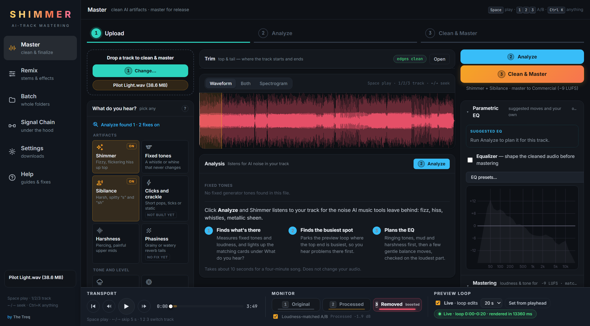

<div align="center">

# Shimmer

### by [The Treq](https://treqmusic.com/)

**Clean up AI music artifacts. Then master for release.**

*A free, offline mastering suite built for tracks made with Suno, Udio, and other AI music tools.*

[](https://github.com/henricksmedia/shimmer/actions/workflows/ci.yml)
[](LICENSE)
[](https://www.python.org/)
[](#your-music-stays-on-your-computer)

<br><br>



</div>

---

## The problem

You generate a track and it sounds great — until you really listen.

There's a thin, fizzy sizzle riding on top of the cymbals. The vocals have a
glassy, plastic sheen. The high end sounds *busy* in a way that real
recordings don't. Turn it up on good speakers and it gets worse.

That noise is a **generation artifact**. AI music models build audio in ways
that leave behind hiss, flicker, and metallic ringing in the high
frequencies — usually between 5 kHz and 12 kHz. It is not in your melody,
your mix, or your performance. It was added by the model.

Normal mastering tools can't fix it. They treat that noise as part of your
music, so they compress it, brighten it, and make it **louder**.

## What Shimmer does

Shimmer does two jobs, in the right order:

1. **Fixes what you hear.** You pick what bothers you from a set of cards
   under **What do you hear?** Each card turns on one tool made for that
   problem: a notch filter for a steady whistle, a de-esser for harsh "s"
   sounds, and so on. You set how hard each one works.
2. **Masters the result.** A loudness target, tone shaping, and true-peak
   limiting, so your song is ready to upload.

That order matters. Fix first, master second. If you master first, you
just make the fizz louder.

## New in 2.0

Shimmer 2.0.0 is a rebuild of 1.1.1. The screens look much the same. The
engine behind them is new.

- **Cards instead of presets.** The 19 presets and the nine-stage cleaner
  are gone. You pick what you hear, and each card turns on one tool that
  was tested on its own.
- **One sound path.** The preview, the export, Batch, album mode, the Remix
  export, and the command line all use the same function, `render()`. What
  you hear in the preview is what the file will be.
- **Louder by default.** The default loudness target is now Commercial
  (−9 LUFS). In 1.1.1 it was Streaming (−14 LUFS), so masters came out
  quiet next to released songs.
- **A tighter limiter.** It finds peaks at 8× oversampling (1.1.1 used 4×)
  and aims just under the ceiling, so peaks no longer slip past it.
- **Safer MP3, OGG and M4A files.** 1.1.1 used −1.5 dBTP for every lossy
  format, and a decoded M4A could reach +1.24 dBTP. Now lossy formats get
  −2.0 dBTP, and every lossy file is decoded and checked after encoding.
- **Filters land on their setting.** In 1.1.1, preset shelves and bells
  landed at twice their setting: −3 dB became −6 dB.
- **OGG export works.** In 1.1.1 every OGG export failed.
- **Your old settings carry over.** A saved 1.x preset turns on the card it
  became.

Every change that alters the sound, with its numbers, is in
[docs/SOUND-CHANGES.md](docs/SOUND-CHANGES.md). What 2.0 does not do yet is
listed under [Known limits](#known-limits).

---

## Hear exactly what you're removing

This is the part most cleanup tools don't give you.

Shimmer lets you listen to **three versions of your track**, and switch
between them instantly with the `1` `2` `3` keys while the song plays:

| Key | Track | What you hear |
|:---:|-------|---------------|
| `1` | **Original** | Your untouched upload |
| `2` | **Processed** | Fixed and mastered |
| `3` | **Removed** | *Only what the fixes took out* — turned up so you can hear it clearly |

That third one is your safety check. The **Removed** track should sound like
the problem you picked: hiss, fizz, a whistle, harsh "s" sounds. If you hear
vocals, snare hits, or melody in there, a fix is working too hard. Turn its
**Amount** down.

Because volume fools your ears, **Loudness-matched A/B** is on by default. It
evens out the levels between versions, so you judge the *sound* instead of
just picking whichever is louder. The bar tells you what it is doing, for
example "Processed −2.2 dB". That is a monitoring level only. Your export is
never touched.

The transport at the bottom has back-to-start, skip 5 seconds either way,
play/pause, and a scrubber you can click or drag. The amber band on the
scrubber is the Live loop window.

---

## Quick start

New to Shimmer, or to mastering? Follow the step-by-step [Getting started guide](docs/GETTING-STARTED.md).

### Windows

1. **[Download the latest release](https://github.com/henricksmedia/shimmer/releases/latest)**
   → grab `Source code (zip)`, then unzip it somewhere permanent (not your
   Downloads folder).
2. **Double-click `start.bat`.**
3. **Wait.** Your browser opens on its own when Shimmer is ready. Drop a
   track in and go.

**What happens on that first launch:** Shimmer needs a free helper called
[uv](https://docs.astral.sh/uv/) to install itself. If you don't have it,
`start.bat` offers to install it for you — just press Enter. It then builds
its own private Python environment and downloads the audio libraries
(up to 200 MB). After an update, it installs again if the list of
libraries changed.

Budget **5–10 minutes for the first run**. After that, Shimmer starts in a
few seconds. Nothing is installed system-wide. The app's libraries go in a
`.venv` folder next to the app, and deleting the Shimmer folder removes
them. Your saved settings are kept in their own small folder
(`%APPDATA%\Shimmer` on Windows).

> Windows may warn you about running a downloaded file. Click **More info →
> Run anyway**. You can read every line of `start.bat` in a text editor
> first — it's plain text with a comment on each step.

### macOS / Linux

```bash
git clone https://github.com/henricksmedia/shimmer.git
cd shimmer
./start.sh
```

(Or download the [latest release](https://github.com/henricksmedia/shimmer/releases/latest),
unzip, and run `./start.sh` from that folder.)

That's it. `start.sh` does the same thing as the Windows launcher: it sets up
[uv](https://docs.astral.sh/uv/) if you don't have it (asking first), builds a
private environment, installs the audio libraries, then opens your browser
once the server is actually ready.

Same expectation as Windows — **5–10 minutes the first time**, seconds after
that. The libraries go in a `.venv` folder next to the app; delete the
Shimmer folder to uninstall. Saved settings are in `~/.config/shimmer`.

<details>
<summary>Prefer to do it by hand?</summary>

```bash
python3 -m venv .venv
source .venv/bin/activate
pip install -r requirements.txt
python -m uvicorn shimmer.server:app --port 7860
```

Then open <http://localhost:7860>.
</details>

Everything works the same as on Windows, with two differences worth knowing:

- **Stem separation runs on the CPU.** GPU acceleration currently looks for
  an NVIDIA card, so on Apple Silicon the Remix tab still works — it's just
  slower. Results are cached per track, so you only wait once.
- **The Batch tab's "Browse…" buttons need Tk.** Most Python installs include
  it. If the picker doesn't open, type or paste the folder path into the box
  instead — that works everywhere. (Homebrew users: `brew install python-tk`.)

Windows is the most-tested platform simply because that's what it was built
on. If you hit a macOS or Linux issue,
[please open an issue](https://github.com/henricksmedia/shimmer/issues) — bug
reports from other platforms are genuinely useful.

### Updating from 1.1.1

Get 2.1.4 the same way you got 1.1.1 (a new release zip, or `git pull` in
your clone), then launch it as before.

- **A git clone keeps itself up to date.** From now on, `start.bat` and
  `start.sh` check GitHub each time they start, and move a clone on the
  `main` branch forward to the newest release. They leave a clone alone when
  it has unsaved changes or no network, and a zip download is never
  touched. To try a branch without that, use `start-test.bat` (or
  `start-test.sh`): it runs that copy as it is, on port 7870, with its own
  settings.

- **The libraries update themselves.** `start.bat` (Windows) and `start.sh`
  (macOS and Linux) see that the library list changed and install what 2.0
  needs before they start.

- **Your saved settings carry over.** A 1.x preset turns on the card it
  became. For example, Suno Hash turns on **Shimmer**, and Muddy / Boxy
  turns on **Low-mid build-up**. `python -m shimmer --list` prints the whole
  table.
- **Stems you already split are kept**, as long as they are in the same
  Shimmer folder. A song's fingerprint did not change, so the stem cache and
  saved Remix projects still match.

### One optional extra

WAV, FLAC, and OGG work right away. MP3 and M4A also need
[ffmpeg](https://ffmpeg.org/):

| | |
|---|---|
| Windows | `winget install ffmpeg` |
| macOS | `brew install ffmpeg` |
| Linux | `apt install ffmpeg` |

### If something goes wrong

- **"uv was not found"** → say yes to the install prompt, or install it
  yourself (`winget install --id=astral-sh.uv -e` on Windows,
  `brew install uv` on macOS), then launch again.
- **The window closes instantly** → open a terminal in the Shimmer folder and
  run the launcher from there so you can read the error.
- **macOS: "permission denied"** → run `chmod +x start.sh`, then `./start.sh`
  again. Or just run `bash start.sh`.
- **Browser opens but the page won't load** → give it another few seconds and
  refresh. The first start is the slow one.
- **Still stuck?** [Open an issue](https://github.com/henricksmedia/shimmer/issues)
  and paste what the black window says.

---

## Your first master, in 3 steps

**1. Drop your track in.** WAV, MP3, FLAC, OGG, or M4A.

**2. Click Analyze, then pick what you hear.** Analyze measures your song.
It looks for fixed tones and turns on the **Fixed tones** card if it finds
any. It tells you how far the song is under your loudness target. It moves
the Live loop to where the top end is busiest, and it plans a short
**Suggested EQ**. It takes about 10 seconds for a four-minute song, and it
never changes your audio.

Analyze only reports what it can measure well today. For the other cards,
your ears decide. Listen, then turn on the cards that match what you hear.
Each card you turn on gets an **Amount** slider. Start where it starts,
check the **Removed** track, and adjust.

**3. Click Clean & Master.** A progress window lights up each stage as it
runs, then closes when your finished file is ready — along with a **What
changed** chart (the spectrum before and after, and what was removed) and
the numbers behind it: loudness before and after, true peak,
peak-to-loudness ratio, stereo correlation, and how hard the limiter worked.
A **Release check** card gives one verdict on the file, "Ready to upload" or
what to look at: loudness on target, true peak under the ceiling, clipping
in the upload, sample rate and format, silence at the start and end, length,
DC offset, mono compatibility, the bass in mono, and tags. Then it shows how
loud the song will play on Spotify, Apple Music, YouTube and the rest. The
window ends on a **Download** step. In **Settings** you can have the file
download by itself, or land straight in a folder of yours with a **Show in
folder** button.

Want to hear your edits right away? Turn on **Live** in the bottom bar. It
loops a short part of your song and renders it again after each change. The
loop is the same render as the export, cut to the loop's length, so what you
hear is what the file will be. A test holds the two together: the difference
between them must be at least 60 dB quieter than the song.

---

## What's inside

### "What do you hear?" — ten cards, one tool each

Pick the cards that match what you hear. Each one turns on the tool made for
that problem.

| Card | What it sounds like | Tool | Status |
|---|---|---|---|
| **Shimmer** | Fizzy, flickering hiss up top | Spectral de-noise | On, to try |
| **Vocal grain** | Grainy hiss riding on the voice | Voice de-noise | New in 2.0.1, to try; picked by ear, its Amount top not yet measured |
| **Fixed tones** | A whistle or whine that never changes | Notch filter | Ready; Analyze turns it on |
| **Sibilance** | Harsh, spitty "s" and "sh" | De-esser | On, to try |
| **Clicks and crackle** | Short pops, ticks or static | De-click | Not built yet |
| **Harshness** | Piercing, painful upper mids | Dynamic EQ (2–5 kHz) | On, to try |
| **Phasiness** | Grainy or watery reverb tails | — | No fix yet |
| **Low-mid build-up** | Muddy, boxy, words hard to hear | Dynamic EQ (200–500 Hz) | On, to try |
| **Lack of air** | Dull, no sparkle | Tone target (in Mastering) | Ready |
| **Loudness** | Quieter than released music | Loudness target (in Mastering) | Ready |

"On, to try" means the tool passed its measurements but has not had its
blind listening round yet. A card marked "Not built yet" or "No fix yet"
changes nothing. You can still mark it, and Shimmer counts those picks on
your computer to help test new fixes.

Each fix has an **Amount** slider. Its top is set by measurement: at 100 %,
a fix takes no more than a small, fixed amount from a clean song (0.10 sones
on a hearing model). The tests behind each fix are in
[docs/STEP6-FIXES.md](docs/STEP6-FIXES.md).

**Shimmer — spectral de-noise.** A small trained model sets a gain for each
frequency between 1.5 and 16 kHz. It runs on your computer, in numpy, so
nothing extra is installed and nothing is uploaded. The first time the card
is on for a song, it reads the whole song once: about 50 seconds for a
3-minute song. The screen shows how far it has got, and turning the card
off stops it.
After that, a new Amount or a new preview takes about a third of a second.

**Fixed tones — notch filter.** AI generators often leave a few thin,
steady tones at one pitch for the whole song. Analyze finds them across the
whole file and turns the card on. Narrow notch filters cut each one, on both
channels, at full depth. On the test models the notch removes 96 % of a
fixed tone.

**Sibilance — de-esser.** Turns the high band down only while an "s", "sh",
"t" or "ch" sticks out: fully in the center, half as much in the sides. Up to
6.5 dB at Amount 100 %.

**Harshness and Low-mid build-up — dynamic EQ.** Finds the band that sticks
out most (up to two in 2–5 kHz for Harshness, one in 200–500 Hz for Low-mid
build-up). It cuts that band only while it gets louder than usual for that
song. Up to 3.3 dB for Harshness and 4.0 dB for Low-mid build-up at Amount
100 %.

**Lack of air and Loudness** are handled in Mastering. Loudness sets the
loudness target to Commercial (−9 LUFS). Lack of air brightens the top end
through the tone target.

### Mastering that respects your dynamics

- **Loudness targets.** LUFS is how streaming platforms measure loudness.

  | Target | LUFS | What it means |
  |---|---|---|
  | **Commercial** (default) | −9 | As loud as most released songs |
  | **Balanced** | −11 | A little quieter, with more punch left in |
  | **Streaming standard** | −14 | The level streaming apps play songs at; sounds quiet in other players |

- **One steady gain.** Loudness is set with one gain, worked out from the
  whole song. There is no multiband compression. A 25 Hz low-cut (high-pass
  filter) comes first. It runs one way, so it adds no pre-echo before a kick.
- **Peak shaper and true-peak limiter.** The shaper, a soft clipper at 4×
  oversampling with both channels linked, rounds off the peaks. Then the
  limiter holds the ceiling. It finds peaks at 8×
  oversampling and eases the gain down across a 2 ms lookahead, so it does
  not click.
- **Tone target.** With mastering on, Shimmer moves your song's tone toward a
  target: its built-in one, or a reference track you pick. **Tone match**
  (Low, Medium, High) sets how much. **Tone** (warmer to brightest) tilts
  it. The built-in curve boosts at most +2 dB and cuts at most −3 dB, and it
  never boosts above the point where your render's top end stops.
- **Reference-track matching.** Pick a released song you like as the tone
  target. Shimmer compares the two tone shapes, level-matched, and moves
  your song part of the way: 50 % of the difference by default, smoothed
  over about an octave, and never more than ±3 dB. The Master tab shows both
  shapes and the curve it will apply. It warns you when the reference has
  far more or far fewer drum hits than your song.

### Export formats

| Format | Details | True-peak ceiling |
|---|---|---|
| WAV 24-bit (default) | Your song's own sample rate | −1.0 dBTP |
| WAV 16-bit 44.1 kHz | The release copy, with TPDF dither | −1.0 dBTP |
| FLAC | 24-bit | −1.0 dBTP |
| FLAC 16-bit 44.1 kHz | The same audio as the WAV release copy, about half the size | −1.0 dBTP |
| MP3 | 320 kbps, 48 kHz at most | −2.0 dBTP |
| OGG Vorbis | Quality 0.8 | −2.0 dBTP |
| M4A (AAC) | 256 kbps | −2.0 dBTP |

16-bit files get TPDF dither: a very quiet, even noise, one step either way,
so quiet fades do not turn grainy. Codecs push peaks up when they encode, so
every MP3, OGG and M4A is decoded after encoding. If one would go over
−1.0 dBTP, it is turned down by the excess and encoded again, and the report
says by how much.

### A real EQ, when you want one

A 12-band parametric EQ with a curve you can drag: bells, low and high
shelves, high-pass, low-pass, and notch filters. Drag a point to move it,
scroll on it to change the Q (how wide or narrow the move is), double-click
to add or delete.

Bells and shelves land exactly on their setting. The high-pass and low-pass
run one way, so they add no pre-echo. Thirteen starting points are built in,
at mastering scale (small, broad moves): corrective ones like Rumble cut,
Tighten lows, De-mud, Box cut and Smooth the top; tonal ones like Tilt
darker, Tilt brighter, Warmth, Open mids, Presence, a gentle Air lift, and
Vocal clarity; and Lo-fi telephone for when you want an effect. Every band
a starting point loads stays editable.

### Suggested EQ: the moves a mastering engineer would make

Analyze also plans a short EQ for the track, the way a pro works: fix
first, shape second, cuts before boosts, nothing big. It listens to the
loud parts only. It looks for a ringing tone, a build-up in the low mids,
and a harsh band in the presence range. Then it makes at most three gentle
balance moves toward a **family** range — Neutral, Pop, Hip-hop, EDM, Rock,
R&B, Acoustic, Lo-fi, or Cinematic. A family is a tolerance, not a target:
it says how far from neutral your track may be before a move is worth
making.

It judges the song the way it will render: after the fixes and, with
mastering on, after the tone curve, so nothing is corrected twice. Every
plan is checked on the loudest 20 seconds. If the peaks would rise more
than the loudness, the limiter would work harder, so boosts are halved,
then dropped. You see the moves and the reasons, you can turn any move off,
and Apply puts them into the EQ as normal bands you can edit.

### Tags that travel with the file

Exports carry proper metadata: title, artist, album, genre, year, track,
copyright and ISRC, written the way each format expects (WAV gets both
RIFF INFO and an ID3 chunk, so Windows Explorer shows them too). The
file's own tags stay. Shimmer fills the blanks from your defaults and adds
a note to the comment, so a file always says what was done to it. Set your
artist name once in the Tags section and every export has it.

### Remix: split the song into stems

Break a finished track into **vocals, drums, bass, and other** (or six
stems with guitar and piano), then mix the parts in a lane mixer, one
row per stem with its own waveform:

- **Mute, solo, fader and pan** on every lane
- **Formant** — shift vocal character without changing the pitch
- **Saturation** — warmth and drive
- **Doubler** — thickens a part like double-tracking it
- **Reverb** — room and depth
- A **Residual** lane holding whatever the separator dropped, so the
  untouched mix is your original, with a null-test figure that says how
  much is in it
- Quick mixes: instrumental, acapella, vocal lift

Pick a quality: **Fast** (about 9 seconds for a 4½-minute song on an
RTX 4070 SUPER), **Best** (the fine-tuned model, about 22 seconds),
**6 stems**, **Ultra** (models averaged with extra passes, about 4.5× Best),
or **Studio** (a Mel-Band RoFormer vocal model, then Best for the rest).
Loop it, export a remix, or download the stems themselves as a ZIP of 24-bit
WAVs. Stems are kept per track and quality, so you only wait for a split
once. Your mix saves itself automatically.

The Remix export runs through the same render and export as the Master tab.
The loop preview plays at once from the loop's own mix. A few seconds later
it switches to that same render, and the status line says it matches the
export.

Separation uses your GPU when you have one. The first run downloads the
separation engine, which is a large one-time install; the Best model
fetches another 330 MB the first time you pick it.

**Models and licences.** Shimmer ships no separation model. Each split
downloads its model the first time you pick it, from the author's own
release, into `stem_cache/` next to the app, and works offline after that.
A model file you place in `stem_cache/models/` yourself (same file name) is
used as it is. Every model offered may be used on music you release and
sell:

| Split | Model | Author | Licence |
|---|---|---|---|
| Fast, Best, 6 stems, Ultra | htdemucs, htdemucs_ft, htdemucs_6s, hdemucs_mmi | Meta Platforms (Demucs) | MIT |
| Studio | Mel-Band RoFormer vocal model, then htdemucs_ft | Kimberley Jensen; Meta | MIT |

Models whose authors have published no terms are not offered. The full list
with links is in [NOTICE](NOTICE), and each card in the Remix tab names its
model, author and licence.

### Batch: a whole folder at once

Point Shimmer at a folder and let it work. Every file goes through the
Master tab's own render and export, with tags and the release check. With
**Auto-detect** on, each file gets what Analyze finds (Fixed tones today),
and the log lists what it found in each file. Results stream in file by file
as it goes, with each file's loudness and true peak when mastering is on.

**Album mode** masters the folder as one record. Shimmer measures every
track, then picks one gain that brings the loudest track to the target. The
others keep their distance below it, so a quiet song stays quieter than the
single instead of every track being pushed to the same level. The log shows
the loudest track, the gain, and the album's overall loudness.

Batch can also plan a **Suggested EQ** for each file on its own, and write
your **Tags** defaults onto every export.

### The Signal Chain tab

A map of every stage your audio passes through, in order, drawn from the
settings you have right now: Read, Trim, Sample rate, Fixes, Tone, EQ,
Master, Export, and Report. Each stage says whether it will run and, when
it won't, why. The map is built from the same rules `render()` follows, so
it shows what a run will actually do.

---

## How it works

Every tab sends your song through one function, `render()`, in this order:

1. **Sample rate.** If the format needs a different rate (the 16-bit
   release copies are 44.1 kHz), the song is resampled first. That way the
   limiter's ceiling holds at the rate that is written.
2. **Fixes.** One tool per card that is on: the notch filter first, then
   the spectral de-noise, the de-esser, and the dynamic EQ. Each tool works
   out its plan once from the whole song, so a preview window gets the same
   treatment as the export.
3. **Tone.** With mastering on, the tone curve moves the song toward the
   built-in target or your reference track.
4. **EQ.** Your parametric EQ.
5. **Level.** With mastering on: the 25 Hz low-cut, one loudness gain worked
   out from the whole song, the peak shaper, and the true-peak limiter. With
   mastering off and **Preserve volume** on: one gain that puts the song back
   at its own level.
6. **Export.** Dither for 16-bit files, encoding, the lossy check and tags.
   Then the release check reads the file that was written.

Analyze, the Suggested EQ planner, and the Signal Chain tab only measure.
They never change the sound.

---

## Known limits

2.0.0 is the first release of the new engine. These are known, and each is
planned for a later version:

- **The Remix and Batch tabs still show the old preset menu.** Behind the
  scenes, each preset turns on the card it maps to. The cards come to both
  tabs later.
- **Clicks and crackle and Phasiness have no working fix yet.** The de-click
  is built, but it misses moderate pops in dense music, so the card says
  "Not built yet". Phasiness has no fix at all yet.
- **The fixes marked "On, to try" have not had their blind listening rounds
  yet.** The Shimmer fix removes the flicker it was trained on. On the test
  models, it does little for the other kinds of fizz.
- **All four fixes at full Amount can take a little too much.** With
  Shimmer, Sibilance, Harshness and Low-mid build-up all at 100 %, two of
  the five test songs lost a little more than one fix is allowed to take.
  2.0.1 brought Sibilance and Harshness back under that limit; more sound
  tuning is planned.
- **Batch has no cancel button.**
- **Icons show as words when you are offline.** The icon font loads from
  Google Fonts.

---

## Your music stays on your computer

Shimmer runs entirely on your machine. Your tracks are never uploaded, never
sent to a server, and never used to train anything. There are no accounts and
no subscriptions. After setup, it works without an internet connection. The
only things it fetches are the page's fonts (when you are online) and a stem
model the first time you pick it.

---

## FAQ

**Will this make my track sound dull?**
It can if you push it too far. That's what the **Removed** track is for —
listen to it. If you hear real music in there, lower that card's Amount.
Every Amount slider already stops where its fix starts to take too much from
a clean song.

**Do I need to know what LUFS or true peak means?**
No. Leave the target on Commercial and Shimmer handles it. The numbers are
shown for people who want them.

**Which cards should I turn on?**
Click **Analyze** first. It turns on Fixed tones when it finds any, and it
tells you if the song is quieter than your target. Then listen, and turn on
the cards that match what you hear. Check the **Removed** track after each
one.

**What happened to my preset?**
Presets are gone in 2.0. Your saved preset turns on the card it became, at
that card's starting Amount. `python -m shimmer --list` shows which preset
became which card.

**Does the Shimmer fix send my music anywhere?**
No. It is a small trained model that ships with Shimmer and runs on your
computer, in numpy. Nothing is uploaded and nothing extra is installed.

**Can I use this on regular (non-AI) recordings?**
Yes, though it's tuned for AI artifacts. The mastering, the EQ, and stem
remixing work on any audio.

**Is it really free?**
Yes. Free to download, free to use, and free to use on music you sell. The
licence only matters if you want to copy, change or share Shimmer's code, or
run it as a service: that needs a written licence. See
[License](#license--credits) below.

**Can I use it on tracks I'm selling?**
Yes. The licence covers the software, not your music. Anything you make with
Shimmer is yours, with no strings and no royalties.

---

## For developers

Command line, for scripting and batch jobs:

```bash
python -m shimmer input.wav output.wav --target cd
python -m shimmer input.wav output.wav --fix tones=0.5 --no-auto
python -m shimmer input.wav release.wav --master --release
python -m shimmer --suggest input.mp3
python -m shimmer --list
```

The command line runs the same render and export as the Master tab.
`--list` shows the cards, the loudness targets, the formats, and which 1.x
preset turns on which card. Mastering stays off unless `--master` or
`--target` asks for it, as in 1.x. The old 1.x cleaning flags are accepted
and ignored, with a note. Run `python -m shimmer --help` for every option.

Run the test suite:

```bash
python -m pytest tests/
```

Where to read more:

- **[docs/README.md](docs/README.md)** — the developer overview: the sound
  path, the project layout, and the tests.
- **[docs/ARCHITECTURE.md](docs/ARCHITECTURE.md)** — how 1.x worked, why it
  was rebuilt, and the plan and rules for 2.0.
- **[docs/API.md](docs/API.md)** — every HTTP route the screens call.
- **[docs/SOUND-CHANGES.md](docs/SOUND-CHANGES.md)** — every sound change
  against 1.1.1, with numbers.
- **[docs/STEP6-FIXES.md](docs/STEP6-FIXES.md)** — how each fix was measured.
- **[docs/REBUILD-TRACKER.md](docs/REBUILD-TRACKER.md)** — where each step of
  the rebuild stands.
- **[CHANGELOG.md](CHANGELOG.md)** — version history.

Architecture in brief: FastAPI backend, plain JavaScript frontend (no build
step), NumPy and SciPy for the sound work. The engine is `shimmer/core/`,
the web routes are `shimmer/api/`, `shimmer/server.py` serves the app, and
`shimmer/cli.py` is the command line.

---

## Contributing

Fixes, new tools for the cards, and platform improvements are all welcome —
especially macOS and Linux bug reports, since Shimmer was built on Windows.
Open an [issue](https://github.com/henricksmedia/shimmer/issues) or a pull
request.

By sending a change, fix or idea, you let Henricks Media use, change and
license it as part of Shimmer, with no payment owed (section 4 of the
[licence](LICENSE)).

## License & credits

Shimmer is released under the [Shimmer License](LICENSE). It is not open
source: the code is public so you can read it, not so you can reuse it.

**In plain language:**

- ✅ Use it free, for anything — including **music you sell**. Anything you
  make with Shimmer is yours. The licence covers the code, never your music.
- ✅ Read the code to see how it works, and report bugs.
- ❌ Copying the code, changing it, sharing it, hosting it as a service, or
  using any part of it in other software needs a written licence from
  [Henricks Media](https://henricksmedia.com/).

Versions before 2.2.0 were released under the AGPL-3.0, and copies of those
versions stay under it.

The **Shimmer** and **The Treq** names and logos belong to Henricks Media.

Copyright, trademark, and third-party component licences are listed in
[NOTICE](NOTICE).

Built on excellent open-source work: [NumPy](https://numpy.org/) and
[SciPy](https://scipy.org/) for the DSP math,
[FastAPI](https://fastapi.tiangolo.com/) for the server,
[pyloudnorm](https://github.com/csteinmetz1/pyloudnorm) for loudness
measurement, [soundfile](https://github.com/bastibe/python-soundfile) for
audio I/O, and
[Demucs](https://github.com/facebookresearch/demucs) (Meta,
MIT) with [audio-separator](https://github.com/nomadkaraoke/python-audio-separator)
(MIT, carrying [RoFormer model code](https://github.com/lucidrains/BS-RoFormer)
by lucidrains) on [PyTorch](https://pytorch.org/) for stem separation. Each
keeps its own license.

The separation models download on first use from their authors' releases
and stay on your machine: the Demucs models by Meta (MIT) and the Mel-Band
RoFormer vocal model by
[Kimberley Jensen](https://github.com/KimberleyJensen/Mel-Band-Roformer-Vocal-Model)
(MIT). Shimmer only offers models whose license allows use on music you
release and sell; the full list, with each license, is in [NOTICE](NOTICE).

---

<div align="center">

### Built by an AI music creator, for AI music creators

I'm not a trained musician — I make music with these same AI tools. Shimmer
exists because I got tired of hearing that fizz on my own tracks, and you
shouldn't need an audio engineering background to fix it.

**[🎵 Hear my music — The Treq](https://treqmusic.com/)**

<sub>© 2026 Jeremy Henricks · [Henricks Media](https://henricksmedia.com/) · All rights reserved · [Shimmer License](LICENSE)</sub>

</div>
