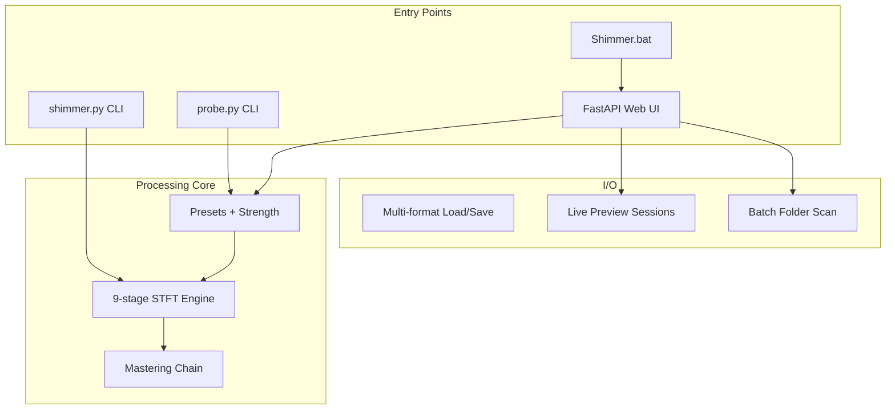

# Shimmer — Complete Feature Reference

Shimmer is an offline, local, deterministic tool for removing the high-frequency
artifacts that AI music generators leave behind: metallic "shimmer" fizz,
narrow-band birdies and whistles, amplitude-modulated hash flicker, and periodic
"checkerboard" comb textures. This document is the authoritative catalog of
every feature in the tool, sourced directly from the codebase.

Related docs: [README.md](README.md) for quick start and project layout.

## Contents

1. [Overview](#1-overview)
2. [Entry points and launch](#2-entry-points-and-launch)
3. [Audio I/O](#3-audio-io)
4. [DSP processing engine](#4-dsp-processing-engine)
5. [Presets](#5-presets)
6. [Auto-detect and analysis](#6-auto-detect-and-analysis)
7. [Mastering chain](#7-mastering-chain)
8. [Web UI](#8-web-ui)
9. [HTTP API reference](#9-http-api-reference)
10. [CLI reference](#10-cli-reference)
11. [Batch processing](#11-batch-processing)
12. [Job system and infrastructure](#12-job-system-and-infrastructure)

---

## 1. Overview

- **Purpose:** remove narrowband flickering high-frequency artifacts (default
  band 5.1–7.2 kHz) produced by diffusion models, VAE/neural vocoders, and
  phase-reconstruction errors. Presets extend coverage from ~2 kHz (Vocal
  Glaze) up to 20 kHz (Deep Scrub).
- **Architecture:** Python backend (FastAPI + NumPy/SciPy STFT DSP) with a
  native HTML/ES-module frontend. No Gradio.
- **Execution model:** single-user, single job in flight. CPU-heavy processing
  runs on a thread executor so the event loop stays responsive
  ([server.py](server.py)).
- **Determinism:** processing is fully deterministic; the only randomness
  (noise resynthesis phase) is seeded via the `seed` parameter.



---

## 2. Entry points and launch

### Web UI launcher — [Shimmer.bat](Shimmer.bat)

- Creates and reuses a `.venv` via `uv`; installs
  [requirements.txt](requirements.txt) on first run.
- Probes that fastapi, uvicorn, numpy, scipy, soundfile, and pyloudnorm import
  cleanly before starting.
- Kills any prior process bound to port **7860** (netstat + PowerShell
  `Stop-Process`).
- Starts `uvicorn server:app --host 127.0.0.1 --port 7860` and auto-opens the
  browser at `http://localhost:7860` after a 2-second delay.

Manual launch:

```bash
pip install -r requirements.txt
python -m uvicorn server:app --host 127.0.0.1 --port 7860
```

### CLI — [shimmer.py](shimmer.py)

- `shimmer input output [options]` — input formats WAV/MP3/FLAC/OGG/M4A;
  output format inferred from the extension.
- Inline 40-character progress bar during processing.
- `--list-presets` prints all visible presets with descriptions.
- `--suggest INPUT` analyzes a file and prints the recommended preset plus
  per-band shimmer-density scores.
- Nearly every processing parameter is overridable via flags (see
  [Section 10](#10-cli-reference); a few advanced params are preset/API-only).

### Diagnostic CLI — [probe.py](probe.py)

- `python probe.py input [--outdir ...]` — standalone artifact analysis.
- Region selection with `--t0` / `--dur`, plus band and STFT parameters.
- Outputs `artifact.wav` (isolated flagged bins), `roi_band_spectrogram.png`,
  and `roi_residual_map.png` for manual diagnosis.
- Hosts `suggest_preset()`, used by the CLI `--suggest`, the API, and batch
  auto-detect.

---

## 3. Audio I/O

Source: [audio_io.py](audio_io.py)

| Capability | Details |
|---|---|
| Read formats | WAV, FLAC, OGG, AIFF via soundfile; MP3, M4A, AAC, MP4 via ffmpeg fallback |
| Write formats | Same set; lossless subtypes PCM_16 / PCM_24 / FLOAT; optional TPDF dither on PCM_16 |
| In-memory WAV | `encode_wav_bytes()` for live-preview payloads |
| Measurements | Peak and RMS in dBFS and linear (`measure()`) |
| Volume preservation | `preserve_volume()` — RMS-matched scaling when mastering is off; peak-limited, max 4× gain |
| Clip protection | `clip_protect()` normalizes to a 0.999 ceiling |
| Full pipeline | `process_file()` — read, process, optional mastering, write, optional diff file |
| Removed/diff signal | `(post-filtered dry − processed) × 5.0` so users can audition exactly what was removed |

ffmpeg on the system PATH is required for MP3/M4A/AAC; WAV/FLAC/OGG work
without it. The web UI's help Setup tab documents the install
(`winget install ffmpeg` on Windows).

---

## 4. DSP processing engine

Sources: [engine.py](engine.py), [dsp.py](dsp.py), [params.py](params.py)

`process(x, sr, p)` runs the STFT stage pipeline for `iterations` passes,
applies wet/dry mix, then post filters and edge fades.

### The 9-stage STFT pipeline (in `STAGE_REGISTRY` order)

| # | Stage | Enable param | Purpose |
|---|---|---|---|
| 1 | Expander | `expander` (bool) | Downward expander pushing quiet high-band tails further down |
| 2 | Denoise | `denoise` > 0 | Wiener-like spectral denoise with minimum-statistics noise PSD tracking |
| 3 | De-resonator | `deres` > 0 | Dynamic notch EQ on persistent narrow peaks, with persistence EMA and tonal-frame threshold boost |
| 4 | Shimmer | always on | Core stage: flags narrowband outliers above the local frequency median inside the target band and attenuates with a soft knee |
| 5 | De-harsh | `deharsh` > 0 | De-esser-style dynamic tamer comparing band energy against a mid-band reference |
| 6 | FlickerTamer | `flicker_tame` > 0 | Sub-band AM compressor; splits the band into independent sub-band compressors that squash rapid level swings (the defining "Suno hash" flicker). Intentionally ignores the transient gate |
| 7 | De-checkerboard | `decheck` > 0 | Detects and attenuates periodic spectral peaks from deconvolution upsampling ("checkerboard" grids) |
| 8 | Narrow-tone killer | `tone_kill` > 0 | Long-term per-bin EMA notcher for fixed whistles (e.g. 16 kHz / 17.8 kHz Suno tones); no per-frame gates by design |
| 9 | Noise resynth | `noise_resynth` > 0 | Random-phase blend to de-crystallize residual texture |

### Shared per-frame gates

- **Noise-likeness gate** (`flat_start` / `flat_end`) — spectral flatness maps
  each frame from tonal (skip) to noise-like (full processing).
- **Transient gate** (`flux_thr_db` / `flux_range_db`) — energy flux protects
  drum hits and consonants from being processed.
- **`steady_state_mode`** — when true, the Shimmer, De-harsh, De-checker,
  Denoise, and De-resonator stages skip the transient gate entirely. Use for
  steady-state artifacts (Suno hash, sustained sheen) where the gate would
  silently weaken cleaning on every hit.
- **Density gate** (`density_lo` / `density_hi` / `density_floor`) — protects
  broadband musical events; `density_floor` forces a minimum stage activity on
  dense frames (essential when "dense" *is* the artifact).

### Post-STFT time-domain filters

Applied by `apply_post_filters()` using primitives in [dsp.py](dsp.py):

- Subsonic highpass (`subsonic_hz`, 0 = disabled)
- High shelf cut/boost (`high_shelf_hz` / `high_shelf_db`)
- Presence shelf (`presence_hz` / `presence_db`)

### Pipeline-level controls

- **Iterations** (`iterations`, 1–3): re-runs the full pipeline on the previous
  pass's output. Detectors re-converge on the cleaner background; often the
  difference between "almost gone" and "gone" on stubborn hash.
- **Pre-analyze** (`pre_analyze` + `pa_*`): optional two-pass mode; a cheap
  full-file scan builds a per-bin attenuation mask (long-term magnitude excess
  plus AM depth), applied as a multiplicative pre-filter in the main pass.
  Eliminates long-EMA warmup error.
- **Diagnostic** (`diagnostic`): computes before/after 5–8 kHz band energy and
  AM depth plus the top surviving narrow peaks; surfaced in job metrics and
  the UI metrics strip.
- **Wet/dry mix** (`mix`, 0..1).
- **Padding and fade** (`pad`, `fade_ms`): STFT edge padding and output fades.
- **Preset strength** (0..2): `apply_preset_strength()` in
  [params.py](params.py) linearly scales a whitelist of amount-style fields
  (stage strengths, dB ceilings, density floors, air cut, denoise floor,
  iterations) between the neutral baseline and the preset value, extrapolating
  past 100% with per-key safety clamps. Structural fields (band edges, time
  constants, thresholds, `mix`) are deliberately untouched.

### Full parameter reference

Every tunable lives in the `Params` dataclass in [params.py](params.py).
Defaults shown below.

**Shimmer band:** `start_hz` 5100, `end_hz` 7200, `edge_hz` 200 (cosine taper).

**STFT:** `n_fft` 2048, `hop` 512.

**Detection and gating:** `flat_start` 0.25, `flat_end` 0.70, `freq_med_bins`
9, `thr_db` 8.0, `slope` 0.6, `density_lo` 0.02, `density_hi` 0.15,
`density_floor` 0.0, `flux_thr_db` 6.0, `flux_range_db` 8.0,
`steady_state_mode` false.

**Creative:** `noise_resynth` 0.0, `mix` 1.0, `pad` true, `fade_ms` 5.0.

**Spectral denoise (`dn_*`):** `denoise` 0.0, `dn_start_hz` 1500,
`dn_end_hz` 16000, `dn_edge_hz` 200, `dn_floor_db` −18, `dn_psd_smooth_ms` 50,
`dn_minwin_ms` 400, `dn_up_db_per_s` 3, `dn_attack_ms` 5, `dn_release_ms` 120,
`dn_freq_smooth_bins` 3.

**De-resonator (`deq_*`):** `deres` 0.0, `deq_start_hz` 300, `deq_end_hz`
12000, `deq_edge_hz` 150, `deq_freq_med_bins` 31, `deq_thr_db` 6.0,
`deq_slope` 0.7, `deq_max_att_db` 8, `deq_density_lo` 0.03, `deq_density_hi`
0.20, `deq_density_floor` 0.0, `deq_persist_ms` 600, `deq_persist_thr_db` 2.5,
`deq_freq_smooth_bins` 5, `deq_tonal_boost_db` 6.

**De-harsh (`dh_*`):** `deharsh` 0.0, `dh_start_hz` 5000, `dh_end_hz` 9000,
`dh_edge_hz` 250, `dh_ref_start_hz` 1000, `dh_ref_end_hz` 4000, `dh_thr_db`
6.0, `dh_slope` 0.5, `dh_max_att_db` 6, `dh_attack_ms` 5, `dh_release_ms` 120.

**Narrow-tone killer (`tk_*`):** `tone_kill` 0.0, `tk_start_hz` 3500,
`tk_end_hz` 20000, `tk_long_ms` 2000, `tk_freq_med_bins` 51, `tk_thr_db` 3.0,
`tk_slope` 5.0, `tk_max_att_db` 20, `tk_warmup_ms` 500,
`tk_freq_smooth_bins` 1.

**FlickerTamer (`ft_*`):** `flicker_tame` 0.0, `ft_start_hz` 4500,
`ft_end_hz` 12000, `ft_n_bands` 6, `ft_edge_hz` 100, `ft_attack_ms` 3,
`ft_release_ms` 250, `ft_thr_db` 1.5, `ft_slope` 0.85, `ft_max_att_db` 18.

**De-checkerboard (`cb_*`):** `decheck` 0.0, `cb_start_hz` 3000, `cb_end_hz`
16000, `cb_min_spacing_hz` 80, `cb_max_spacing_hz` 600, `cb_peak_thr_db` 4,
`cb_max_att_db` 8, `cb_persist_ms` 400.

**Expander (`exp_*`):** `expander` false, `exp_start_hz` 3000, `exp_end_hz`
8000, `exp_threshold_db` −45, `exp_ratio` 2.0, `exp_attack_ms` 10,
`exp_release_ms` 150.

**Post filters:** `high_shelf_hz` 0, `high_shelf_db` 0, `subsonic_hz` 0,
`presence_hz` 0, `presence_db` 0 (0 = disabled).

**Pipeline control:** `iterations` 1, `pre_analyze` false (`pa_start_hz` 4000,
`pa_end_hz` 14000, `pa_n_fft` 4096, `pa_hop` 2048, `pa_max_seconds` 60,
`pa_freq_med_bins` 51, `pa_thr_db` 3, `pa_max_att_db` 18, `pa_am_weight` 1.0),
`diagnostic` false, `seed` 0, `debug` false.

**CLI coverage note:** the following are *not* exposed as CLI flags and are
reachable only through presets or API `overrides`: `density_floor`,
`steady_state_mode`, `tone_kill` and all `tk_*`, `flicker_tame` and all
`ft_*`, `iterations`, `pre_analyze` and all `pa_*`, and `diagnostic`.

---

## 5. Presets

Source: [presets.py](presets.py). Default preset: `generic`. Presets are
named for the artifact shape they target, not the model version that produced
it.

### 17 visible presets

| Key | UI label | Target artifact |
|---|---|---|
| `generic` | Generic | Safe defaults for unknown sources; moderate narrow-tone killer for fixed Suno whistles |
| `suno_hash` | Suno Hash (5-12 kHz Flicker) | AM-modulated narrowband hiss; FlickerTamer-led, broadband stages kept gentle |
| `cymbal_sheen` | Cymbal Sheen | Sustained tonal high tone (8–14 kHz) that never decays; tone-killer-led |
| `laser_whistle` | Laser Whistle | Thin, intermittent narrow-band tonal chirps (9–15 kHz) |
| `air_brittle` | Brittle Air | Glassy top end above 12 kHz while mids stay clean |
| `sibilance_rattle` | Sibilance Rattle | Harsh "sss"/"tss" bursts on vocals (6–10 kHz) |
| `cymbal_chatter` | Cymbal Chatter | Repetitive "ta-ta-ta" rattle on hi-hats and percussion |
| `broadband_fizz` | Broadband Fizz | Constant fuzzy haze across the brilliance band (8–18 kHz) |
| `checkerboard_grid` | Checkerboard Grid | Faint deconvolution comb / ringing texture |
| `reverb_flutter` | Reverb Flutter | Reverb tails that grain instead of smoothing |
| `vocal_glaze` | Vocal Glaze | Shimmery glaze coating vocal harmonics (2–8 kHz) |
| `vocal_glaze_plus` | Vocal Glaze + Top End | Vocal Glaze + Suno Hash combined in one pass (2–12 kHz) |
| `echo_sheen` | Echo Sheen | Signal-correlated shimmer/hiss shadowing the content |
| `presence_haze` | Presence Haze | Smooth noise-like haze in the 3–8 kHz presence band |
| `phantom_cymbal` | Phantom Cymbal | Washy metallic cymbal wash in the 4–10 kHz band |
| `harsh_veil` | Harsh Veil | Gritty texture across the upper mids (4–12 kHz) |
| `deep_scrub` | Deep Scrub | Maximum-strength wide-band cleanup (3–18 kHz) |

Each preset's factory docstring (returned by `/api/presets` and
`--list-presets`) explains the artifact signature and which stages are
emphasized.

### 8 legacy hidden aliases

Version-named keys remain resolvable so existing CLI calls, saved settings,
and scripts keep working. They never appear in UI dropdowns (`visible: false`
in the API).

| Alias | Maps to |
|---|---|
| `suno_v3` | `laser_whistle` |
| `suno_v3.5` | `laser_whistle` |
| `suno_v4` | `cymbal_chatter` |
| `suno_v4.5` | `broadband_fizz` |
| `suno_v5` | `checkerboard_grid` |
| `suno_v5_pro` | `air_brittle` |
| `suno_v5.5` | `reverb_flutter` |
| `suno_cymbal` | `cymbal_sheen` |

Saved settings that reference an alias are migrated to the canonical key on
load ([settings_store.py](settings_store.py)).

---

## 6. Auto-detect and analysis

Source: [probe.py](probe.py)

- `suggest_preset(path)` analyzes the first **30 seconds** of a file and
  returns the best-matching preset plus a ranked top 3 with confidence scores
  and human-readable reasons.
- Per-artifact feature scoring includes: shimmer density, tonality,
  persistence, periodicity, comb structure, top-end concentration, sibilance
  bursts, tail flutter, vocal glaze, echo sheen, presence wash, metallic wash,
  and harsh grit.
- A per-second shimmer-intensity timeline (8–16 kHz) is returned; the UI uses
  it to draw the sparkline and anchor the live-preview loop at the hottest
  region.
- Falls back to `generic` when the top score is below 0.05 ("no artifact
  detected").
- `analyze_track()` ([mastering.py](mastering.py)) adds a loudness/spectrum
  snapshot: integrated LUFS, LRA, true peak, and a 1/3-octave long-term
  spectrum.
- Exposed via: the Analyze button in the UI, `POST /api/suggest` and
  `POST /api/analyze`, CLI `shimmer --suggest`, and batch `auto_detect: true`.
- `analyze_region()` isolates flagged bins into `artifact.wav` plus
  spectrogram/residual PNGs for manual diagnosis (standalone probe.py CLI).

---

## 7. Mastering chain

Source: [mastering.py](mastering.py)

Optional true-mastering stage applied after artifact cleaning:

| Step | Details |
|---|---|
| 1. DC removal + highpass | `hp_hz`, default 25 Hz |
| 2. Tone-match EQ | Analysis-driven 1/3-octave correction toward a reference curve; correction clamped to ±3 dB, scaled by `eq_strength` |
| 3. LUFS gain | Gain toward the target integrated loudness |
| 4. True-peak limiter | Lookahead brickwall with 4× oversampled true-peak detection |
| 5. Micro-adjust | Up to `max_iterations` (default 2) re-measure passes until within 0.35 dB of the LUFS target |

`MasterParams` ([params.py](params.py)): `enabled` (true), `target_lufs`
(−14.0), `ceiling_dbtp` (−1.0), `eq_strength` (0.55), `intensity`
(low/med/high, mapping to EQ strength 0.25/0.55/0.85), `hp_hz` (25),
`lookahead_ms` (2.0), `release_ms` (50), `max_iterations` (2).

Loudness target presets (`LOUDNESS_TARGETS`): `streaming` −14 LUFS, `loud`
−11 LUFS, `cd` −9 LUFS.

Analysis exports: `measure_loudness()` (integrated LUFS, LRA, true peak),
`analyze_spectrum()` (1/3-octave long-term spectrum), `analyze_track()`
(combined snapshot). The mastering report (before/after LUFS, true peak,
limiter max gain reduction) flows into job metrics and the UI metrics strip.

---

## 8. Web UI

Sources: [static/index.html](static/index.html) and the ES modules in
[static/js/](static/js/) (`main.js`, `single.js`, `batch.js`, `visualizer.js`,
`controls.js`, `preset.js`, `help.js`, `settings.js`, `api.js`).

### Application shell

- Two main tabs with ARIA tablist roles: **Single File** (default) and
  **Batch**.
- Dark purple/gold theme ([static/css/tokens.css](static/css/tokens.css));
  viewport-locked layout that degrades to a scrollable single column below
  1100 px.
- First-visit onboarding: the Quick start help opens automatically once
  (tracked in `localStorage`).
- All settings persist across sessions (see below).

### Single File workflow (3-step wizard: Upload, Analyze, Clean & Master)

**Upload**
- Dropzone with drag-and-drop and click-to-pick; accepts `.wav`, `.mp3`,
  `.flac`, `.ogg`, `.m4a`.
- Drag-over highlight; after selection the dropzone collapses to a compact
  chip and the whole window becomes a drop target.
- The Clean & Master button stays disabled until a file is selected.

**Preset and analysis**
- Preset dropdown populated from `/api/presets` (visible presets only), with
  an expandable description under it.
- Analyze button runs auto-detect plus loudness analysis, applies the top
  preset, and shows a results row: suggested preset, confidence bar, and a
  Details popover with the reason text, an intensity-timeline sparkline, and
  rank-2/3 alternates with one-click Apply.
- Preset strength slider 0–200% (step 5%): visible sliders re-scale live in
  the client, hidden amount keys scale server-side via the same whitelist.

**Mastering controls**
- Master for release toggle (default on), loudness target (Streaming −14 /
  Loud −11 / CD & Club −9 LUFS), intensity (Low/Medium/High).
- After Analyze, a readout shows input LUFS, true peak, and LRA.
- "Match loudness when mastering is off" (preserve volume) appears only when
  mastering is disabled.

**Output and processing**
- Output format: WAV 24-bit, FLAC, MP3 320k, OGG, M4A.
- Clean & Master runs full-file processing with an SSE-driven progress bar,
  then loads the results into the player.
- A green "Ready to download" banner appears with metric chips and the
  download link. Download filenames follow
  `{stem}_{preset}_{processed|removed}_{jobid8}{ext}`.
- Metrics strip: peak/RMS in→out, duration, sample rate, channels, LUFS and
  true peak before→after, limiter max gain reduction, and 5–8 kHz
  energy/AM-depth diagnostics with top residual peaks.

**Advanced controls drawer**
- Right-side modal drawer (closes via ×, backdrop click, or Escape) rendered
  from the `CONTROL_SPEC` schema in
  [static/js/controls.js](static/js/controls.js).
- 10 sliders in 3 groups, each with a live value, tooltip, and a `?` that
  opens the help Controls tab anchored to that slider:
  - **Band:** Start Hz (500–12000), End Hz (1000–20000)
  - **Detection:** Threshold (2–20 dB), Slope (0.1–1.5)
  - **Processing:** Denoise, De-resonator, De-harsh, De-checker (each
    0–100%), Air cut (−12 to 0 dB, inverted: right = off), Mix (0–100%)
- Each group shows a plain-English intro with directional guidance.

**Player and visualizer** ([static/js/visualizer.js](static/js/visualizer.js))
- Three track tabs sharing one playhead: **Original** (enabled on upload),
  **Processed** and **Removed** (enabled after processing). Switching is
  instant and preserves the playhead.
- Two canvas modes: **Waveform** (per-column min/max peaks + RMS fill) and
  **Spectrogram** (real 1024-point FFT, Hann window, log-frequency rows,
  Inferno colormap) with the current shimmer band drawn as overlay lines.
- Click to seek; gold loop-window overlay during live preview.
- While playing: a live log-frequency spectrum with shimmer-band shading and
  an LUFS meter with a target marker tied to the mastering target.
- Loudness-matched A/B toggle attenuates the louder track using the measured
  LUFS values.
- Keyboard shortcuts (suppressed while focus is in a form control): Space
  play/pause, 1/2/3 select track, Left/Right seek ±5 s.

**Live preview**
- Toggle loops a short window (5/10/15/20 s) and re-renders the processed and
  removed slices on every parameter change (debounced 250 ms).
- The file is uploaded once to create a preview session; the loop anchors
  automatically at the hottest artifact region from the analyze timeline, or
  manually via "Set from playhead".
- LRU cache of the last 20 renders makes parameter comparisons instant;
  track swaps use a ~15 ms Web Audio crossfade for gapless A/B.
- The Removed track gets a ~14 dB client-side audition boost, capped against
  the slice's own peak to avoid clipping.
- Status line shows idle / uploading / rendering / live / error. Preview
  exits when a full Clean & Master runs; the session is released on page
  unload.

### Batch tab

See [Section 11](#11-batch-processing) for the backend. UI features:

- Input and output folder fields with native folder pickers
  (via `/api/browse-folder`); output defaults to `{input}_deshimmered`.
- Preset mode radio: **Same preset for all** (dropdown) or **Auto-detect each
  file** (hides the dropdown).
- Preset strength (0–200%), output format, preserve volume, and a full
  mastering block (enable/target/intensity) mirroring the single-file tab.
- Process All streams a color-coded log: header lines in gold, per-file
  successes in green (duration, peak in→out, detected preset + confidence in
  auto mode), failures in red, then a completion summary.

### Help system ([static/js/help.js](static/js/help.js))

Modal with focus management (Escape, ×, or backdrop to close) and five tabs:

1. **Quick start** — what shimmer is and the five-step workflow, plus tips
   (listen to the Removed track; click any `?`).
2. **Pick a preset** — an interactive decision-tree quiz starting from "where
   do you hear the artifact?" (vocals / percussion / top end / wash / reverb /
   nothing worked / unsure) that routes to a recommended preset with a "why"
   explanation and a one-click "Use [preset]" action.
3. **Controls** — reference cards auto-generated from `CONTROL_SPEC`: short
   description, when to turn up/down, and typical ranges. Slider `?` buttons
   deep-link here with a scroll-and-flash highlight.
4. **Troubleshoot** — symptom cards covering "shimmer still there",
   over-cutting, and workflow questions.
5. **Setup** — ffmpeg installation for MP3/M4A support.

Trigger points: header `?` (Quick start), preset label `?` (Pick a preset),
per-slider `?` (Controls, anchored).

### Settings persistence

Persisted via a debounced (300 ms) `POST /api/settings` and restored on boot:
`preset`, `preset_strength`, `sliders` (all advanced values),
`preserve_volume`, `output_format`, `mastering` (enabled/target/intensity),
and `ab_loudness_match`.

Storage location ([settings_store.py](settings_store.py)):
`%APPDATA%/Shimmer/settings.json` on Windows, `~/.config/shimmer/settings.json`
elsewhere. Legacy preset aliases are migrated on load.

---

## 9. HTTP API reference

Source: [server.py](server.py). All endpoints are served by FastAPI on
`127.0.0.1:7860`.

| Method | Path | Purpose |
|---|---|---|
| GET | `/` | Serves `static/index.html` |
| GET | `/static/*` | Static assets with `Cache-Control: no-cache` |
| GET | `/api/presets` | Every resolvable preset: `name`, `label`, `description`, full `values` (Params dict), `visible` flag; plus `default` |
| GET | `/api/settings` | Load persisted UI settings |
| POST | `/api/settings` | Save UI settings JSON |
| POST | `/api/browse-folder` | Open the native (tkinter) folder picker; `{initial_dir?, title?}` → `{path}` or `{path: null}` |
| POST | `/api/process` | Start a full-file job → `{job_id}` |
| GET | `/api/progress/{job_id}` | SSE stream of `{fraction, status?, done?, error?}` with 15 s keepalives |
| GET | `/api/metrics/{job_id}` | Job metrics; 202 while running, 500 on job error |
| GET | `/api/result/{job_id}?kind=` | Stream the file: `processed` \| `diff` \| `original` |
| POST | `/api/suggest` | Multipart upload → preset suggestion + track analysis |
| POST | `/api/analyze` | Alias of `/api/suggest` |
| POST | `/api/batch` | JSON body → SSE stream of per-file batch status |
| POST | `/api/upload` | Upload once → preview session `{session_id, sample_rate, channels, duration_s, name, analysis}` |
| DELETE | `/api/upload/{session_id}` | Release a preview session |
| POST | `/api/preview` | Render a loop slice → single binary payload |

### Request shapes

`POST /api/process` (multipart form):

- `file` — the audio upload
- `params` — JSON string:
  `{preset, preset_strength (0..2), overrides: {param: value, ...}, mastering: {...}, mastering_analysis: {...}}`.
  Order of application: preset → strength scaling → explicit overrides.
- `preserve_volume` — bool, default true
- `output_format` — `wav` | `flac` | `mp3` | `ogg` | `m4a`

`POST /api/batch` (JSON):

```json
{
  "input_folder": "D:\\music\\in",
  "output_folder": "",
  "preset": "generic",
  "preset_strength": 1.0,
  "preserve_volume": true,
  "output_format": "wav",
  "auto_detect": false,
  "mastering": {"enabled": true, "target_lufs": -14.0, "intensity": "med"}
}
```

`POST /api/preview` (JSON): `{session_id, start_s, end_s, preset,
preset_strength, overrides, preserve_volume, mastering}`. The response is one
binary payload — `[u32 json_len][json meta][u32 wav_len][processed wav]
[removed wav]` — where the meta includes per-slice LUFS for client-side
loudness matching plus `render_ms`.

### Job metrics

`GET /api/metrics/{job_id}` returns `sample_rate`, `channels`, `duration_s`,
`input`/`output` peak and RMS, `diagnostic` (when enabled), the `mastering`
report, and `loudness` (input/output integrated LUFS, populated whether or
not mastering ran, so the client can loudness-match A/B in every state).

---

## 10. CLI reference

Source: [shimmer.py](shimmer.py). Flags grouped as in `--help`:

| Group | Flags |
|---|---|
| Preset selection | `--preset` (visible keys + legacy aliases), `--list-presets`, `--suggest INPUT` |
| Shimmer band | `--start-hz`, `--end-hz`, `--center-hz` + `--width-cents` (alternative band spec), `--edge-hz` |
| STFT | `--n-fft`, `--hop` |
| Shimmer detection | `--freq-med-bins`, `--thr-db`, `--slope`, `--density-lo`, `--density-hi` |
| Gating | `--flat-start`, `--flat-end`, `--flux-thr-db`, `--flux-range-db` |
| Creative | `--noise-resynth`, `--mix` |
| Spectral denoise | `--denoise`, `--dn-start-hz`, `--dn-end-hz`, `--dn-edge-hz`, `--dn-floor-db`, `--dn-psd-smooth-ms`, `--dn-minwin-ms`, `--dn-up-db-per-s`, `--dn-attack-ms`, `--dn-release-ms`, `--dn-freq-smooth-bins` |
| De-harsh | `--deharsh`, `--dh-start-hz`, `--dh-end-hz`, `--dh-edge-hz`, `--dh-ref-start-hz`, `--dh-ref-end-hz`, `--dh-thr-db`, `--dh-slope`, `--dh-max-att-db`, `--dh-attack-ms`, `--dh-release-ms` |
| De-checkerboard | `--decheck`, `--cb-start-hz`, `--cb-end-hz`, `--cb-min-spacing-hz`, `--cb-max-spacing-hz`, `--cb-peak-thr-db`, `--cb-max-att-db`, `--cb-persist-ms` |
| De-resonator | `--deres`, `--deq-start-hz`, `--deq-end-hz`, `--deq-edge-hz`, `--deq-freq-med-bins`, `--deq-thr-db`, `--deq-slope`, `--deq-max-att-db`, `--deq-density-lo`, `--deq-density-hi`, `--deq-persist-ms`, `--deq-persist-thr-db`, `--deq-freq-smooth-bins`, `--deq-tonal-boost-db` |
| Downward expander | `--expander`, `--exp-start-hz`, `--exp-end-hz`, `--exp-threshold-db`, `--exp-ratio`, `--exp-attack-ms`, `--exp-release-ms` |
| Post-STFT filters | `--high-shelf-hz`, `--high-shelf-db`, `--subsonic-hz`, `--presence-hz`, `--presence-db` |
| Mastering | `--master`, `--no-master`, `--target {streaming,loud,cd}`, `--target-lufs`, `--ceiling`, `--master-intensity {low,med,high}` |
| Output | `--no-pad`, `--fade-ms`, `--no-preserve-volume`, `--subtype {PCM_16,PCM_24,FLOAT}` (default PCM_24), `--write-diff FILE` |
| Misc | `--seed`, `--debug` |

Explicit flags always override the chosen preset. Mastering is off by default
on the CLI; enable it with `--master`, `--target`, or `--target-lufs`. After
processing, the CLI prints duration, peak/RMS in→out, LUFS and true-peak
before→after (when mastering ran), and elapsed time.

The advanced parameters not exposed as flags are listed at the end of
[Section 4](#4-dsp-processing-engine).

---

## 11. Batch processing

Source: `api_batch` and `_batch_one` in [server.py](server.py)

- Scans the input folder (non-recursive) for `*.wav`, `*.mp3`, `*.flac`,
  `*.ogg`, `*.m4a` (plus uppercase `*.WAV`, `*.MP3`, `*.FLAC`), sorted and
  deduplicated.
- Output folder defaults to `{input_folder}_deshimmered` and is created if
  missing; each output file keeps its stem with the chosen format's extension.
- Each file runs through `process_file()` on a thread executor with the
  shared preset (strength-scaled) or, with `auto_detect: true`, a per-file
  `suggest_preset()` pick reported back as `detected_preset`,
  `detected_label`, and `detected_confidence`.
- Optional mastering applies to every file.
- SSE event stream: `start` (total count, output folder, preset or
  "auto-detect"), `file_start`, `file_done` (duration, peak in/out, detection
  info), `file_error`, `end`.

---

## 12. Job system and infrastructure

- **Job store** ([jobs.py](jobs.py)): one UUID job per full-file run with a
  temp workdir, an asyncio progress queue feeding the SSE stream, and a
  status lifecycle of queued → running → done | error. Jobs older than
  **1 hour** are swept.
- **Preview store** ([preview_store.py](preview_store.py)): decoded float32
  samples held in RAM per session, capped at the first **30 minutes** of
  audio; sessions idle for **1 hour** are evicted. Every preview render pads
  the requested window with 1.5 s of preroll and 0.25 s of postroll so
  stateful stages (noise PSD trackers, persistence EMAs) warm up before the
  audible slice, then trims back.
- **Settings store** ([settings_store.py](settings_store.py)): JSON
  persistence with legacy-alias migration (see Section 8).
- **Windows import fix** ([_winfix.py](_winfix.py)): must be imported before
  scipy/numpy on Windows; both entry points do this.
- **CI** ([.github/workflows/ci.yml](.github/workflows/ci.yml)): on push/PR to
  main, byte-compiles all sources and runs an import smoke test on Python
  3.11 and 3.12.
- **PushToGitHub.bat**: interactive commit-and-push helper.
- **Dependencies** ([requirements.txt](requirements.txt)): numpy, scipy,
  soundfile, matplotlib, fastapi, uvicorn, python-multipart, pyloudnorm.
  ffmpeg (system PATH) is an optional runtime dependency for compressed
  formats.

### Module map

| Module | Role |
|---|---|
| [shimmer.py](shimmer.py) | CLI entry point, argparse, orchestration |
| [server.py](server.py) | FastAPI HTTP API |
| [params.py](params.py) | `Params` and `MasterParams` dataclasses, preset-strength scaler, loudness targets |
| [presets.py](presets.py) | 17 artifact-shape preset factories + legacy aliases |
| [engine.py](engine.py) | STFT loop, 9 processing stages, shared gates, post filters |
| [dsp.py](dsp.py) | Primitive DSP helpers (filters, conversions, band math) |
| [audio_io.py](audio_io.py) | File I/O, measurements, `process_file()` |
| [mastering.py](mastering.py) | LUFS / tone-match EQ / true-peak limiter chain and analysis |
| [probe.py](probe.py) | Auto-detect scoring, region analysis, diagnostics CLI |
| [preview_store.py](preview_store.py) | In-memory live-preview sessions |
| [jobs.py](jobs.py) | Async job state for full-file processing |
| [settings_store.py](settings_store.py) | UI settings persistence |
| [_winfix.py](_winfix.py) | Windows scipy/numpy import-order fix |
| [static/](static/) | Frontend: HTML, split CSS, ES-module JS |
