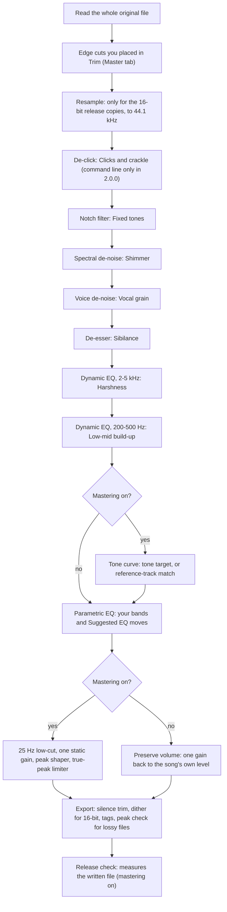

# Shimmer 2.0.0: feature reference

Shimmer is a local app that cleans and masters songs made with AI music
tools such as Suno. It runs on your own computer. Version 2.0.0 (2026-09-13)
is a rebuild of 1.1.1.

This page lists the features in 2.0.0, by tab and by stage. Each one was
checked against the code. Some things are not built yet. They are named as
such, and all of them are listed in
[Known limits in 2.0.0](#10-known-limits-in-200).

Other docs:

- [SOUND-CHANGES.md](SOUND-CHANGES.md): every change to the sound since
  1.1.1, with numbers.
- [STEP6-FIXES.md](STEP6-FIXES.md): how each fix was measured.
- [API.md](API.md): the routes the screens call.
- [ARCHITECTURE.md](ARCHITECTURE.md): how the app is built, and why.

## Contents

1. [One sound path](#1-one-sound-path)
2. [Master tab](#2-master-tab)
3. [Mastering](#3-mastering)
4. [Output, tags and the release check](#4-output-tags-and-the-release-check)
5. [Signal Chain tab and the progress window](#5-signal-chain-tab-and-the-progress-window)
6. [Batch tab and album mode](#6-batch-tab-and-album-mode)
7. [Remix tab](#7-remix-tab)
8. [Settings tab, and where things are saved](#8-settings-tab-and-where-things-are-saved)
9. [Command line](#9-command-line)
10. [Known limits in 2.0.0](#10-known-limits-in-200)

---

## 1. One sound path

Every tab makes its sound with one function, `render()` in
`shimmer/core/render.py`. It is used by:

- the Master tab's live preview and its export
- the Batch tab, and album mode
- the Remix tab's export
- the command line

Every file is written by one function too, `export()` in
`shimmer/core/export.py`.

1.1.1 had six copies of this work, and its preview did not match its
export. In 2.0.0 the preview is the same render on a short window of the
song. A test holds each preview window to the same span of the full export:
the difference must be at least 60 dB below the signal. This holds with
every fix at full, too.

### The order of the stages

Each stage runs at one fixed place in the chain. The order is set in the
docstring at the top of `shimmer/core/render.py`.


```mermaid
flowchart TD
  A["Read the whole original file"] --> B["Edge cuts you placed in Trim (Master tab)"]
  B --> C["Resample: only for the 16-bit release copies, to 44.1 kHz"]
  C --> D["De-click: Clicks and crackle (command line only in 2.0.0)"]
  D --> E["Notch filter: Fixed tones"]
  E --> F["Spectral de-noise: Shimmer"]
  F --> F2["Voice de-noise: Vocal grain"]
  F2 --> G["De-esser: Sibilance"]
  G --> H["Dynamic EQ, 2-5 kHz: Harshness"]
  H --> I["Dynamic EQ, 200-500 Hz: Low-mid build-up"]
  I --> J{"Mastering on?"}
  J -- yes --> K["Tone curve: tone target, or reference-track match"]
  J -- no --> L
  K --> L["Parametric EQ: your bands and Suggested EQ moves"]
  L --> M{"Mastering on?"}
  M -- yes --> N["25 Hz low-cut, one static gain, peak shaper, true-peak limiter"]
  M -- no --> O["Preserve volume: one gain back to the song's own level"]
  N --> P["Export: silence trim, dither for 16-bit, tags, peak check for lossy files"]
  O --> P
  P --> Q["Release check: measures the written file (mastering on)"]
```

A fix only runs when its card is on. A stage with nothing to do passes the
audio through unchanged. With everything off, the output is bit for bit the
input.

Some work is done once for the whole song and kept:

- the scan for fixed tones
- each fix's plan (for example, which bands the dynamic EQ watches)
- the mastering tone curve
- the loudness gain

So a preview window uses the same notches, the same gains and the same
level as the full export. A window is rendered with 1 s of lead-in and
0.5 s of tail, so the filters and the limiter settle as they do in a full
render.

---

## 2. Master tab

The Master tab takes one song from upload to a finished file. It has three
steps, shown at the top: **1 Upload**, **2 Analyze**, **3 Clean & Master**.

### 2.1 The app around it

- **Side rail:** Master, Remix, Batch, Signal Chain, Settings and Help. Below
  them, a card shows the loaded song's name.
- **Transport bar** (along the bottom, on Master and Remix):
  - **Transport:** back to the start, back 5 s, play/pause, forward 5 s,
    and a scrubber you can click or drag. The amber band on the scrubber is
    the preview loop.
  - **Monitor:** **1 Original**, **2 Processed**, **3 Removed**, and a
    **Loudness-matched A/B** switch (on by default).
  - **Preview loop:** the **Live** switch, the loop length and **Set from
    playhead**.
- **Keys:** Space plays and pauses. 1, 2 and 3 switch tracks. The left and
  right arrows skip 5 s. **Ctrl+K** opens a command palette that can switch
  tabs, play, switch tracks, run Analyze and open Help.
- **Help** has six tabs: Quick start, What do you hear? (with a short quiz
  that points you to a card), Controls, Troubleshoot, Setup and About. A
  **?** next to a card or control opens help on that one.

### 2.2 Upload

You drop in one song, or click **Choose file…**. It is uploaded once, and
the Master tab reuses it for the rest of the session.

- **File types:** WAV, MP3, FLAC, OGG and M4A. WAV, FLAC and OGG are read
  directly. MP3 and M4A need ffmpeg installed (Help, Setup).
- **Long files:** the copy kept for the preview stops at 30 minutes. The
  export always reads the whole original file.
- **Clean-up:** a session unused for one hour is removed, with its files.
- **Recent sessions:** the empty Master tab lists up to six recent songs.
  In browsers that allow it (Chromium-based ones), a click reloads the song
  and its settings. Otherwise the row asks you to drop the file again.

The upload already measures fixed tones and loudness, so the cards can show
what was found before you click Analyze.

### 2.3 Analyze

Click **Analyze** in the Analysis card, or step 2 in the right column. It
takes about 10 seconds for a four-minute song. It measures the song and
never changes it. It:

- measures loudness (LUFS), true peak (dBTP) and loudness range
- draws a 1/3-octave spectrum, and finds where the top end stops (many AI
  renders stop at 12-15 kHz)
- scans the whole file for **fixed tones**: steady tones the generator
  leaves at one pitch for the whole song
- marks what it found on the **What do you hear?** cards, and turns on
  **Fixed tones** when it finds steady tones
- moves the preview loop to where the top end is busiest
- plans a **Suggested EQ** (see [2.9](#29-eq-and-suggested-eq))

**The Analysis card is a checklist.** Each thing Analyze found is one row:
a box to tick, what ticking it does ("Notch it", "Set to Commercial", "Add
to the EQ"), and a word saying whether it is **On** now, **Not on yet**, or
**Optional**. What Analyze recommends starts ticked; the Suggested EQ starts
unticked, as optional. **Apply** makes the sound match the ticks: "Apply 1
fix", or "Apply 2 changes" when it also turns something off. When nothing is
waiting, it says "Everything you ticked is on". A change made elsewhere (a
card on the left, the Loudness menu, the EQ) shows up in the list at once.

The Suggested EQ row sits under its own **Suggestion** label, because
Analyze plans it for every song; it is not a problem found. The header
counts it apart ("1 thing to fix · 1 suggestion"). **See the moves ↓** on
that row jumps down to the Suggested EQ panel and outlines it for a moment.

**Next: Clean & Master.** Under the checklist, a bar names the next step
and has its button. It runs the same **Clean & Master** as the button at
the top of the right-hand panel, which glows after Analyze until you press
it or load a new song. Everything under the bar is optional detail.

**Expand** opens the analysis in a bigger panel over the page, with a
**Loop the worst part** button.

**What Analyze reports as found.** Only two cards get a "Found" note today,
because only these can be measured reliably:

- **Fixed tones:** each tone found, with its pitch and how far it stands
  above its surroundings.
- **Loudness:** how far the song is under the chosen loudness target, when
  it is 1 dB or more.

Every other card stays quiet until its detector passes its own tests. A
card that cannot measure its problem does not guess.

### 2.4 "What do you hear?" cards and their fixes

The cards replace 1.x's 19 presets. You listen, then turn on a card for
each problem you hear. Each card that is on runs one tool. The cards and
their tools come from `shimmer/core/catalog.py` (`CARDS`, `TOOL_LABELS`,
`TOOLS_READY`) and `shimmer/core/render.py` (`_FIX_TOOLS`).

| Card | What you hear | Tool | Band | Deepest cut at Amount 100 % | State in 2.0.0 |
|---|---|---|---|---|---|
| Shimmer | Fizzy, flickering hiss up top | Spectral de-noise | 1.5-16 kHz | a gain per frequency bin, set by a trained model | On, to try |
| Vocal grain | Grainy hiss riding on the voice | Voice de-noise | centre only, 3.5-10 kHz | a gain per frequency bin, worked out from the song | New, to try |
| Fixed tones | A whistle or whine that never changes | Notch filter | at each tone found | full notch depth | On |
| Sibilance | Harsh, spitty "s" and "sh" | De-esser | 4.5-10 kHz | 6.5 dB | On, to try |
| Clicks and crackle | Short pops, ticks or static | De-click | above 2 kHz | not a fixed cut | Built, not passed. The card says "Not built yet" |
| Harshness | Piercing, painful upper mids | Dynamic EQ | 2-5 kHz | 3.3 dB | On, to try |
| Phasiness | Grainy or watery reverb tails | none | | | "No fix yet" |
| Low-mid build-up | Muddy, boxy, words hard to hear | Dynamic EQ | 200-500 Hz | 4.0 dB | On, to try |
| Lack of air | Dull, no sparkle | Tone target | whole spectrum | | Part of mastering |
| Loudness | Quieter than released music | Loudness target | whole signal | | Part of mastering |

"On, to try" means the fix is measured and turned on so it can be tried on
real songs, but its blind listening round is still to come. How each fix
was measured, and what it takes from a clean song:
[STEP6-FIXES.md](STEP6-FIXES.md).

**How the cards look and work:**

- The cards come in two groups: **Artifacts** and **Tone and level**. A line
  at the top counts them, for example "Analyze found 1 · 2 fixes on".
- A card Analyze measured shows **Found** and what it found: a tone's pitch
  in kHz (or how many tones), or how many dB under the target.
- Click a card to turn it on. Click again to turn it off.
- Each card that is on adds a row under **Fixes on**: the tool's name, the
  card, who turned it on ("by you" or "by Analyze") and an **Amount**
  slider. A card Analyze did not measure says "Starting gentle — check the
  Removed track."
- A card marked **Not built yet** or **No fix yet** can still be picked. It
  shows as "noted" and changes nothing. The pick is counted in your browser
  to help test new fixes.
- **Lack of air** and **Loudness** change Mastering instead of running a
  fix. Turning either on turns mastering on. Loudness sets the loudness
  target to Commercial (-9 LUFS). Lack of air sets Tilt to Bright, and back
  to Neutral when you turn it off.

**Each tool, in plain words:**

- **Spectral de-noise (Shimmer).** A small trained model looks at the
  song's spectrum and gives each frequency bin in 1.5-16 kHz a gain: how
  much of it to keep. It runs in numpy on your own computer, on the CPU,
  so nothing extra is installed. Its weights ship with Shimmer
  (`shimmer/core/repair/hash_remover.npz`). Without that file the tool
  does nothing and says so. On the test models it removes the flicker it
  was trained on, but not the other three kinds of fizz, so it passes on
  one of its four fault models. It takes at most 0.064 sones from a clean
  song.
- **Voice de-noise (Vocal grain).** A gritty hiss that rides on an AI lead
  vocal, strongest at 4-8 kHz. It works on the centre of the mix, where the
  lead vocal sits, and leaves the sides alone. It reads the whole song once,
  then takes out three things: a steady hiss floor above 3.5 kHz; a hiss
  that rises and falls with the voice, measured again every 2 seconds; and
  a grain of sharp little spikes, each pulled back to the level around it.
  It works one of two ways, chosen under the card's Amount slider:
  **Centre of the mix** (the default) needs nothing extra. **Vocal only**
  first splits out the vocal with the Remix tab's splitter, then works on
  the vocal alone, so cymbals in the centre are left as they are. It reuses
  a split the Remix tab has already made for the file. Without the
  splitter, the card uses the centre of the mix and says so in its report.
  The author picked it by ear on one song in listening rounds 5-16
  (2026-09-23). Its cost on clean songs, which sets the top of its Amount
  slider, is still to be measured.
- **Notch filter (Fixed tones).** Narrow notches at each steady tone the
  scan finds, on both channels. Each notch is narrow, so the music on
  either side is kept. It removes 96 % of a fixed tone. It only catches
  tones that hold one pitch. This is 1.1.1's repair, ported unchanged.
- **De-esser (Sibilance).** While an "s", "sh", "t" or "ch" sticks out, it
  turns the 4.5-10 kHz band down, and leaves it alone the rest of the time.
  The centre, where the lead vocal is, gets the full cut. The sides get
  half. It listens for sounds that jump above the brightness around them
  and are more centred than the song's top end usually is, so it can tell
  most consonants from cymbals.
- **Dynamic EQ (Harshness, Low-mid build-up).** It finds, once for the
  whole song, the band that most often rings out above its neighbours. It
  then turns that band down only while it is louder than usual for this
  song. Harshness watches up to two
  bands in 2-5 kHz. Low-mid build-up watches one band in 200-500 Hz. If no
  band sticks out, nothing is cut. Both channels get the same cut, so the
  stereo image stays put.
- **De-click (Clicks and crackle).** It finds pops up to about 3 ms long
  and fills each gap from the sound on both sides, above 2 kHz only. It
  runs first, before the notch filter, since a click would ring on through
  a notch. It is built but has not passed its tests: it does not yet find
  pops in dense music. The Master tab does not offer it. The command line
  runs it with `--fix clicks`.
- **Tone target and loudness target (Lack of air, Loudness).** These two
  cards are handled in the Tone and Master stages. With mastering off, they
  change nothing.

**The first time Shimmer is on for a song.** The spectral de-noise has to
read the whole song once before it can run. That takes about 50 s for a
3-minute song.

- With Live preview on, Shimmer does this as its own job
  (`POST /api/prepare`). The preview status line at the bottom says
  "Getting ready for this song…", then how far it has got, for example
  "reading the whole song once, 40%".
- Turning the Shimmer card off during this first read stops it. Nothing
  half done is kept.
- If you export first, the read happens during the export, and the progress
  window shows it under Fixes.
- After that, a new Amount or a new preview window is quick, because the
  model's gains are kept for the song.

### 2.5 Amount

Each card that is on has an **Amount** slider, from 0 to 100 %. 0 % changes
nothing. 100 % is the deepest cut that fix allows.

- A card starts at 50 % when you turn it on. Fixed tones starts at 100 %,
  the depth 1.1.1 used.
- For Fixed tones, Amount scales how deep each notch goes.
- For the other fixes, the top of the slider is set from measurement: at
  100 %, the fix takes at most 0.10 sones from a clean song (the decision
  rule in [STEP6-FIXES.md](STEP6-FIXES.md)).
- Moving the slider renders the loop again when Live is on.

**Auto.** The fixes Analyze finds are turned on too. Today that is Fixed
tones: its notches run at full depth unless you set its Amount yourself. If
you turn Fixed tones off for a song, it stays off.

### 2.6 The Removed track

Press **3** (or click **Removed**) to hear the Removed track. It is what the
fixes took out, and nothing else: the song before the fixes, less the song
after them. It does not include the tone curve, the EQ or mastering.

Processed and Removed play rendered audio, so they are dimmed until Live
preview or Clean & Master has rendered some. Clicking a dimmed one (or
pressing 2 or 3) turns on Live and plays that track once the loop is ready.

- It is marked **boosted**: the player turns it up so you can hear it. That
  boost is a monitoring level only and never goes into a file.
- It should sound like hiss, fizz, whistles or sizzle. If you hear vocals,
  snare hits or melody in it, a fix is cutting into your music. Lower that
  card's Amount.
- It plays once Live preview is on, or after Clean & Master has run.

Every export also writes the Removed track on the server as its own file,
`{song}_removed_{id}.{ext}`. The command line writes it with
`--write-diff`.

### 2.7 Live preview

Turn on **Live** in the Preview loop. A window of the song loops, and every
change renders it again.

- **Loop length:** 10, 20 (default) or 30 s. **Set from playhead** moves the
  window to where the playhead is.
- **A/B:** press 1 for the original, 2 for the processed song, 3 for the
  Removed track.
- **Loudness-matched A/B** (on by default) turns the louder track down, so
  you judge the sound, not the level. It changes what you hear only, never
  the export.
- **The status line** says what the preview is doing, for example how long
  a render took.

The preview renders its window with the same settings as the export
(`POST /api/preview`). With mastering on, it uses the whole song's
loudness gain. With mastering off and Preserve volume on, it uses the whole
song's gain too. So a quiet verse previews at the level it will export at.
In 1.1.1 each window was matched on its own, so a quiet verse previewed too
loud.

**The player** shows the song as **Waveform**, **Spectrogram** or **Both**,
with a live spectrum and a loudness meter.

### 2.8 Trim

The **Trim** card shows the start and end of the song ("top and tail") on a
level scale in dB. Short glitches at the edges are around -50 dBFS, which is
a flat line on a normal waveform, so the dB scale is what makes them
visible.

- **Edge glitches.** Shimmer scans both ends for a short burst (a click, a
  cut reverb tail, a DC step) that a silence trim cannot catch. When it
  finds one, the card says so and offers **Use suggested cut** or
  **Review**. It never cuts anything by itself.
- **Edge cuts.** Pick **Head** or **Tail**, then click to place the in or
  out point. Arrow keys nudge it by 1 ms (10 ms with Shift). You can also
  type the in and out points in ms. Zoom: 250 ms, 1 s, 3 s or 10 s.
  **Audition** plays from the marker. **Clear** removes the cuts.
- Edge cuts run first in the export, before any other stage, so no stage
  works on audio you cut.
- **Silence trim** is a separate option (in the Trim card and in Output).
  It removes the quiet floor below -60 dBFS from the start and end of the
  finished file, keeping a short natural pad. Playback in the app stays full
  length so A/B stays in sync. It is 1.1.1's trim, ported unchanged.

### 2.9 EQ and Suggested EQ

**Parametric EQ.** Your own EQ bands, in the right column. They run after
the fixes and the tone curve, and before mastering's gain. An **EQ
presets…** menu holds starting points.

| Limit | Value |
|---|---|
| Bands | up to 12 |
| Types | bell, low shelf, high shelf, low-cut (high-pass), high-cut (low-pass), notch |
| Frequency | 20 Hz to 20 kHz |
| Gain | ±18 dB |
| Q | 0.1 to 18 |

- Bells and shelves land on their setting: within 0.1 dB for bells and
  0.2 dB for shelves. (1.x doubled them.)
- The low-cut and high-cut run one way, so they add no pre-echo. They are
  -3 dB at the frequency you set.

**Suggested EQ.** Analyze proposes a few EQ moves. They show above the EQ.
**Apply to EQ** puts them in the Parametric EQ, where every move stays
editable. With **Use on the final pass** on, the plan goes into the EQ by
itself.

- It judges the loud parts of the song, not a quiet intro.
- It judges the song the way it will render: after the fixes and, with
  mastering on, after the tone curve, so nothing is corrected twice.
- Real problems (a ringing tone, a mud stack, a harsh band) get narrow
  cuts. The overall balance gets at most three broad, gentle moves.
- Cuts come before boosts. Every plan is checked on the loudest 20 s. If
  peaks would rise more than loudness, boosts are halved, then dropped.
- A **tone family** sets how far from neutral the balance may be before a
  move is worth making: Neutral (the default), Pop, Hip-hop / Trap, EDM /
  Dance, Rock / Metal, R&B / Soul, Acoustic / Folk, Lo-fi / Ambient or
  Cinematic / Orchestral. Shimmer does not guess the genre. The family is
  your call.

### 2.10 Clean & Master, and after the run

Click **Clean & Master** (step 3; it says **Clean** when mastering is off).
The progress window shows each stage (see
[5.2](#52-the-progress-window)) and ends on a **Download** step.

After the run, the Master tab shows:

- a **✓ Ready to download** banner with a **Download** button
- **What changed:** the whole-file spectrum before and after, what was
  removed, and the level-matched difference. Hover for the numbers at any
  frequency.
- **Release check:** is this file ready to upload? (see
  [4.3](#43-the-release-check))

---

## 3. Mastering

Mastering sets the release level, shapes the tone and holds the peaks under
a ceiling. In the app, **Master for release** is on by default. (On the
command line it is off unless you ask for it, as in 1.x.)

### 3.1 Loudness targets

From `LOUDNESS_TARGETS` in `shimmer/core/catalog.py`:

| Choice | Level | What it means |
|---|---|---|
| **Commercial** (default) | -9 LUFS | As loud as most released songs |
| **Balanced** | -11 LUFS | A little quieter, with more punch left in |
| **Streaming standard** | -14 LUFS | The level streaming apps play songs at; sounds quiet in other players |

How the level is set, in order:

1. **Low-cut at 25 Hz.** Removes rumble and DC. It runs one way, so it
   adds no pre-echo.
2. **One static gain.** Worked out once from the whole song, after the
   fixes, tone curve and EQ. It does not ride up and down. It is checked
   once against the finished loudness, after the shaper and limiter, and
   corrected, so the song lands on its target (within about 0.05 LU).
3. **Peak shaper.** A soft clipper that rounds off the peaks. At −9 LUFS
   it does most of the peak work. It runs at 4x the sample rate, so it
   folds no off-key tones back into the audible range, and both channels
   get the same gain, so the stereo image stays put. Away from the peaks
   it leaves the audio exactly as it was.
4. **True-peak limiter.** Holds every peak under the format's ceiling
   (see [4.1](#41-formats)). It finds peaks at 8x and aims 0.17 dB under
   the ceiling, the most a peak can hide between readings.

### 3.2 Tone target: Built-in

With mastering on, a tone curve moves the song toward a tone target, band
by band. **Tone target** has two choices: **Built-in** (the default,
measured from finished masters) or **Reference track**.

The built-in target is 1.1.1's tone curve, ported bit for bit. It is worked
out once from the whole song.

- **Tone match:** Low (gentle EQ), Medium (default) or High (more
  correction). How much of the move to make. It shapes tone only, not
  loudness.
- **Tilt:** Brightest, Bright, Neutral (default), Warm or Warmer. Warm to
  bright, up to about 2 dB at the ends of the spectrum.
- No band is boosted more than 2 dB or cut more than 3 dB.
- Where the song's top end stops (many AI renders stop at 12-15 kHz),
  nothing is boosted in the empty band above it.

### 3.3 Tone target: Reference track

Pick **Reference track** and load a released song you like. Your song's
tone then moves toward it instead of toward the built-in target.

- It only runs with mastering on.
- Both songs are matched in level first, so only the tone is compared.
  Loudness still follows the loudness target.
- **Amount** sets how much of the difference to take: 0 to 100 %, 50 % by
  default. The screen advises 50 % or lower.
- The EQ is smoothed over about an octave. No band moves more than 3 dB
  either way. Boosts in 5-12 kHz stop at +2 dB. Tilt still applies.
- Where the reference has no top end to compare (above 90 % of its own
  top-end cutoff), your song's own top is kept.
- If the reference has a lot more or a lot less drums than your song, you
  get a warning. (Today the line is 1.5 times either way. The sources give
  no number, so this is a first guess.)
- A chart shows **Your song**, the **Reference** and the **EQ Shimmer
  applies**, from 31.5 Hz to 20 kHz. A line above it names the biggest move
  in the low end, the mids and the top end.
- **Remove** drops the reference, and the tone target goes back to
  Built-in. The reference is also removed with the song's session.

### 3.4 Mastering off: Preserve volume

With mastering off, there is no loudness target, no tone curve and no
limiter. **Preserve volume** (in Output, on by default) adds one gain for
the whole song, so a cleaning-only file plays at the level it came in at:

- It matches the song's own RMS level.
- It never goes past a peak of 0.999.
- It never moves the level more than 4 times (12 dB) either way.
- If no stage changed the sound, it does nothing.

---

## 4. Output, tags and the release check

### 4.1 Formats

From `FORMATS` in `shimmer/core/catalog.py`. The names are as the Format
menu shows them:

| Format | Sample rate | Bit depth | True-peak ceiling |
|---|---|---|---|
| **WAV (24-bit PCM)** (default) | the song's own | 24-bit | -1.0 dBTP |
| **WAV release copy (16-bit · 44.1 kHz · dithered)** | 44.1 kHz | 16-bit | -1.0 dBTP |
| **FLAC (24-bit)** | the song's own | 24-bit | -1.0 dBTP |
| **FLAC release copy (16-bit · 44.1 kHz · dithered)** | 44.1 kHz | 16-bit | -1.0 dBTP |
| **MP3 (320 kbps)** | the song's own | lossy | -2.0 dBTP |
| **OGG Vorbis** (quality 0.8) | the song's own | lossy | -2.0 dBTP |
| **M4A (AAC)** 256 kbps | the song's own | lossy | -2.0 dBTP |

- **Release copies** are resampled to 44.1 kHz before the fixes and the
  limiter, so the ceiling holds at the rate that is written. The FLAC
  release copy is the same audio as the WAV one at about half the size.
- **Dither:** 16-bit files get TPDF dither of ±1 LSB.
- **Lossy files are checked after encoding.** Encoders push peaks up. Each
  MP3, OGG and M4A file is decoded and measured. If it is over -1.0 dBTP,
  it is turned down by the excess and encoded again, and the report says
  by how much. On drum-heavy songs an M4A can be turned down by up to
  about 2.5 dB this way.
- **MP3 and M4A need ffmpeg.** They are encoded from 32-bit float.
- **The source is never overwritten.**
- **A file appears whole or not at all.** It is written under a temporary
  name, tagged, then renamed.
- **The report reads the written file.** Loudness and true peak are measured
  on what is on disk.

**File size.** Below the Format menu, Shimmer shows how big the file will
be. Before the run, it renders three 10-second windows exactly as the export
will and scales up from them. WAV sizes are exact. FLAC and lossy sizes are
a close range. With a size limit set (see [8.1](#81-settings-tab)), a file
over the limit gets a warning, and Shimmer offers a lossless format that
fits. It offers MP3 only when nothing lossless fits. It never changes the
format or cuts the song by itself.

**File names.** Downloads are named `{song}_processed_{id}.{ext}`, or
`{song}_trimmed_{id}.{ext}` with silence trim on. `{id}` is the first 8
characters of the run's id. A second pass on a Shimmer file is named from
the song, so suffixes never chain.

**Remember settings next time** (in Output): when on, your card picks,
mastering, EQ and other Master choices come back on your next visit, and
your own card picks stay when you load a new song. When off, each page load
starts from the defaults.

### 4.2 Tags

Shimmer reads the song's own tags and carries them into the export. The
**Tags** section:

- **Write tags on the export** (on by default).
- **Fields:** Title, Artist, Album artist, Album, Genre, Year, Track no.,
  Copyright and ISRC. The title is filled from the file.
- **Keep the file's own tags** (on by default): the file's own tags stay and
  your fields fill only the blanks. Off: your fields replace the file's tags
  where you typed something.
- Album artist falls back to the artist. A blank copyright is filled as
  "© year artist" when both are known.
- **Add a Shimmer note to the comment** (on by default): one line per pass,
  for example `Shimmer 2.0.0: pass 1, Fixed tones 2 notches, mastered -9
  LUFS / -1 dBTP`. The note names every fix that ran, each card with its
  Amount, then your EQ moves and the loudness target and ceiling (or
  "cleaning only"). The pass number counts the Shimmer notes already in the
  file, so a file carries its own history.
- **How tags are written:** WAV gets a RIFF INFO chunk and an ID3 chunk.
  FLAC and OGG get Vorbis comments. MP3 gets ID3v2.3. M4A gets iTunes
  atoms.

### 4.3 The release check

After a mastered export, Shimmer opens the file it just wrote and checks
it, the way an engineer signs off a file before it goes to a distributor.
It measures only. It changes nothing. It runs when mastering is on.

You get one verdict first, then each check:

| Check | Passes when |
|---|---|
| Loudness | within 0.5 LU of the target (within 1 LU warns) |
| True peak | at or under the format's ceiling |
| Clipping in the source | the uploaded file was not already clipped |
| Sample rate | 44.1 or 48 kHz (hi-res rates also pass) |
| Format | WAV or FLAC. A lossy file warns: fine for listening, not for a store |
| Start, End | no long silence at the start or end |
| Length | 30 seconds or more |
| DC offset | none |
| Mono check | the left and right channels are not out of phase |
| Bass in mono | the bass below 100 Hz does not drop more than 3 dB when played in mono |
| Tags | title, artist and album are written |
| ISRC | noted, not required: the distributor assigns one if you have none |

It also shows **how loud it plays** on each service, from the file's
loudness:

| Service | Plays at | Turns quiet songs up? |
|---|---|---|
| Spotify | -14 LUFS | yes, leaving 1 dB of headroom |
| Apple Music | -16 LUFS | yes |
| YouTube | -14 LUFS | no |
| Amazon Music | -14 LUFS | no |
| Tidal | -14 LUFS | no |
| Deezer | -15 LUFS | no |

---

## 5. Signal Chain tab and the progress window

### 5.1 Signal Chain tab

The **Signal Chain** tab shows what each stage will do with the settings on
the Master tab right now, before you export. It updates when you change a
setting. It reads your settings and the song's facts (its rate, bit depth,
the tones found, a reference track). It touches no audio
(`POST /api/chain`).

It shows nine stages, in the order the sound goes through them:

| Stage | Name on screen | What it says |
|---|---|---|
| Read | Original file | The file's rate, bit depth, channels and length |
| Trim | Edge cuts | Your in and out points, and how much is kept |
| Sample rate | Resample | Whether the format needs a new rate |
| Fixes | the tools that run | One row per card: on, nothing to cut, needs mastering, not built yet or no fix yet. Each notch, and each fix's deepest cut at its Amount |
| Tone | Tone match or Reference match | Tone match and Tilt, or the reference and its Amount |
| EQ | Parametric EQ | Your bands |
| Master | Loudness and limiter (or Preserve volume) | The target, the ceiling, the 25 Hz low-cut and the gain |
| Export | the format | Rate, dither, tags, silence trim, save folder |
| Report | Release check | The checks it will run |

- A stage that does not run is dashed and says why.
- Each stage shows where on the spectrum it acts.
- A summary line at the top says where the sound changes.
- Master shows the actual gain once the preview has played with these
  settings. Until then it shows the target.
- Each stage has a button that opens the matching part of the Master tab
  (for example "Open Mastering").

### 5.2 The progress window

One progress window is used by Clean & Master, stem separation and the
Remix render. During a Master tab export it lights each stage as the server
reports it, in chain order: read, trim, sample rate, fixes, tone, EQ,
master, export, report. Stages that do not run in this export are dashed.
Under the chain are the current stage, a short detail (for example the
notches found, or the loudness target and ceiling) and a percentage.

When the file is written, the window ends on the **Download** step: "Your
file is ready", with **Download** and **Close**. When the file is saved to
a folder (see [8.1](#81-settings-tab)), the step offers **Show in folder**
and **Download a copy**.

The server can stop a Master tab or Remix export between stages
(`POST /api/cancel/{job_id}`). In 2.0.0 no screen has a Cancel button for
it.

---

## 6. Batch tab and album mode

The Batch tab runs every audio file in a folder through the same render and
export as the Master tab, one file at a time.

### 6.1 What you pick

- **Folders:** an **Input folder** and an **Output folder (optional)**. With
  no output folder, files go to a new folder named after the input folder
  with `_deshimmered` added. **Browse…** opens a folder picker.
- **Preset:** Batch still shows the 1.x preset menu. The preset you pick
  turns on its matching card, at that card's starting Amount (see
  [8.3](#83-how-1x-settings-carry-over)). Generic turns on no card.
  **Same preset for all** and **Auto-detect each file** are still there, but
  in 2.0 **Auto-detect each file** no longer tries presets on each file, and
  **Preset strength** has no effect.
- **Processing:**
  - **Output format:** the same seven formats as the Master tab.
  - **Preserve volume:** with mastering off, each file keeps its own level.
  - **Trim leading/trailing silence.**
  - **Apply EQ from Master tab:** the EQ bands you set on the Master tab.
    If none are set, the log says so and skips the EQ.
  - **Suggested EQ per file:** plans a short EQ for each file on its own,
    judged after that file's fixes, with the **Family for the suggested
    EQ** you pick. Its moves are added after any EQ from the Master tab.
  - **Write tags from the Master tab:** the Master tab's artist, album
    artist, album, genre, year, copyright and ISRC, with its keep-or-replace
    choice and Shimmer note. Each file keeps its own title, or takes it from
    its file name.
  - **Master for release**, **Loudness target**, **Tone match** and
    **Tone** (the Tilt).
  - **Album mode** (only with mastering on).
- **Process All** starts the run.

Fixed tones are found and notched in each file, as on the Master tab.

### 6.2 Which files, and how they are named

- Batch reads the `.wav`, `.mp3`, `.flac`, `.ogg` and `.m4a` files in the
  input folder itself (not in folders inside it).
- Each output keeps the file's name, with the chosen format's extension. A
  file of the same name in the output folder is replaced. A source file is
  never written over.

### 6.3 The log

The **Log** shows one line per file, as it happens:

- the file's length and its peak before and after
- with mastering on: its loudness, true peak, how hard the limiter worked,
  and the release check (✓, or ⚠ or ✕ with the checks that need a look)
- what Analyze found in the file (fixed tones, and how far under the target
  it was)
- seconds trimmed, Suggested EQ moves, and whether tags were written
- **FAILED** and the reason, for a file that could not be processed

### 6.4 Album mode

Album mode masters the folder as one record. Mastering each track on its
own would bring every song to the target, so a quiet song would end up as
loud as the single. Album mode keeps the tracks' levels in step instead.

1. **Pass 1** measures every track just before mastering's gain: after its
   fixes, tone curve and EQ. Nothing is written.
2. **One gain** is worked out: the one that brings the loudest track to the
   target. The log shows the loudest track, the gain, the album's overall
   loudness and the spread from the loudest to the quietest track.
3. **Pass 2** renders every track again from its original file, with that
   one gain. The peak shaper and the limiter still work on each track at
   the format's ceiling.

Each track's release check grades its loudness against the level album
mode gives it, not against the target, since being under the target is the
point.

Batch has no Cancel button.

---

## 7. Remix tab

The Remix tab splits a song into stems (separate parts, such as vocals and
drums), lets you rebalance them and add effects, then renders a mastered
remix. It has three steps: **1 Upload**, **2 Separate**, **3 Mix &
Render**.

### 7.1 Stem separation

- After you drop a song, the mixer asks **How many stems?** Click a choice
  to separate. The **Quality** menu and **Separate stems** button re-run it
  at another quality later.
- **The choices:** Fast, Best, 6 stems, Ultra and Studio.
  - Fast, Best, Ultra and Studio make four stems: **vocals, drums, bass**
    and **other**. 6 stems adds **guitar** and **piano** (experimental).
  - Best uses the fine-tuned model, about 2.5 times slower than Fast.
    Ultra blends three Demucs models and is the slowest. Studio uses a
    RoFormer vocal model with the fine-tuned Demucs for the rest.
  - With an NVIDIA graphics card, a four-minute song takes about 10 s at
    Fast and 25 s at Best. Without one it still works, several times
    slower.
- **Models are downloaded the first time** you pick a choice, from each
  author's own release: about 80 MB for Fast and for 6 stems, 330 MB for
  Best, 160 MB more for Ultra, and for Studio a 915 MB vocal model plus
  its runner (about 300 MB). Shimmer ships no model. Every model offered
  may be used on music you release and sell (Help, Setup, lists each one
  and its licence).
- **Stems are kept** per song and per choice, in `stem_cache` next to the
  app, so a song only waits once. Recent sessions on the Remix tab reload
  finished stems at once.

### 7.2 The mixer

- **One lane per stem**, each with its own waveform, mute, solo, fader, pan
  and an **FX** rack: formant, saturation, doubler and reverb. The original
  stays on top as the reference.
- **A Residual lane** holds whatever the separator dropped: the mix minus
  every stem (reverb tails, room, most of the AI fizz). With it in the mix,
  an untouched remix is identical to your original.
- **Quick:** **Instrumental** (vocals muted), **Acapella** (vocals solo),
  **Vocal lift** (vocals +2 dB, the other lanes -1 dB) and **Reset** (every
  lane back to neutral; the stems stay separated).

### 7.3 Preview

Live preview is always on in Remix. Every move renders the loop again.

- **Loop length:** 10 (default), 15 or 20 s, and **Set from playhead**.
- Press **1** for the original and **2** for the remix. **Loudness-matched
  A/B** is on by default.
- The loop plays at once from its own mix, without cleanup, marked "level
  approximate". A few seconds later it switches to `render()` on a window
  of the whole remix, cleanup and format included, and says "matches the
  export". That preview matches the export within 60 dB (a test). The
  export reuses that mix.

### 7.4 Render & Download

**Render & Download** sums the lanes with their effects, then runs the
Master tab's `render()` and `export()`.

- **Mastering:** **Master the remix**, with **Loudness target**, **Tone
  match** and **Tilt**, as on the Master tab.
- **Artifact cleanup on export:**
  - **Auto — find and cut fixed tones in the remix** (the default): applies
    what the remix itself shows, which is Fixed tones today.
  - **Off — export the mix as-is.**
  - The 1.x presets are also on this menu. A preset turns on its matching
    card.
- **Format:** the same seven formats as the Master tab.
- The export carries the original upload's tags and a Shimmer note.

### 7.5 Stems download

The **Stems** section downloads the parts themselves as a ZIP of 24-bit WAV
files at the song's sample rate, one file per lane:

- **Download stems as separated:** every lane exactly as separated,
  residual included, so the files add back up to the original.
- **Download stems with this mix:** each lane through its fader and
  effects. Muted lanes, and lanes left out by solo, are not included.

### 7.6 Projects

Your Remix settings for a song are saved as you work, keyed by the file's
contents (see [8.2](#82-where-things-are-saved)). Load the same file again
and they come back, with its stems from the cache.

---

## 8. Settings tab, and where things are saved

### 8.1 Settings tab

The Settings tab has one card, **Downloads**: what happens when a run
finishes.

- **Download automatically when a run finishes:** the file starts
  downloading as the run ends. The Download step stays as a backup.
- **Download location:**
  - **My browser's Downloads folder** (the default): the normal browser
    download.
  - **This folder:** Shimmer writes the finished file straight into a
    folder you pick (type a path or use **Browse…**), under the same name a
    download gets, tags included.
- **Size limit:** **Warn when a file is over** a size in MB (50 by
  default). Set it to the largest file your upload site takes. See
  [4.1](#41-formats).

### 8.2 Where things are saved

| What | Where |
|---|---|
| Settings | `settings.json` in `%APPDATA%\Shimmer\` on Windows, or `~/.config/shimmer/` elsewhere |
| Remix projects | `projects/<file hash>.json` in the same folder |
| Stems | `stem_cache/<file hash>/<model>/` next to the app |
| Recent sessions, and "noted" card picks | your browser's own storage |
| Uploads and exports while you work | temporary folders, removed after one hour |

- Setting `SHIMMER_CONFIG_DIR` moves the settings and projects to another
  folder.
- The screens save your settings as you change them. One settings file
  serves every running copy of Shimmer. Batch reads the Master tab's EQ,
  tags and tone family from it.

### 8.3 How 1.x settings carry over

A 1.x `settings.json` is carried over when it is read
(`migrate_saved()` in `shimmer/settings_store.py`), and old Remix projects,
old requests and old command lines map through `migrate()` in
`shimmer/core/settings.py`:

- **The old preset turns on its card** at that card's starting Amount.
  1.x's version-named presets (`suno_v3`, `suno_v4.5` and the rest) get
  their current names first. If you used 1.x with **Remember settings next
  time** on, the preset you saved turns on its card on the Master tab.
- **Once 2.0 has saved your card picks, they are kept as saved**, so a card
  you turned off stays off.
- **Preset strength does not carry over.** Those presets applied their
  filters at twice their setting, so the old numbers mean nothing now.
- **Kept as saved:** the loudness choice, the format, the EQ, silence trim,
  Preserve volume, and the tone match and Tilt.
- Nothing is written back to the file until the screen next saves.

| 1.x preset | Card in 2.0.0 |
|---|---|
| Generic | none |
| Cymbal Sheen, Laser Whistle, Brittle Air, Checkerboard Grid | Fixed tones |
| Suno Hash (5-12 kHz Flicker), Broadband Fizz, Presence Haze, Echo Sheen, Cymbal Chatter, Phantom Cymbal, Vocal Glaze + Top End, Deep Scrub | Shimmer |
| Sibilance Rattle, Vocal Glaze | Sibilance |
| Harsh Veil | Harshness |
| Muddy / Boxy (De-Mud) | Low-mid build-up |
| Dark Mix Rescue (Brighten) | Lack of air |
| Reverb Flutter | Phasiness |

---

## 9. Command line

The command line runs one file through the same `render()` and `export()`
as the Master tab.

```
python -m shimmer input.wav output.wav [options]
```

The output format follows the output file's extension: `.wav`, `.flac`,
`.mp3`, `.ogg` or `.m4a`.

**Fixes (the "What do you hear?" cards):**

| Option | What it does |
|---|---|
| `--fix CARD[=AMOUNT]` | Turn on a card, at an Amount from 0 to 1 (the card's starting Amount if left out). Repeat for more cards |
| `--no-auto` | Only the cards you name. Do not also fix what Analyze finds (Fixed tones today) |
| `--no-static-repair` | No Fixed tones at all, found or named (1.x's name) |
| `--preset NAME` | A 1.x preset name: turns on the card it became |
| `--list` (or `--list-presets`) | List the cards, loudness targets, formats and 1.x presets, then exit |
| `--suggest INPUT` | Analyze a file and print what it finds, then exit |

Card names for `--fix`: `shimmer`, `tones`, `sibilance`, `clicks`,
`harshness`, `phasiness`, `mud`, `air`, `loudness`. `--list` shows each
card's state: ready, built but not passed yet (`clicks`), or no fix yet
(`phasiness`). A fix that is built but not passed still runs when you name
it here. The screens do not offer it.

**Mastering:**

| Option | What it does |
|---|---|
| `--master` | Master to the default target (Commercial, -9 LUFS) |
| `--target cd\|loud\|streaming` | Master to this target: Commercial (-9), Balanced (-11) or Streaming standard (-14 LUFS) |
| `--no-master` | No mastering |
| `--intensity low\|med\|high` | How much of the tone correction to make (Tone match) |
| `--tilt warmer\|warm\|neutral\|bright\|brightest` | Warm to bright |
| `--reference FILE` | Move the tone toward this reference track (mastering only) |
| `--match-amount 0-1` | How much of the reference's difference to take (default 0.5, at most ±3 dB) |

Mastering is off unless you pass `--master` or `--target`, as in 1.x.
Naming `air` or `loudness` with `--fix` turns mastering on, unless you also
pass `--no-master`.

**Output:**

| Option | What it does |
|---|---|
| `--release` | The release copy: 16-bit at 44.1 kHz with dither, as WAV (or FLAC for a `.flac` output) |
| `--trim-silence` | Cut silence from the start and end |
| `--no-preserve-volume` | With mastering off, do not put the result back at the input's level |
| `--write-diff FILE` | Also write the Removed track to FILE |

**Old flags.** 1.x's 84 cleaning and output flags (`--denoise`,
`--start-hz`, `--ceiling` and the rest) went with the chain they tuned.
They are still accepted, so old scripts run, and the run prints which ones
it ignored.

**What it prints:** each stage as it runs, the notches cut, the other fixes
that ran, any card that is not built yet, the loudness before and after,
the true peak, the tone target used and, with mastering on, the release
check verdict: "ready to upload", "things to look at" or "not ready".

Examples:

```
python -m shimmer input.wav output.wav --target cd
python -m shimmer input.wav output.wav --fix tones=0.5 --no-auto
python -m shimmer input.wav release.wav --master --release
python -m shimmer input.wav output.wav --master --fix sibilance --fix harshness=0.8
python -m shimmer --suggest input.mp3
python -m shimmer --list
```

---

## 10. Known limits in 2.0.0

- **The Remix and Batch tabs still show the old preset menu.** A preset
  you pick there turns on the card it maps to (see
  [8.3](#83-how-1x-settings-carry-over)). In Batch, **Preset strength** and
  **Auto-detect each file** have no effect.
- **The Master tab still has the 1.x "Advanced artifact controls"
  drawer.** Its sliders do not change the sound in 2.0.
- **Clicks and crackle and Phasiness have no working fix yet.** The
  de-click is built but has not passed its tests. The Master tab card says
  "Not built yet". The command line runs it with `--fix clicks`. Phasiness
  says "No fix yet".
- **All four fixes at full can take too much.** With Shimmer, Sibilance,
  Harshness and Low-mid build-up all at Amount 100 %, two of five test songs
  lost a little more than one fix may take (0.10 sones). See
  [STEP6-FIXES.md, "All four fixes on at once"](STEP6-FIXES.md#all-four-fixes-on-at-once-2026-09-13).
- **The Shimmer fix passes on one of its four fault models.** It is on to
  try on real songs.
- **Blind listening rounds for the fixes are still to come.** The Shimmer,
  Sibilance, Harshness and Low-mid build-up fixes are measured but not yet
  judged blind.
- **No screen has a Cancel button.** This includes Batch. The server can
  stop a Master tab or Remix export, but no button calls it. Turning the
  Shimmer card off during a live preview stops its first read.
- **Icons show as words when you are offline.** The icon font loads from
  Google Fonts.
- **Sound tuning is planned for 2.0.1.**
