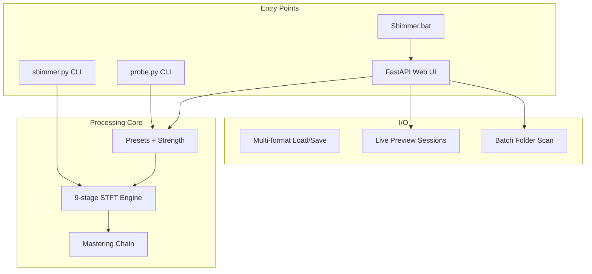

# Shimmer — Complete Feature Reference

Shimmer is an offline, local, deterministic tool for removing the high-frequency
artifacts that AI music generators leave behind: metallic "shimmer" fizz,
narrow-band birdies and whistles, amplitude-modulated hash flicker, and periodic
"checkerboard" comb textures. This document is the authoritative catalog of
every feature in the tool, sourced directly from the codebase.

Related docs: [README.md](README.md) for quick start and project layout.

## Contents

1. [Overview](#1-overview)
2. [Entry points and launch](#2-entry-points-and-launch)
3. [Audio I/O](#3-audio-io)
4. [DSP processing engine](#4-dsp-processing-engine)
5. [Presets](#5-presets)
6. [Auto-detect and analysis](#6-auto-detect-and-analysis)
7. [Mastering chain](#7-mastering-chain)
8. [Web UI](#8-web-ui)
9. [HTTP API reference](#9-http-api-reference)
10. [CLI reference](#10-cli-reference)
11. [Batch processing](#11-batch-processing)
12. [Job system and infrastructure](#12-job-system-and-infrastructure)

---

## 1. Overview

- **Purpose:** remove narrowband flickering high-frequency artifacts (default
  band 5.1–7.2 kHz) produced by diffusion models, VAE/neural vocoders, and
  phase-reconstruction errors. Presets extend coverage from ~2 kHz (Vocal
  Glaze) up to 20 kHz (Deep Scrub), plus two full-band tonal-rescue presets.
- **Beyond cleanup:** a true mastering chain (LUFS target, corrective tone
  curve, true-peak limiter), a user parametric EQ, and a Remix tab (Demucs
  stem separation + per-stem character effects) — one tool from raw AI
  render to release-ready file.
- **Architecture:** Python backend (FastAPI + NumPy/SciPy STFT DSP) with a
  native HTML/ES-module frontend. No Gradio.
- **Execution model:** single-user, single job in flight. CPU-heavy processing
  runs on a thread executor so the event loop stays responsive
  ([server.py](server.py)).
- **Determinism:** processing is fully deterministic; the only randomness
  (noise resynthesis phase) is seeded via the `seed` parameter.


```mermaid
flowchart TB
  subgraph entry [Entry Points]
    BAT[Shimmer.bat]
    CLI[shimmer.py CLI]
    PROBE[probe.py CLI]
    WEB[FastAPI Web UI]
  end
  subgraph core [Processing Core]
    PRESET[Presets + Strength]
    ENGINE[9-stage STFT Engine]
    MASTER[Mastering Chain]
  end
  subgraph io [I/O]
    LOAD[Multi-format Load/Save]
    BATCH[Batch Folder Scan]
    PREVIEW[Live Preview Sessions]
  end
  BAT --> WEB
  CLI --> ENGINE
  WEB --> PRESET --> ENGINE --> MASTER
  WEB --> PREVIEW
  WEB --> BATCH
  PROBE --> PRESET
```

---

## 2. Entry points and launch

### Web UI launcher — [Shimmer.bat](Shimmer.bat)

- Creates and reuses a `.venv` via `uv`; installs
  [requirements.txt](requirements.txt) on first run.
- Probes that fastapi, uvicorn, numpy, scipy, soundfile, and pyloudnorm import
  cleanly before starting.
- Kills any prior process bound to port **7860** (netstat + PowerShell
  `Stop-Process`).
- Starts `uvicorn server:app --host 127.0.0.1 --port 7860` and auto-opens the
  browser at `http://localhost:7860` after a 2-second delay.

Manual launch:

```bash
pip install -r requirements.txt
python -m uvicorn server:app --host 127.0.0.1 --port 7860
```

### CLI — [shimmer.py](shimmer.py)

- `shimmer input output [options]` — input formats WAV/MP3/FLAC/OGG/M4A;
  output format inferred from the extension.
- Inline 40-character progress bar during processing.
- `--list-presets` prints all visible presets with descriptions.
- `--suggest INPUT` analyzes a file and prints the recommended preset and
  strength, the verified ranking (score, confidence, strength, residue,
  collateral, purity) with reasons, any second-pass suggestion and notes.
- Nearly every processing parameter is overridable via flags (see
  [Section 10](#10-cli-reference); a few advanced params are preset/API-only).

### Diagnostic CLI — [probe.py](probe.py)

- `python probe.py input [--outdir ...]` — standalone artifact analysis.
- Region selection with `--t0` / `--dur`, plus band and STFT parameters.
- Outputs `artifact.wav` (isolated flagged bins), `roi_band_spectrogram.png`,
  and `roi_residual_map.png` for manual diagnosis.
- Hosts `suggest_preset()`, used by the CLI `--suggest`, the API, and batch
  auto-detect.

---

## 3. Audio I/O

Source: [audio_io.py](audio_io.py)

| Capability | Details |
|---|---|
| Read formats | WAV, FLAC, OGG, AIFF via soundfile; MP3, M4A, AAC, MP4 via ffmpeg fallback |
| Write formats | Same set; lossless subtypes PCM_16 / PCM_24 / FLOAT; optional TPDF dither on PCM_16 |
| In-memory WAV | `encode_wav_bytes()` for live-preview payloads |
| Measurements | Peak and RMS in dBFS and linear (`measure()`) |
| Volume preservation | `preserve_volume()` — RMS-matched scaling when mastering is off; peak-limited, max 4× gain |
| Clip protection | `clip_protect()` normalizes to a 0.999 ceiling |
| Full pipeline | `process_file()` — read, process, optional mastering, write, optional diff file |
| Removed/diff signal | `(post-filtered dry − processed) × 5.0` so users can audition exactly what was removed |

ffmpeg on the system PATH is required for MP3/M4A/AAC; WAV/FLAC/OGG work
without it. The web UI's help Setup tab documents the install
(`winget install ffmpeg` on Windows).

---

## 4. DSP processing engine

Sources: [engine.py](engine.py), [dsp.py](dsp.py), [params.py](params.py)

`process(x, sr, p)` runs the STFT stage pipeline for `iterations` passes,
applies wet/dry mix, then post filters and edge fades.

### The 9-stage STFT pipeline (in `STAGE_REGISTRY` order)

| # | Stage | Enable param | Purpose |
|---|---|---|---|
| 1 | Expander | `expander` (bool) | Downward expander pushing quiet high-band tails further down |
| 2 | Denoise | `denoise` > 0 | Wiener-like spectral denoise with minimum-statistics noise PSD tracking |
| 3 | De-resonator | `deres` > 0 | Dynamic notch EQ on persistent narrow peaks, with persistence EMA and tonal-frame threshold boost |
| 4 | Shimmer | always on | Core stage: flags narrowband outliers above the local frequency median inside the target band and attenuates with a soft knee |
| 5 | De-harsh | `deharsh` > 0 | De-esser-style dynamic tamer comparing band energy against a mid-band reference |
| 6 | FlickerTamer | `flicker_tame` > 0 | Sub-band AM compressor; splits the band into independent sub-band compressors that squash rapid level swings (the defining "Suno hash" flicker). Intentionally ignores the transient gate |
| 7 | De-checkerboard | `decheck` > 0 | Detects and attenuates periodic spectral peaks from deconvolution upsampling ("checkerboard" grids) |
| 8 | Narrow-tone killer | `tone_kill` > 0 | Long-term per-bin EMA notcher for fixed whistles (e.g. 16 kHz / 17.8 kHz Suno tones); no per-frame gates by design |
| 9 | Noise resynth | `noise_resynth` > 0 | Random-phase blend to de-crystallize residual texture |

### Shared per-frame gates

- **Noise-likeness gate** (`flat_start` / `flat_end`) — spectral flatness maps
  each frame from tonal (skip) to noise-like (full processing).
- **Transient gate** (`flux_thr_db` / `flux_range_db`) — energy flux protects
  drum hits and consonants from being processed.
- **`steady_state_mode`** — when true, the Shimmer, De-harsh, De-checker,
  Denoise, and De-resonator stages skip the transient gate entirely. Use for
  steady-state artifacts (Suno hash, sustained sheen) where the gate would
  silently weaken cleaning on every hit.
- **Density gate** (`density_lo` / `density_hi` / `density_floor`) — protects
  broadband musical events; `density_floor` forces a minimum stage activity on
  dense frames (essential when "dense" *is* the artifact).

### Post-STFT time-domain filters

Applied by `apply_post_filters()` using primitives in [dsp.py](dsp.py):

- Subsonic highpass (`subsonic_hz`, 0 = disabled)
- High shelf cut/boost (`high_shelf_hz` / `high_shelf_db`)
- Presence shelf (`presence_hz` / `presence_db`)

### User parametric EQ ([eq.py](eq.py))

Separate from the automatic mastering tone curve: the user's creative
filter bank, applied in the pipeline **after** artifact cleaning and post
filters, **before** mastering — so the limiter always catches user boosts.

- Up to **12 bands**; types: bell, low shelf, high shelf, high-pass,
  low-pass, notch. Safety clamps: 20 Hz–20 kHz, ±18 dB, Q 0.1–18.
- Runs zero-phase (`sosfiltfilt`, forward + backward). The two passes
  square the magnitude response, so gain bands are **designed at half
  gain** and land exactly at the user's dB; pass/notch filters get their
  slope doubled (a 12 dB/oct biquad high-pass is effectively 24 dB/oct).
  The frontend curve renderer mirrors the same rule, so the drawn curve
  is exactly what is applied.
- Frontend ([static/js/eq.js](static/js/eq.js)): interactive curve editor
  — drag nodes, scroll to change Q, double-click to add/remove bands —
  with the track's analysis spectrum as a background silhouette, per-band
  chips, and 13 starting points at mastering scale, grouped in the
  menu with a one-line gloss each. Corrective: Rumble cut (high-pass
  28 Hz), Tighten lows (high-pass, −1.5 dB @ 65 Hz, −1 dB shelf @
  130 Hz), De-mud (−2 dB @ 300 Hz), Box cut (−1.5 dB @ 450 Hz), Smooth
  the top (−1.5 dB @ 5.5 kHz, −0.5 dB shelf @ 10 kHz). Tonal: Tilt
  darker / Tilt brighter (±0.75 dB shelves pivoting near 1 kHz), Warmth
  (+1 dB @ 120 Hz, −1 dB @ 8 kHz), Open mids (+1 dB @ 1.5 kHz), Presence
  (+1.5 dB @ 3 kHz), Air, gentle (+1 dB shelf @ 10 kHz, greyed out when
  the render's cutoff is under 12 kHz), Vocal clarity. Creative: Lo-fi
  telephone. A preset replaces the current bands; every band stays
  editable.
- Participates in live preview, full processing, and batch (via the
  "Apply EQ from Master tab" checkbox, which reuses the persisted EQ
  settings).

### Suggested EQ (the Tone step) — [autoeq.py](autoeq.py)

A per-track corrective EQ plan, measured at Analyze time and applied in
the user EQ stage above. Analysis only: nothing here changes audio except
the verification run on a copy of the loudest excerpt.

How it decides (a producer's order of business):

1. **Judge the loud parts.** 3 s windows; "loud" = within 6 dB of the
   90th-percentile window RMS (at least 4 windows). Long tracks are
   sampled evenly (up to 96 windows). Shape = median 1/3-octave band
   power over the loud windows, relative to the 200 Hz–2 kHz median (the
   same scale as the mastering reference, `mastering._REF_DB`).
2. **Judge what the EQ will hear.** The server passes a `cleaner` that
   runs the chosen preset on the loudest 20 s; the balance is judged
   after that change and after the mastering tone curve when mastering
   is on (`tone_curve_db`), so the plan never corrects what cleaning or
   the tone match already handles. Bands at or above 0.9 × the render's
   cutoff are not judged and never boosted.
3. **Fix first** (narrow, subtractive, verified):
   - *Ringing tone*: on a 96-points-per-octave grid, spectrum minus its
     ±1/6-octave median; a peak ≥ 8 dB above that baseline, ≤ 1/8 octave
     wide, present (≥ 5 dB) in ≥ 60 % of loud windows, with no partner at
     1/3, 1/2, 2/3, 3/2, 2 or 3 × its frequency (a played note has
     partners), not within 3 % of a static-repair notch, never under
     120 Hz, and not more than 40 dB under the loudest region. Bell, Q
     4–10 from the measured width, cut = half the prominence, 4 dB max,
     two at most.
   - *Mud stack*: the 200–500 Hz band whose residual against a line
     fitted through 100 Hz–1 kHz (log-frequency) is ≥ 2 dB in ≥ 60 % of
     loud windows, unless a narrow tone dominates that band. Bell Q 1.4,
     cut = 0.6 × excess, 2.5 dB max.
   - *Harsh band*: the 2–5 kHz band ≥ 2.5 dB over a line fitted through
     1–8 kHz, persistent. Bell Q 1.2, cut = half the excess, 1.5 dB max.
4. **Shape second**: six regions (sub 20–60, bass 60–150, low mids
   150–500, mids 500–2k, presence 2–6k, air 6k+). A region outside the
   family range gets one broad move toward the range (¾ of the amount
   outside, 2 dB max, 0.5 dB minimum): bell 40 Hz, low shelf 100 Hz,
   bell 300 Hz, bell 1 kHz, bell 3.5 kHz, high shelf 8 kHz. Sub and bass
   moving the same way become one low shelf at 90 Hz. Regions the Fix
   layer already cut get no shape move. Three shape moves at most; cuts
   first; boosts ≤ +1.5 dB (≤ +1 dB in presence and air; no air lift
   when the cutoff is ≤ 11 kHz).
5. **Budget and check**: four moves total, cuts before boosts. The plan
   is run (zero-phase, through `eq.apply_eq`) on the loudest 20 s (the
   cleaned copy when a cleaner was given); integrated LUFS and true peak
   before and after give PLR before/after. If peaks rise more than
   loudness by over 1 dB, boosts are halved, then dropped.

**Families** (`FAMILIES`): per-region offset from neutral and tolerance
(± dB). Neutral 0 / ±4 sub, ±3 bass, ±2.5 low mids, ±2 mids, ±2.5
presence, ±3 air; Pop, Hip-hop / Trap (sub +4, bass +3, top −1), EDM /
Dance, Rock / Metal, R&B / Soul, Acoustic / Folk, Lo-fi / Ambient,
Cinematic / Orchestral. Offsets say where a family usually sits;
tolerances say how far a track may stray before a move is worth making.
No reference tracks and no genre detection.

**Result** (`plan_tone(...)`): `moves[]` (`type, freq_hz, gain_db, q,
enabled, layer fix|shape, kind resonance|mud|harsh|balance, region,
reason`), `regions[]` (deviation from the family center, tolerance,
status, deviation after the plan), `shape` (29-band measured / judged /
center / tolerance), `verify` (excerpt, LUFS and true peak before/after,
PLR, `plr_shift_db`, `limiter_safe`, `boosts_scaled|dropped`), `summary`
(8th-grade sentence), `eq` (ready for `eq_params_from_json`).

### Deterministic repairs (run first) — [repair.py](repair.py)

Placed after Trim and before the tone curve and crossover, so every
adaptive detector downstream sees a signal without clicks or generator
lines (docs/PLAN.md Section 2, approved 2026-09-04).

- **De-click / de-crackle** (`declick` 0..1, `dc_min_hz` 2000,
  `dc_order` 32, `dc_max_ms` 2.0, `dc_pad` 8). The band above `dc_min_hz`
  is whitened with a per-second linear predictor; samples whose residual
  exceeds a robust threshold (9σ at 0 down to 4σ at 1) are flagged;
  padded runs are kept only if short and *isolated* (the level after the
  run is within 6 dB of the level before, and the run peaks 10 dB above
  both), which rejects drum hits and consonant onsets; kept runs are
  re-synthesised from the predictor forwards and backwards and
  cross-faded. Regions dense with accepted clicks (> 40/s) get a second,
  lower-threshold pass (crackle). Only the high-band component changes.
  On in Sibilance Rattle (0.6) and Deep Scrub (0.5); an Advanced slider
  and `--declick` expose it everywhere. `declick` is on the
  preset-strength whitelist.
- **Static repair** (`repair.NotchPlan`, `apply_static_repair`). The
  whole-file scan (`detect.scan_fixed_lines`: 25th-percentile excess over
  a 51-bin envelope, plus comb teeth by frequency-axis autocorrelation
  with a neighbour test) yields fixed lines; `plan_from_lines` keeps
  those with ≥ 6 dB persistent excess (below 3 kHz: ≥ 10 dB and ≥ 90 %
  duty), never below 2 kHz, at most 24. Line frequencies are refined to
  sub-bin accuracy. Each becomes a four-bin-wide (about 43 Hz) RBJ
  peaking cut applied zero-phase to both channels; depth follows the
  line's 90th-percentile excess (how strong it gets in the loud parts of
  the song), capped at 30 dB. The upload endpoint scans once per session, Analyze
  returns the plan (`repair_plan`) and the Master tab lists the lines
  with checkboxes; the request's `repair` block carries the choice
  (`{"enabled": false}` skips the stage, an explicit `notches` list is
  validated and used, otherwise the server scans). Batch (`static_repair`,
  default on), Remix cleaning and the CLI (`--no-static-repair` to skip)
  scan automatically. Both repair diffs are folded into the Removed
  signal.
- **Bandwidth cutoff** (`estimate_cutoff_hz`, `Params.cutoff_hz`). Welch
  spectrum, trend fitted on 4–10 kHz; the cutoff is the lowest frequency
  above 8 kHz sitting ≥ 30 dB under trend for the rest of the band with
  real content in the octave below. `analyze_track` reports it, the tone
  curve never boosts at or above 0.9× cutoff, and a positive shelf in the
  post filters is followed by a zero-phase low-pass at the cutoff.

### Fine-grid dynamic pass — [finepass.py](finepass.py)

Runs on each M/S high-band channel *before* the coarse 4096/1024 engine
(docs/PLAN.md Section 2, placement approved 2026-09-04). A 1024-point
window at hop 256 (about 23 ms / 6 ms at 44.1 kHz) catches fast events
without smearing; the coarse pass then sees a steadier signal.

- **Flicker Tamer** moves here (`flicker_tame`, `ft_*`). Two things
  were wrong with the coarse version. At 4096/1024 the frame rate is
  43 Hz, so modulation above about 23 Hz averaged out inside a frame; on
  the fine grid it sees 10–50 Hz. And it measured the on-phases of the
  flicker against the running mean, which a half-duty flicker sits only
  3 dB above, so it could never cut more than about 1 dB. The fine
  version measures each sub-band against a floor follower (drops at
  once, rises `ft_floor_up_db_s` = 20 dB/s) and engages only where the
  band's fine-time spread (std of the detrended dB envelope over
  `ft_release_ms`, hits masked out) says flicker is present
  (`ft_flicker_min_db` 1.5 → `ft_flicker_full_db` 4.0), so steady cymbal
  wash is left alone. Gated by a fine-grid transient hold on the high
  band (flux > 9 dB → 30 ms hold, 150 ms release). When the fine pass
  runs, the coarse Flicker Tamer is disabled for that channel so the
  same flicker is not compressed twice.
- **Spectral de-esser** (`deess` 0..1, `de_start_hz` 4000, `de_end_hz`
  10000, `de_ref_*` 1000–4000, `de_thr_db` 6, `de_slope` 0.6,
  `de_max_att_db` 8, `de_attack_ms` 1, `de_release_ms` 40,
  `de_bin_med_bins` 31, `de_bin_excess_db` 3). When the band rises more
  than `de_thr_db` above its reference the band is cut like a de-esser,
  weighted per bin: bins above the band's 31-bin median spectrum take up
  to 1.5× the cut, bins below take down to 0×. Not gated by the transient
  hold. On in Sibilance Rattle (0.6), Deep Scrub (0.4) and Vocal Glaze +
  Top End (0.3); Advanced slider "De-esser". `deess` and `de_max_att_db`
  are on the preset-strength whitelist.
- `fine_pass` (default on), `fine_n_fft` 1024, `fine_hop` 256. Long files
  are processed in 90 s chunks with a 0.5 s lead-in so the envelope
  followers settle before each audible region.
- **De-harsh per-bin weighting** (`dh_per_bin` 0.5 default,
  `dh_bin_med_bins` 31): the coarse De-harsh keeps its band-level
  trigger, but the cut is weighted per bin the same way, so a glazed
  overtone is cut harder than the band around it.

### Stage reporting

`clean_and_master(..., stage_callback=fn)` calls `fn(key, label, detail)`
as each chain stage starts: `repair`, `pre` (mastering on), `split`,
`fine` (when the fine pass runs) and `engine` per M/S channel (detail
"Mid channel" / "Side channel"), `recombine`, `post` (label adds "and
your EQ" when bands are active), `master` (mastering on). The server adds
`edit` (explicit trim points), `level` (preserve volume) and `export`
(writing the file and tags) around it and pushes every stage down the
job's progress stream, which the processing window draws as the live
chain ([static/js/progress-chain.js](static/js/progress-chain.js), one
module shared by Clean & Master, stem separation and the remix render).
Separation reports `setup`, `separate` and `load`; the remix render
reports `mix`, `analyze` (auto preset), the chain phases and `export`.
Tests: `tests/test_pipeline_stages.py`.

### Pipeline-level controls

- **Iterations** (`iterations`, 1–3): re-runs the full pipeline on the previous
  pass's output. Detectors re-converge on the cleaner background; often the
  difference between "almost gone" and "gone" on stubborn hash.
- **Pre-analyze** (`pre_analyze` + `pa_*`): optional two-pass mode; a cheap
  full-file scan builds a per-bin attenuation mask (long-term magnitude excess
  plus AM depth), applied as a multiplicative pre-filter in the main pass.
  Eliminates long-EMA warmup error.
- **Diagnostic** (`diagnostic`): computes before/after 5–8 kHz band energy and
  AM depth plus the top surviving narrow peaks; surfaced in job metrics and
  the UI metrics strip.
- **Wet/dry mix** (`mix`, 0..1).
- **Padding and fade** (`pad`, `fade_ms`): STFT edge padding and output fades.
- **Preset strength** (0..2): `apply_preset_strength()` in
  [params.py](params.py) linearly scales a whitelist of amount-style fields
  (stage strengths, dB ceilings, density floors, air cut, denoise floor,
  iterations) between the neutral baseline and the preset value, extrapolating
  past 100% with per-key safety clamps. Structural fields (band edges, time
  constants, thresholds, `mix`) are deliberately untouched.

### Full parameter reference

Every tunable lives in the `Params` dataclass in [params.py](params.py).
Defaults shown below.

**Shimmer band:** `start_hz` 5100, `end_hz` 7200, `edge_hz` 200 (cosine taper).

**STFT:** `n_fft` 2048, `hop` 512.

**Detection and gating:** `flat_start` 0.25, `flat_end` 0.70, `freq_med_bins`
9, `thr_db` 8.0, `slope` 0.6, `density_lo` 0.02, `density_hi` 0.15,
`density_floor` 0.0, `flux_thr_db` 6.0, `flux_range_db` 8.0,
`steady_state_mode` false.

**Creative:** `noise_resynth` 0.0, `mix` 1.0, `pad` true, `fade_ms` 5.0.

**Spectral denoise (`dn_*`):** `denoise` 0.0, `dn_start_hz` 1500,
`dn_end_hz` 16000, `dn_edge_hz` 200, `dn_floor_db` −18, `dn_psd_smooth_ms` 50,
`dn_minwin_ms` 400, `dn_up_db_per_s` 3, `dn_attack_ms` 5, `dn_release_ms` 120,
`dn_freq_smooth_bins` 3.

**De-resonator (`deq_*`):** `deres` 0.0, `deq_start_hz` 300, `deq_end_hz`
12000, `deq_edge_hz` 150, `deq_freq_med_bins` 31, `deq_thr_db` 6.0,
`deq_slope` 0.7, `deq_max_att_db` 8, `deq_density_lo` 0.03, `deq_density_hi`
0.20, `deq_density_floor` 0.0, `deq_persist_ms` 600, `deq_persist_thr_db` 2.5,
`deq_freq_smooth_bins` 5, `deq_tonal_boost_db` 6.

**De-harsh (`dh_*`):** `deharsh` 0.0, `dh_start_hz` 5000, `dh_end_hz` 9000,
`dh_edge_hz` 250, `dh_ref_start_hz` 1000, `dh_ref_end_hz` 4000, `dh_thr_db`
6.0, `dh_slope` 0.5, `dh_max_att_db` 6, `dh_attack_ms` 5, `dh_release_ms` 120.

**Narrow-tone killer (`tk_*`):** `tone_kill` 0.0, `tk_start_hz` 3500,
`tk_end_hz` 20000, `tk_long_ms` 2000, `tk_freq_med_bins` 51, `tk_thr_db` 3.0,
`tk_slope` 5.0, `tk_max_att_db` 20, `tk_warmup_ms` 500,
`tk_freq_smooth_bins` 1.

**FlickerTamer (`ft_*`):** `flicker_tame` 0.0, `ft_start_hz` 4500,
`ft_end_hz` 12000, `ft_n_bands` 6, `ft_edge_hz` 100, `ft_attack_ms` 3,
`ft_release_ms` 250, `ft_thr_db` 1.5, `ft_slope` 0.85, `ft_max_att_db` 18.

**De-checkerboard (`cb_*`):** `decheck` 0.0, `cb_start_hz` 3000, `cb_end_hz`
16000, `cb_min_spacing_hz` 80, `cb_max_spacing_hz` 600, `cb_peak_thr_db` 4,
`cb_max_att_db` 8, `cb_persist_ms` 400.

**Expander (`exp_*`):** `expander` false, `exp_start_hz` 3000, `exp_end_hz`
8000, `exp_threshold_db` −45, `exp_ratio` 2.0, `exp_attack_ms` 10,
`exp_release_ms` 150.

**Post filters:** `high_shelf_hz` 0, `high_shelf_db` 0, `subsonic_hz` 0,
`presence_hz` 0, `presence_db` 0 (0 = disabled).

**Pipeline control:** `iterations` 1, `pre_analyze` false (`pa_start_hz` 4000,
`pa_end_hz` 14000, `pa_n_fft` 4096, `pa_hop` 2048, `pa_max_seconds` 60,
`pa_freq_med_bins` 51, `pa_thr_db` 3, `pa_max_att_db` 18, `pa_am_weight` 1.0),
`diagnostic` false, `seed` 0, `debug` false.

**CLI coverage note:** the following are *not* exposed as CLI flags and are
reachable only through presets or API `overrides`: `density_floor`,
`steady_state_mode`, `tone_kill` and all `tk_*`, `flicker_tame` and all
`ft_*`, `iterations`, `pre_analyze` and all `pa_*`, and `diagnostic`.

---

## 5. Presets

Source: [presets.py](presets.py). Default preset: `generic`. Presets are
named for the artifact shape they target, not the model version that produced
it.

### 19 visible presets

| Key | UI label | Target artifact |
|---|---|---|
| `generic` | Generic | Safe defaults for unknown sources; moderate narrow-tone killer for fixed Suno whistles |
| `suno_hash` | Suno Hash (5-12 kHz Flicker) | AM-modulated narrowband hiss; FlickerTamer-led, broadband stages kept gentle |
| `cymbal_sheen` | Cymbal Sheen | Sustained tonal high tone (8–14 kHz) that never decays; tone-killer-led |
| `laser_whistle` | Laser Whistle | Thin, intermittent narrow-band tonal chirps (9–15 kHz) |
| `air_brittle` | Brittle Air | Glassy top end above 12 kHz while mids stay clean |
| `sibilance_rattle` | Sibilance Rattle | Harsh "sss"/"tss" bursts on vocals (6–10 kHz) |
| `cymbal_chatter` | Cymbal Chatter | Repetitive "ta-ta-ta" rattle on hi-hats and percussion |
| `broadband_fizz` | Broadband Fizz | Constant fuzzy haze across the brilliance band (8–18 kHz) |
| `checkerboard_grid` | Checkerboard Grid | Faint deconvolution comb / ringing texture |
| `reverb_flutter` | Reverb Flutter | Reverb tails that grain instead of smoothing |
| `vocal_glaze` | Vocal Glaze | Shimmery glaze coating vocal harmonics (2–8 kHz) |
| `vocal_glaze_plus` | Vocal Glaze + Top End | Vocal Glaze + Suno Hash combined in one pass (2–12 kHz) |
| `echo_sheen` | Echo Sheen | Signal-correlated shimmer/hiss shadowing the content |
| `presence_haze` | Presence Haze | Smooth noise-like haze in the 3–8 kHz presence band |
| `phantom_cymbal` | Phantom Cymbal | Washy metallic cymbal wash in the 4–10 kHz band |
| `harsh_veil` | Harsh Veil | Gritty texture across the upper mids (4–12 kHz) |
| `deep_scrub` | Deep Scrub | Maximum-strength wide-band cleanup (3–18 kHz) |
| `muddy_boxy` | Muddy / Boxy (De-Mud) | Congested 200–500 Hz low-mid buildup ("cardboard box" mixes). Works through gentle static EQ, not STFT surgery — the band-split pipeline never sends low-mids through the artifact engine |
| `dark_mix_rescue` | Dark Mix Rescue (Brighten) | Dull, behind-a-blanket mixes: high-shelf air lift + presence lift + mud cut, paired with moderate high-band cleaning because brightening exposes the hash the darkness was hiding |

Each preset's factory docstring (returned by `/api/presets` and
`--list-presets`) explains the artifact signature and which stages are
emphasized.

### 8 legacy hidden aliases

Version-named keys remain resolvable so existing CLI calls, saved settings,
and scripts keep working. They never appear in UI dropdowns (`visible: false`
in the API).

| Alias | Maps to |
|---|---|
| `suno_v3` | `laser_whistle` |
| `suno_v3.5` | `laser_whistle` |
| `suno_v4` | `cymbal_chatter` |
| `suno_v4.5` | `broadband_fizz` |
| `suno_v5` | `checkerboard_grid` |
| `suno_v5_pro` | `air_brittle` |
| `suno_v5.5` | `reverb_flutter` |
| `suno_cymbal` | `cymbal_sheen` |

Saved settings that reference an alias are migrated to the canonical key on
load ([settings_store.py](settings_store.py)).

---

## 6. Auto-detect and analysis

Source: [probe.py](probe.py)

Source: [detect.py](detect.py) (scorer), [probe.py](probe.py) (`suggest_preset`
wrapper, region diagnostics)

- `suggest_preset(path)` returns the best-matching artifact preset **with a
  recommended preset strength**, a ranked list of up to 6 matches (each with
  its own strength, confidence, reason and verification numbers), an optional
  second-pass suggestion, tonal-balance notes, and the intensity timeline.
- **Stage 1 — evidence scan** (whole file, up to 300 s, non-overlapping
  4096-pt frames, power summed over L/R so side-only artifacts cannot cancel
  as they would in a mono mix). Calibrated measurements in dB or fractions:
  steady narrow tones (25th-percentile excess over a 51-bin envelope, plus
  duty cycle; flicker is measured on its own 1024/256 grid so 10–50 Hz hash
  modulation is visible),
  spectral balance (top tilt, presence, upper-mid, mud, dullness), and on the
  hottest 5 s window at 1024 hop: sub-band amplitude flicker vs. the body,
  comb spacing, sibilance bursts, high-band periodicity beyond the beat,
  decay-tail residue, intermittent ringing, presence/body correlation and
  band flatness. These give each preset a *prior* and its evidence phrase.
- **Stage 2 — verification** (hottest window). Every artifact preset is run
  through the real cleaning pipeline (`clean_and_master`, no mastering / EQ)
  and the *removed* signal is split into artifact-like energy (cells ≥ 2 kHz
  that are neither transient hold windows nor sustained musical partials
  below 10 kHz) and protected energy (body < 2 kHz ×3, transients, partials).
  Verified score = benefit × quality: benefit ramps the artifact-like removal
  from −45 to −20 dB re. the top-end energy but is penalised 1.5 dB per dB
  past −18 dB (removing more than a plausible share of the top end is
  over-processing, not residue); quality ramps purity (artifact share of
  what was removed) from 0.5 to 0.95. Blended 80/20 with the prior.
- **Strength** — the top picks are re-run at 50/100/150/200 % (top pick also
  ±25 % around its choice) and the *gentlest* strength within 0.75 dB of the
  best net benefit wins, guarded so collateral may not rise more than 3 dB or
  purity fall more than 0.1 versus 100 %. Batch auto-detect applies it through
  `apply_preset_strength` (the batch strength slider multiplies it), Remix
  auto-clean applies it, and the Single File tab sets the Preset strength
  slider when a match is applied.
- **Tone kill** — steady tones found by the scan (≥ 6 dB excess) are
  re-measured in the processed output; the share of their excess removed
  carries up to 40 % of the verified score. When the winner still leaves a
  tone more than half intact, a note names the frequency, says whether it
  sits in the center (Mid is cleaned at 20 %, so it is largely out of reach)
  and points to a Parametric EQ notch.
- **Second pass** — the runner-ups are tried on the winner's cleaned output;
  if one still removes ≥ 40 % as much residue at ≥ 80 % purity and at least
  −26 dB re. the top end, it is reported as `follow_up`.
- A per-second top-end intensity timeline (3–16 kHz level against the body,
  normalised per track) is returned; the UI draws it as the "Noise over
  time" strip, parks the live-preview loop on the worst stretch, and the
  verification window is chosen from it.
- Falls back to `generic` when the top score is below 0.05 or the best trial
  clean removes less than −48 dB re. the top end.
- Cost: roughly 25–30 short pipeline runs, about 8–15 s per track.
- `analyze_track()` ([mastering.py](mastering.py)) adds a loudness/spectrum
  snapshot: integrated LUFS, LRA, true peak, and a 1/3-octave long-term
  spectrum.
- Exposed via: the Analyze button in the UI, `POST /api/suggest` and
  `POST /api/analyze`, CLI `shimmer --suggest`, and batch `auto_detect: true`.
- `analyze_region()` isolates flagged bins into `artifact.wav` plus
  spectrogram/residual PNGs for manual diagnosis (standalone probe.py CLI).

---

## 7. Mastering chain

Source: [mastering.py](mastering.py)

Single-pass mastering chain. The corrective tone curve is computed from the
RAW input analysis and applied BEFORE artifact cleaning (so EQ can never
re-boost what the cleaner removed); the level chain runs after cleaning:

| Step | Details |
|---|---|
| 1. Tone curve (pre-clean) | Analysis-driven 1/3-octave correction toward a neutral reference, applied zero-phase in the STFT domain. The track is measured as band **power** per 1/3-octave band relative to its own 200 Hz–2 kHz median; the reference (`_REF_DB`) is the same kind of number for released music (after Pestana, Ma, Reiss, Barbosa, Black, AES 135, 2013: about −5 dB/oct from 100 Hz to 4 kHz in the raw spectrum, flatter in recent decades; in band-power terms about −1.5 dB/oct, steeper above 4 kHz, rolling off under 60 Hz). Shape against shape, so only the difference matters. Bounds: +2.0 / −3.0 dB, boosts capped at +0.5 dB in the 5–12 kHz harshness band, no boost at or above 0.9 × the render's cutoff. Scaled by `eq_strength`/`intensity`; the warm↔bright `tilt` (±2 dB smooth tilt, 5 positions) rides on top within the same bounds |
| 2. DC removal + highpass | `hp_hz`, default 25 Hz (zero-phase Butterworth) |
| 3. LUFS gain | One static gain toward the target integrated loudness — measured once, applied once, no iterative passes |
| 4. Soft peak shaper | Transparent below the knee; smoothly compresses the top ~2 dB so the limiter only shaves the last fraction of a dB |
| 5. True-peak limiter | Lookahead brickwall with 4× oversampled true-peak detection |

`MasterParams` ([params.py](params.py)): `enabled` (true), `target_lufs`
(−14.0), `ceiling_dbtp` (−1.0), `eq_strength` (0.55), `intensity`
(low/med/high, mapping to EQ strength 0.25/0.55/0.85), `tilt`
(brightest/bright/neutral/warm/warmer), `hp_hz` (25), `lookahead_ms` (2.0),
`release_ms` (50).

Loudness target presets (`LOUDNESS_TARGETS`): `streaming` −14 LUFS, `loud`
−11 LUFS, `cd` −9 LUFS.

**Codec-aware export ceilings** (`get_export_ceiling_dbtp`): unless the user
sets an explicit ceiling, exports use −1.0 dBTP for lossless (WAV/FLAC) and
−1.5 dBTP for lossy (MP3/OGG/M4A/AAC/Opus) so decoders can't clip. Applied
on the web single/batch/remix paths and by the CLI (from the output
extension). TPDF dither is applied on PCM_16 exports.

Analysis exports: `measure_loudness()` (integrated LUFS, LRA, true peak),
`analyze_spectrum()` (1/3-octave long-term spectrum: `band_db` mean
per-bin level, `band_power_db` total band power, `rel_db` band power
relative to the 200 Hz–2 kHz median; all true dB, 10·log10 of power),
`analyze_track()` (combined snapshot). The mastering report (before/after LUFS, true peak,
limiter max gain reduction) flows into job metrics and the UI metrics strip.

---

## 8. Web UI

Sources: [static/index.html](static/index.html) and the ES modules in
[static/js/](static/js/) (`main.js`, `single.js`, `batch.js`, `visualizer.js`,
`trim.js`, `controls.js`, `preset.js`, `help.js`, `settings.js`, `api.js`).

### Application shell

- Three main tabs with ARIA tablist roles: **Single File** (default),
  **Remix**, and **Batch**.
- Dark purple/gold theme ([static/css/tokens.css](static/css/tokens.css));
  viewport-locked layout that degrades to a scrollable single column below
  1100 px.
- First-visit onboarding: the Quick start help opens automatically once
  (tracked in `localStorage`).
- Optional “Remember settings next time” under Trim silence (off by
  default); when on, Single File choices restore on the next visit.

### Single File workflow (3-step wizard: Upload, Analyze, Clean & Master)

**Upload**
- Dropzone with drag-and-drop and click-to-pick; accepts `.wav`, `.mp3`,
  `.flac`, `.ogg`, `.m4a`.
- Drag-over highlight; after selection the dropzone collapses to a compact
  chip and the whole window becomes a drop target.
- The Clean & Master button stays disabled until a file is selected.

**Trim (top & tail)**
- Detection is two-pass ([edges.py](edges.py)): an absolute pass wants a
  gap below −75 dBFS between the burst and the music (renders with real
  digital silence); a relative pass finds where the music proper starts
  (within 20 dB of the scan's loudest point), estimates the head's own
  quiet level as the 20th percentile of the peak envelope before it, and
  looks for a burst standing ≥ 10 dB above that level with a quiet run
  after it. AI renders usually need the relative pass: their heads sit
  at −60 to −70 dBFS, never at silence.
- Every upload is scanned at both ends for render artifacts — the short
  burst generators leave at the very top of a track, typically 15–35 ms
  around −50 dBFS. These sit *above* the −60 dBFS silence gate, so the
  "trim silence" option keeps them, and they are invisible on a linear
  waveform.
- A finding is always surfaced: an amber notice names what was found
  (length, peak level, gap before the music) and offers "Use suggested cut"
  or "Review". A clean scan is surfaced too, as a green "edges clean" chip
  in the card header. Detection **never** edits audio on its own.
- The Trim view draws a dB envelope (floor −100 dBFS) rather than a
  waveform, so quiet artifacts are actually visible. The detected region is
  shaded, and the discarded region is dimmed behind the marker.
- Head/Tail toggle, zoom presets (250 ms / 1 s / 3 s / 10 s), click or drag
  to place the marker, ←/→ nudge 1 ms (Shift 10 ms), numeric ms fields, and
  Audition to play the original from the marker.
- Suggested cuts land 10 ms past the point where the artifact's slope has
  reached the floor (the middle of the gap's noise band), so the tick and
  its decay go and the quiet floor stays; removing that floor is the
  separate "Trim leading/trailing silence on export" setting, mirrored in
  the Trim card. Cuts snap to the nearest zero crossing, and a 5 ms fade
  is applied at each new edge so the cut itself cannot click.
- An armed cut shows in the card header while the panel is closed, and the
  applied cut is reported on the done banner ("Trimmed 40 ms head").
- The cut is applied to the source *before* cleaning and mastering, so a
  head click never drives the limiter or skews loudness measurement.

**Preset and analysis**
- Preset dropdown populated from `/api/presets` (visible presets only), with
  an expandable description under it.
- Analyze button runs the verified auto-detect (Section 6) plus loudness
  analysis, applies the top preset *and its recommended strength*, and
  shows the result as a verdict. The applied match is a hero block: name,
  strength as a big number, a solid amber Applied pill, the match bar and
  the reason in full. It is whichever match is applied, so it moves when
  you click Apply on another; the other matches (up to five) sit in a
  quiet ranked table (rank, name, match bar, strength, Apply; reason on
  hover). Apply also moves the Preset strength slider. When a runner-up
  still finds residue on the winner's output, a two-pass plan card lays
  out both passes by name ("Pass 1: <applied> now · Pass 2: <follow-up>"),
  shows the settings pass 1 needs as state rows (mastering off, Preserve
  volume on) and offers one button: "Set up pass 1" flips them, then
  "Run pass 1: <applied> (Clean)" starts the run. When that run finishes,
  "Continue to pass 2" loads its result in place (named like an export,
  {stem}_{preset}_processed_{id}.wav), applies the pass-2 preset, turns
  mastering on and shows the pass-2 card immediately, ready to run, with
  an optional "Analyze this result first" button. Run both passes (and
  Continue) hand off to pass 2 inside the processing window, which stays
  up the whole way: "Pass 1 done" over a busy bar while the result loads
  and the EQ is planned, then a big 3-2-1 count in front of the pass-2
  chain (the wordmark's face in the aurora gradient, an amber ring
  draining, Go in green), so the gap never reads as the end; Stop here
  or Esc keeps the loaded result and runs nothing. A loaded file whose name matches an export is treated as
  pass 1's output: the dropzone notes "Shimmer output · pass 1 was …",
  and the card becomes "Pass 2: <follow-up>" (mastering on, Preserve
  volume off) whose button applies the pass-2 preset and runs
  Clean & Master. Tonal-balance and cutoff
  notes sit in a Details list. Below: the "Noise over time" strip, one bar
  per second of top-end noise, amber for the worst stretches, with a time
  axis; click it to jump there (moves the loop window while Live is on,
  seeks the player otherwise). Takes roughly ten seconds.
- Workflow stepper: three equal segments across the page (1 Upload,
  2 Analyze, 3 Clean & Master). Each stage has one colour everywhere it
  appears (1 teal, 2 cyan, 3 amber); the current stage has a filled badge
  and a full underline, done stages an outlined badge, pending stages
  grey. Stage buttons carry the same number badge and colour, and step 3
  reads "Clean" when mastering is off.
- Dock status line under the two stage buttons: the current preset,
  strength, and "master to <target>" or "cleaning only", read from the
  live controls.
- Analyze also lives in the dock above Clean & Master (cyan, step 2). It
  runs the analysis and jumps to the card; once done it becomes "View
  analysis" (still cyan, outlined, with a check). Clicking it then, or
  the card's Expand button, opens the Analysis workspace: a sheet that
  slides up over the page (four status tiles on top: Applied, Second
  pass, Fixed tones, Top end; then the timeline, the hero and table left,
  next step, details and fixed tones right) with "Loop the worst part"
  and Close. The transport stays visible below it; Escape or a new upload
  closes it.
- Preset strength slider 0–200% (step 5%): visible sliders re-scale live in
  the client, hidden amount keys scale server-side via the same whitelist.
- Clean & Master with a pending second-pass suggestion and mastering on
  asks first with three choices: turn mastering off for this pass
  (Preserve volume on), master anyway, or cancel (nothing runs; Escape
  also cancels). The progress window is titled "Cleaning" or
  "Cleaning & mastering" to match the run.

**Mastering controls**
- Master for release toggle (default on), loudness target (Streaming −14 /
  Loud −11 / CD & Club −9 LUFS), tone match (Low/Medium/High), and tone
  tilt (Brightest/Bright/Neutral/Warm/Warmer).
- After Analyze, a readout shows input LUFS, true peak, and LRA.
- "Preserve volume" (in Output; also in Batch) keeps a cleaning-only pass
  at the original's level. It stays in view while mastering is on, greyed
  and locked, since the loudness target sets the level then.
- Trim leading/trailing silence on export (below −60 dBFS, keeps a short
  natural pad; playback stays full-length so A/B stays in sync).

**Equalizer card**
- The user parametric EQ (see Section 4) as an interactive curve editor;
  changes re-render the live preview like any other control.

**Output and processing**
- Output format: WAV 24-bit, FLAC, MP3 320k, OGG, M4A.
- Clean & Master runs full-file processing with an SSE-driven progress bar,
  then loads the results into the player.
- A green "Ready to download" banner appears with metric chips and the
  download link. Download filenames follow
  `{stem}_{preset}_{processed|removed}_{jobid8}{ext}`.
- The processing window ends on a **Download step**
  (`processModal.offerDownload` in `static/js/progress-chain.js`): the
  chain stays drawn as finished, and the progress lines give way to the
  file's name and size (`export.name`, `export.size_bytes` in the
  metrics), a primary button, an optional secondary one, Close and
  Escape. What the step does comes from the Settings tab (below). Pass 1
  of a two-pass plan gets no step: its window closes by itself, or the
  plan holds it for the hand-off.
- **Settings tab, Downloads** (`#tab-settings`): "Download automatically
  when a run finishes" presses the Download step's button for you.
  "Download location" is the browser's Downloads folder (default) or
  "This folder": the client sends the folder as `save_folder`, the
  server copies the export (the silence-trimmed variant when that is
  on) there as the job ends under the download filename, tags included,
  and the step leads with "Show in folder" (`POST /api/reveal`) with
  "Download a copy" beside it. The picker is `/api/browse-folder`, as
  in Batch. The banner says where the file went and keeps its Download
  button; a copy that failed shows as a warning chip and the step falls
  back to the browser download. Neither applies to pass 1 of a two-pass
  plan (the client sends no `save_folder` for it). The Signal Chain's
  Export stage carries a "saved to <folder>" badge, and the Output
  section points at Settings.
- "What changed" card ([report.py](report.py) measures,
  `static/js/report.js` draws): whole-file 1/6-octave spectra before and
  after the pass plus the removed signal, and a level-matched "after
  minus before" strip (level match = median change from 100 Hz to
  2 kHz). A one-line verdict names the deepest cut and its range, the
  largest change under 2 kHz and the level change; hover gives the
  numbers per band.
- Stat readout in three labeled rows. Loudness: LUFS in→out against the
  target, true peak, LRA, limiter max gain reduction, peak and RMS in→out,
  peak-to-loudness ratio in→out, stereo correlation in→out. Cleaning:
  5–8 kHz energy, flicker depth (AM depth as a percentage), narrow peaks
  left, clicks fixed, fixed tones notched, top-end cutoff. Job: edge
  trim, export trim, EQ bands, length (m:ss), sample rate, channels, and
  the export (format, bit depth, dither). Warnings (limiter pumping) get
  their own row.

**Advanced artifact controls (the Advanced pane)**
- A wide sheet (1060 px, full screen on phones), not a side drawer.
  Left: the controls in chain order, in sections with the Signal Chain's
  phase colours: Repair (De-click), Band (Start Hz, End Hz), Detection
  (Threshold, Slope), Cleanup tools (De-esser, Noise Reduction,
  De-resonator, De-harsh, Flicker Tamer, Comb Suppressor, Tone Notcher,
  Noise Resynthesis), Recombine (Mix), Post (Air cut). Labels are the
  chain's own terms with a plain-words gloss; each slider says what its
  two ends mean, so no group needs a paragraph. Right: a Focus panel
  that explains whatever is under the pointer or keyboard (what it does,
  move it right when, move it left when, typical range, the preset value
  against the current one) and lights its stage on a mini chain.
- The tick under every slider is the preset's value at the current
  strength (`presetToSliderValues`); a slider that differs is marked
  "changed", its section counts them, the header says "Generic · 100% ·
  2 controls overridden for this run", and Reset all appears. Double-click
  a slider to put it back on the preset; Shift + arrow keys move ten steps.
- Shows whether the Live loop is on, since that is how a change is heard.
- Source of truth: `CONTROL_SPEC` and `GROUPS` in
  [static/js/controls.js](static/js/controls.js); `renderControls` returns
  `getValues / setValues / setBaseline / getChanged / resetAll`. Closes
  via ×, backdrop click, or Escape.

**Player and visualizer** ([static/js/visualizer.js](static/js/visualizer.js))
- Three track tabs sharing one playhead: **Original** (enabled on upload),
  **Processed** and **Removed** (enabled after processing). Switching is
  instant and preserves the playhead.
- Two canvas modes: **Waveform** (per-column min/max peaks + RMS fill) and
  **Spectrogram** (real 1024-point FFT, Hann window, log-frequency rows,
  Inferno colormap) with the current shimmer band drawn as overlay lines.
- Click to seek; gold loop-window overlay during live preview.
- Transport in the bridge: back to start, back 5 s, play/pause, forward
  5 s, the clock, and a scrubber (click or drag to seek; cyan fill =
  playhead, amber band = Live loop window). Space, ←/→ and 1/2/3 keys
  still work.
- Canvas height follows the mode: 150 px in Waveform (a navigation strip),
  300 px in Spectrogram and Both, where vertical resolution matters.
- While playing: a 170 px live log-frequency analyzer with a 12 dB grid
  (0 dB = full-scale sine), frequency labels, a 4.5 dB/oct display tilt
  around 1 kHz so a mix reads roughly flat, shimmer-band shading, and a
  dashed ghost of the other A/B track's smoothed spectrum (Original behind
  Processed and the reverse). Under it, a momentary-loudness strip
  (BS.1770 K-weighting, 400 ms, from the audio being heard) with a target
  marker tied to the mastering target; hover for the LUFS value.
- Loudness-matched A/B toggle attenuates the louder track using the measured
  LUFS values (per-slice during Live preview, whole-file after a run),
  capped at 6 dB. The applied monitoring gain is shown next to the toggle
  ("Processed −2.2 dB", "(capped)" when the cap engaged); it never reaches
  the export.
- Keyboard shortcuts (suppressed while focus is in a form control): Space
  play/pause, 1/2/3 select track, Left/Right seek ±5 s.

**Live preview**
- Toggle loops a short window (5/10/15/20 s) and re-renders the processed and
  removed slices on every parameter change (debounced 250 ms).
- The file is uploaded once to create a preview session; the loop anchors
  automatically at the hottest artifact region from the analyze timeline, or
  manually via "Set from playhead".
- LRU cache of the last 20 renders makes parameter comparisons instant;
  track swaps use a ~15 ms Web Audio crossfade for gapless A/B.
- The Removed track gets a ~14 dB client-side audition boost, capped against
  the slice's own peak to avoid clipping.
- Mastering level parity: a slice is mastered with the static gain the
  whole file receives (`master(..., loudness_ref=...)`: whole-file raw LUFS
  plus the slice's own pre/post-clean offset), not normalised on its own.
  Without this a quiet verse previewed at the full target level, the
  Original/Processed delta ballooned, and the A/B match silently cut the
  Processed monitor by up to 6 dB.
- Status line shows idle / uploading / rendering / live / error. Preview
  exits when a full Clean & Master runs; the session is released on page
  unload.

### Signal Chain tab

Sources: [chain.py](chain.py), [static/js/chain.js](static/js/chain.js),
`POST /api/chain`.

- The view is generated, not hand-written. The Master tab exposes the
  exact state a Clean & Master click would send (preset, strength, slider
  overrides, mastering, EQ, preserve volume, trim silence, output format,
  whether a Trim cut is armed); `build_chain()` resolves it with the same
  functions as `/api/process` and returns the modules in the order
  `pipeline.py`, `engine.py` and `server.py` apply them.
- How it is drawn: stages flow left to right and wrap like text, with one
  continuous SVG wire that drops down and returns to the left edge at each
  row break (no horizontal scrolling; the wire follows the real card
  positions and redraws on resize). Each stage carries a `phase` (edit,
  repair, pre, split, fine, engine, recombine, post, level, master,
  export) with one hue per phase, moving around the wheel in signal order,
  used on the wire, the card's top rail, the phase label and the badges.
  Each stage also carries a `band` ([lo, hi] Hz, or null for whole-signal
  or time-only stages), drawn as a small log-frequency bar (40 Hz to
  20 kHz) with a tick at the crossover. Inactive stages are dashed with a
  one-line reason and a dashed wire into them. A summary sits on top
  (stages on, STFT size and passes, bypass point, the two gates, and a
  phase legend with on/total counts); a sticky detail panel beside the
  flow shows the selected stage's phase, number, larger band bar with
  axis labels, full text, every value, and the Advanced-drawer link.
- Modules: Trim → De-click → Static repair → Tone curve → Crossover →
  M/S → Pre-analyze mask → the nine STFT stages in registry order → Side
  width comp → Recombine + wet/dry → Post filters + fades → Parametric
  EQ → Preserve volume / clip protect → HP/DC → LUFS gain → Soft clip →
  True-peak limiter → Export. The repair modules show the de-click
  amount and threshold and the notch list the request carries ("3 lines",
  deepest line), and the tone curve / post filters show the cutoff cap. Each carries live badges (crossover in Hz, Mid/Side scale,
  stage bands, ceilings, strengths after preset-strength scaling) and an
  `active` flag; inactive modules are drawn dashed with the reason
  ("mastering is off", "this preset leaves it at zero").
- The gates row shows the flatness gate range, transient hold and
  release, the low-band bypass point, the STFT grid and pass count, and
  how many modules are active.
- Re-renders on every settings change while the tab is visible and on
  opening the tab after a change.

### Remix tab

Sources: [stems.py](stems.py), [stems_runner.py](stems_runner.py),
[stem_effects.py](stem_effects.py), [projects_store.py](projects_store.py),
[static/js/remix.js](static/js/remix.js)

Split a track into stems, rebalance and reshape each part in a lane
mixer, then render a cleaned, mastered remix or export the parts. The
tab walks the same three stages as Master (1 Upload, 2 Separate,
3 Mix & Render): a hero dropzone with a Recent sessions list (rows whose
stems are already separated carry a "stems ready" badge, from
`GET /api/stems/library`) and an engine line (installed, importable,
GPU name, time estimates from `GET /api/stems/engine`); then a two-column
working layout: the mixer on the left, the dock (2 Separate stems with
the quality tier, 3 Render & Download) and the render options on the
right.

**Stem separation** ([stems.py](stems.py), [stems_runner.py](stems_runner.py))
- Demucs in a dedicated side venv (`.venv-stems`, ~6 GB with torch —
  never installed into the app venv). Env resolution:
  `$SHIMMER_STEMS_PYTHON` override, else `.venv-stems` created on demand
  with uv (or venv+pip). CUDA is installed when `nvidia-smi` is present;
  the worker picks the GPU when torch can see it.
- The worker, `stems_runner.py`, runs with the side venv's Python and
  streams JSON events (status, progress, done, error) on stdout. Progress
  comes from Demucs' own segment loop across models and shift passes, so
  the processing window moves with the real work. Model checkpoints
  download on first use (torch hub, under `stem_cache/torch-home`). A
  CUDA out-of-memory error retries with shorter segments, then the CPU.
- Quality tiers (`stems.TIERS`): **fast** = `htdemucs` (one pass),
  **best** = `htdemucs_ft` (fine-tuned, one specialist model per stem,
  four passes, 330 MB download the first time), **six** = `htdemucs_6s`
  (adds guitar and piano), **ultra** = `htdemucs_ft+htdemucs+hdemucs_mmi`
  averaged per stem (the first model counts double), 2 shift passes,
  0.5 overlap: the MDX23 recipe, about 4.5× Best. A tier's `model` may
  join several names with `+`; the worker builds one flat BagOfModels
  from their leaf models. **studio** = `kim_melroformer+htdemucs_ft`
  with `engine="hybrid"`: the worker first runs Kimberley Jensen's
  Mel-Band RoFormer vocal model (`vocals_mel_band_roformer.ckpt`, MIT,
  913 MB, through audio-separator with normalisation off so
  instrumental = mix − vocals exactly), then `htdemucs_ft` on the
  instrumental; Demucs' vocal output (bleed) is added to the RoFormer
  vocal so the four lanes still sum to the mix. audio-separator is
  installed into `.venv-stems` on first use (`install_roformer`); its
  checkpoints live in `stem_cache/models/`. No weights ship with
  Shimmer: audio-separator fetches the checkpoint on first use from the
  UVR project's public model mirror on GitHub
  (`TRvlvr/model_repo` releases) and its config from
  `TRvlvr/application_data`; Demucs fetches Meta's from
  `dl.fbaipublicfiles.com`. Once downloaded everything runs offline. A
  checkpoint placed by hand in `stem_cache/models/` (same file name) is
  used without a download. Default: best with a GPU,
  fast without. Measured on an RTX 4070 SUPER with a 4:32 track: Fast
  9 s, Best 22 s; Studio on a 20 s clip 12 s (8 s of it the vocal
  stage), so roughly 2× Best.
- Stems are written as 32-bit float WAVs at Demucs' 44.1 kHz exactly as
  the model produced them (no clipping, rescaling or 16-bit
  truncation), cached at `stem_cache/<sha1>/<model>/` (content hash and
  model), and resampled to the session's rate on load. The pre-tier
  layout (`<sha1>/vocals.wav`, 16-bit) is migrated into `<sha1>/htdemucs/`
  the first time it is touched.
- **Residual and null test.** After loading, the server keeps
  `residual = mix − Σ stems` as a lane of its own (docs/PLAN.md,
  decision 2): reverb tails, room, and most of the generator's junk.
  With it in the mix the untouched remix nulls against the original
  exactly. `measure_stems` reports the residual's RMS relative to the
  mix (`null_db`; about −29 dB for Fast, −20 dB for Best on the test
  clip, since four specialists agree less about the sum than one
  model), per-stem RMS, peak and share of the mix's energy, per-lane
  peaks for the waveforms, and `suggested_loop_s`: the 10 s window
  where every stem is playing, scored by summed log energy.
- `GET /api/stems/info/{sid}` returns those measurements; the SSE job
  reports stages `setup` (first run only), `separate`, `load`, `null`.

**The mixer** (one row per lane, built by remix.js from `/api/stems/info`)
- Original on top as the reference (the monitor's key 1), then the
  stems in canonical order (vocals, drums, bass, guitar, piano, other),
  the residual last. Each row: the lane's waveform in its colour on a
  shared time ruler (click any lane to seek; the loop window and the
  playhead are drawn across all lanes), mute, solo (exclusive click,
  Ctrl+click for additive DAW-style groups), fader −24…+12 dB, pan (a
  balance control: turning toward one side only attenuates the other),
  an FX button that opens the rack under the row, a whole-file level
  bar with a peak tick, and the lane's share of the mix. Other is
  labelled for what it holds (synths, keys, strings, FX). Comparing:
  the Original lane carries a Listen button, the ruler's corner a
  1 Original / 2 Remix switch, and clicking a lane's name plays that
  side inside the loop (`listenTo()`, which also drives keys 1 and 2).
- Effects rack, fixed order: **Formant** (spectral-envelope shift,
  voice character without pitch change) → **Saturation**
  (RMS-compensated tanh drive) → **Doubler** (two detuned, delayed
  copies) → **Reverb** (stereo Schroeder, room→hall); then gain, pan
  and mute (`stem_effects.apply_gain_mute`, the cheap uncached stage).
  Each effect has industry-term labels with plain-language hints; the
  enabled effects' sliders show inline beside the chips.
- Quick mixes: Instrumental (mute vocals), Acapella (solo vocals),
  Vocal lift (vocals +2 dB, the rest −1 dB), Reset (every lane back to
  neutral, in place, so the rows and racks stay bound to their state).
- The loop parks on `suggested_loop_s` when the stems arrive; the
  mixer header shows the null-test figure and a pill with the stem
  count, tier, device and time (or "cached").

**Looped A/B preview** (`POST /api/remix/preview`)
- Loop window (10/15/20 s) follows the playhead; per-stem fx renders are
  cached server-side keyed by window, stem and effect settings, so
  mute/solo/gain/pan edits re-render only what changed. Any lane names
  are accepted, including the residual and the 6-stem extras.
- The summed slice runs through the **mastering chain** when "Master the
  remix" is on, with the whole-file gain reference (see Live preview), so
  the preview loop sits at the level the export will have.
- Per-slice LUFS of original vs remix comes back in the meta and drives a
  **loudness-matched A/B** checkbox: the louder side is attenuated, capped
  at 6 dB like Master's and skipped while the remix is silent, with the
  bar saying what it does ("Remix −3.1 dB").

**Render & Download** (`POST /api/remix/render`)
- Full mastering controls matching the other tabs: loudness target, tone
  match, tilt, plus format (WAV/FLAC/MP3/OGG/M4A, codec-aware ceiling).
- **Artifact cleanup on export**: Off, a specific preset, or Auto-detect
  (default) — the summed remix runs through the full safe pipeline
  (tone curve → band split → M/S cleaning → mastering). Auto-detect
  analyzes the remix itself, since the separator spreads the source's
  artifacts across the lanes and the effects rack can reshape them. The
  loop preview stays uncleaned for speed; cleanup runs at export only.
- The render ends in a green banner (cleaning preset, LUFS, format) with
  a Download button that stays, plus a Loudness / Cleaning / Job readout
  (LUFS before → after vs target, true peak, limiter gain reduction,
  preset with detection confidence and strength, notched tones, lanes
  used, length, format). The file also downloads at once.

**Stems export** (`POST /api/stems/export`)
- A ZIP of 24-bit WAVs at the session's rate, one per lane, named
  `{track}_{lane}.wav`: as separated (`processed: false`, residual
  included, so the files sum back to the original) or through the mix
  (`processed: true`: each lane's gain, pan and effects; muted or
  un-soloed lanes left out). A job like the others; the ZIP comes from
  `/api/result` as `{track}_stems_{model|mixed}_{id}.zip`.

**Per-track projects** ([projects_store.py](projects_store.py))
- Every edit (lanes, mastering settings, cleanup, format, tier)
  autosaves to `%APPDATA%/Shimmer/projects/<sha1>.json`, keyed by the
  same content digest as the stem cache — re-dropping the file restores
  the whole mix, and a cached tier separates instantly on drop.

**Player in the bridge.** The bottom bar (transport, monitor, preview
loop) belongs to whichever tab owns the player: `<body data-tab>` picks
the Master set or the Remix set of controls in each zone (`.bz-owner`).
On Remix it drives the A/B loop player: start / back 5 s / play /
forward 5 s, a scrubber whose amber band is the loop window (seeking
outside the loop moves it), 1 Original / 2 Remix, loudness-matched
A/B, loop length, Set from playhead, and the live status. The mixer
stays in the page. Space, 1, 2 and the arrow keys apply to the active
tab's player.

### Batch tab

See [Section 11](#11-batch-processing) for the backend. UI features:

- Input and output folder fields with native folder pickers
  (via `/api/browse-folder`); output defaults to `{input}_deshimmered`.
- Preset mode radio: **Same preset for all** (dropdown) or **Auto-detect each
  file** (hides the dropdown).
- Preset strength (0–200%), output format, preserve volume, trim silence,
  "Apply EQ from Master tab" (reuses the persisted user EQ), **Suggested
  EQ per file** (plans a Tone step for each file, judged after that
  file's cleaning, added to any EQ from the Master tab) with a family
  picker, **Write tags from the Master tab** (the Tags defaults on every
  export, title from each file's tags or its name), and a full mastering
  block (enable/target/intensity/tilt) mirroring the single-file tab.
- **Album mode** (under Master for release; greyed when mastering is
  off): the folder is mastered as one record. Pass 1 cleans every track
  with mastering held back, then one gain is decided from the loudest
  track and pass 2 masters each track with it, so the tracks keep their
  relative levels and the loudest lands on the target. Off, every track
  is normalised to the target on its own.
- Process All streams a color-coded log: header lines in gold, per-file
  successes in green (duration, peak in→out, and with mastering on the
  output's integrated LUFS, true peak and limiter gain reduction; detected
  preset + confidence in auto mode, the number of suggested-EQ moves,
  "tags written"), failures in red, then a completion summary. In album
  mode the log shows the two passes, each track's cleaned loudness, and
  an album line: the loudest track, the one gain, the album's overall
  loudness and the spread from loudest to quietest.

### Help system ([static/js/help.js](static/js/help.js))

Modal with focus management (Escape, ×, or backdrop to close) and five tabs:

1. **Quick start** — what shimmer is and the five-step workflow, plus tips
   (listen to the Removed track; click any `?`).
2. **Pick a preset** — an interactive decision-tree quiz starting from "where
   do you hear the artifact?" (vocals / percussion / top end / wash / reverb /
   nothing worked / unsure) that routes to a recommended preset with a "why"
   explanation and a one-click "Use [preset]" action.
3. **Controls** — reference cards auto-generated from `CONTROL_SPEC`: short
   description, when to turn up/down, and typical ranges. Slider `?` buttons
   deep-link here with a scroll-and-flash highlight.
4. **Troubleshoot** — symptom cards covering "shimmer still there",
   over-cutting, and workflow questions.
5. **Setup** — ffmpeg installation for MP3/M4A support.

Trigger points: header `?` (Quick start), preset label `?` (Pick a preset),
per-slider `?` (Controls, anchored).

### Settings persistence

Autosaved via a debounced (300 ms) `POST /api/settings` while the UI is
open (`remember_settings`, `preset`, `preset_strength`, `sliders`,
`preserve_volume`, `trim_silence`, `output_format`, `mastering`, `eq`,
`ab_loudness_match`, `tags` (the Tags defaults: artist, album artist,
album, genre, year, copyright, ISRC, keep, notes), `tone` (Suggested EQ
family, "use on the final pass", amount), `downloads` (`{auto, location:
"browser"|"folder", folder}`, the Settings tab's Downloads choices,
restored like `tags` regardless of `remember_settings`)) so Batch can reuse the Master
tab's EQ, tags and family in the same session. On page load / refresh,
the Single File tab restores the run settings only when
`remember_settings` is true (the “Remember settings next time” checkbox
under Trim silence; off by default); `tags` and `tone` come back
regardless, since an artist name and a family are identity, not run
state. One settings file serves every running instance. Remix-tab
state persists per track in the projects store instead (see the Remix
tab section).

Storage location ([settings_store.py](settings_store.py)):
`%APPDATA%/Shimmer/settings.json` on Windows, `~/.config/shimmer/settings.json`
elsewhere. Legacy preset aliases are migrated when the file is read.

---

## 9. HTTP API reference

Source: [server.py](server.py). All endpoints are served by FastAPI on
`127.0.0.1:7860`.

| Method | Path | Purpose |
|---|---|---|
| GET | `/` | Serves `static/index.html` |
| GET | `/static/*` | Static assets with `Cache-Control: no-cache` |
| GET | `/api/presets` | Every resolvable preset: `name`, `label`, `description`, full `values` (Params dict), `visible` flag; plus `default` |
| POST | `/api/chain` | Signal Chain description for a settings payload (same shape as `/api/process` JSON plus `eq`, `preserve_volume`, `trim_silence`, `output_format`, `trim_armed`) → `{modules[], gates, summary}` |
| GET | `/api/settings` | Load persisted UI settings |
| POST | `/api/settings` | Save UI settings JSON |
| POST | `/api/browse-folder` | Open the native (tkinter) folder picker; `{initial_dir?, title?}` → `{path}` or `{path: null}` |
| POST | `/api/reveal` | Show a file the server wrote in the OS file manager (the Download step's "Show in folder"); `{path}` → `{ok}`, 404 when the path does not exist |
| POST | `/api/process` | Start a full-file job → `{job_id}` |
| GET | `/api/progress/{job_id}` | SSE stream of `{fraction}` progress events, `{fraction, stage, status, detail}` chain-stage events (stage keys match the Signal Chain phases: edit, repair, pre, split, fine, engine, recombine, post, level, master, export), then `{done}` or `{error}`; 15 s keepalives |
| GET | `/api/metrics/{job_id}` | Job metrics; 202 while running, 500 on job error |
| GET | `/api/result/{job_id}?kind=` | Stream the file: `processed` \| `diff` \| `original` |
| POST | `/api/suggest` | Multipart upload (+ optional form fields `tone_family`, `mastering` JSON, `overrides` JSON, `tone` bool) → `{preset, strength, ranked[≤6], follow_up, notes, timeline, scores, evidence, verification, metrics, analysis, source_tags, tone_plan}` (see Section 6; ~10 s plus a few seconds for the Tone plan, which cleans the loudest 20 s with the picked preset) |
| POST | `/api/analyze` | Alias of `/api/suggest` |
| POST | `/api/tone` | Multipart upload + `preset`, `preset_strength`, `tone_family`, `mastering` JSON, `repair` JSON, `overrides` JSON → `{tone_plan, analysis, source_tags}`: re-plan the suggested EQ for the current settings |
| GET | `/api/tone/families` | `{families: [{key, label, blurb}]}` in display order |
| POST | `/api/batch` | JSON body → SSE stream of per-file batch status |
| POST | `/api/upload` | Upload once → preview session `{session_id, sample_rate, channels, duration_s, name, analysis, edges, repair: {lines, plan}, source_tags, title_hint}` |
| GET | `/api/envelope/{session_id}?start_s=&end_s=&points=` | Peak envelope in dBFS over a range of the resident session (drawing data for the Trim view) |
| DELETE | `/api/upload/{session_id}` | Release a preview session |
| POST | `/api/preview` | Render a loop slice → single binary payload |
| GET | `/api/stems/engine` | Separation engine state: installed/importable, GPU, per-tier model, checkpoint state and time estimates (`?check=false` skips the import check) |
| GET | `/api/stems/library` | Cached stem sets on disk (digest, source name, models, tiers) |
| GET | `/api/stems/status/{sid}` | Session's separation state: ready, cached tiers, engine |
| POST | `/api/stems/separate` | Demucs stem separation for an upload session at a `tier` (fast/best/six) → `{job_id}`; the session then holds stems + residual |
| GET | `/api/stems/info/{sid}` | Per-stem measurements: order, RMS/peak/share, lane peaks, null test, suggested loop |
| POST | `/api/stems/export` | ZIP of 24-bit WAV stems (`processed: false` as separated, `true` through the mix) → `{job_id}` |
| POST | `/api/remix/preview` | Remix loop slice: per-lane fx + gain/pan/mute + sum, optionally mastered (`mastering: {...}`); meta carries per-slice LUFS for A/B matching |
| POST | `/api/remix/render` | Full-length remix job: lane fx + sum → optional artifact cleanup (`cleaning: {preset: "auto"\|key\|"off"}`, runs the full safe pipeline) → mastering; metrics include cleaning + mastering reports |

### Request shapes

`POST /api/process` (multipart form):

- `file` — the audio upload
- `params` — JSON string:
  `{preset, preset_strength (0..2), overrides: {param: value, ...}, mastering: {...}, mastering_analysis: {...}, eq: {...}, repair: {...}, tags: {...}}`.
  Order of application: preset → strength scaling → explicit overrides.
  `tags` = `{enabled, title, artist, album_artist, album, genre, year, track, copyright, isrc, mode: "fill"|"overwrite", notes: bool}`;
  the export's tags are the source's own tags, the blanks filled from these
  (`fill`) or these winning where set (`overwrite`), plus one Shimmer note
  per pass in the comment when `notes` is true.
- `trim_in_s`, `trim_out_s` — optional explicit in/out points from the Trim
  view. Applied to the source before cleaning and mastering, with a 5 ms
  fade at each new edge. Omitted entirely when no trim is armed.
- `preserve_volume` — bool, default true
- `output_format` — `wav` | `flac` | `mp3` | `ogg` | `m4a`
- `save_folder` — optional path. When set, the export (the trimmed
  variant when `trim_silence` is on) is copied there as the job ends,
  under the download filename. The folder is created if missing; a
  path that cannot be a folder is a 400 before the run starts. The
  metrics report it as `export.saved` (`{enabled, path, folder, name}`,
  or `{enabled, folder, error}` when the copy failed; the job still
  succeeds).

`POST /api/batch` (JSON):

```json
{
  "input_folder": "D:\\music\\in",
  "output_folder": "",
  "preset": "generic",
  "preset_strength": 1.0,
  "preserve_volume": true,
  "output_format": "wav",
  "auto_detect": false,
  "mastering": {"enabled": true, "target_lufs": -14.0, "intensity": "med"},
  "album_mode": false,
  "auto_eq": false,
  "tone_family": "neutral",
  "tags": {"enabled": true, "artist": "The Treq", "mode": "fill", "notes": true}
}
```

`auto_eq` plans a suggested EQ per file (judged after that file's
cleaning) and adds it to `eq`; `file_done` events carry `tone_moves`,
`tone_summary` and `tags_written`.

`POST /api/preview` (JSON): `{session_id, start_s, end_s, preset,
preset_strength, overrides, preserve_volume, mastering}`. The response is one
binary payload — `[u32 json_len][json meta][u32 wav_len][processed wav]
[removed wav]` — where the meta includes per-slice LUFS for client-side
loudness matching plus `render_ms`.

### Job metrics

`GET /api/metrics/{job_id}` returns `sample_rate`, `channels`, `duration_s`,
`input`/`output` peak and RMS, `diagnostic` (when enabled), the `mastering`
report, `loudness` (input/output integrated LUFS, populated whether or
not mastering ran, so the client can loudness-match A/B in every state),
and `export` (`format, subtype, bit_depth, dither, bitrate, tags:
{written, form, fields, tags}`).

---

## 10. CLI reference

Source: [shimmer.py](shimmer.py). Flags grouped as in `--help`:

| Group | Flags |
|---|---|
| Preset selection | `--preset` (visible keys + legacy aliases), `--list-presets`, `--suggest INPUT` |
| Shimmer band | `--start-hz`, `--end-hz`, `--center-hz` + `--width-cents` (alternative band spec), `--edge-hz` |
| STFT | `--n-fft`, `--hop` |
| Shimmer detection | `--freq-med-bins`, `--thr-db`, `--slope`, `--density-lo`, `--density-hi` |
| Gating | `--flat-start`, `--flat-end`, `--flux-thr-db`, `--flux-range-db` |
| Creative | `--noise-resynth`, `--mix` |
| Spectral denoise | `--denoise`, `--dn-start-hz`, `--dn-end-hz`, `--dn-edge-hz`, `--dn-floor-db`, `--dn-psd-smooth-ms`, `--dn-minwin-ms`, `--dn-up-db-per-s`, `--dn-attack-ms`, `--dn-release-ms`, `--dn-freq-smooth-bins` |
| De-harsh | `--deharsh`, `--dh-start-hz`, `--dh-end-hz`, `--dh-edge-hz`, `--dh-ref-start-hz`, `--dh-ref-end-hz`, `--dh-thr-db`, `--dh-slope`, `--dh-max-att-db`, `--dh-attack-ms`, `--dh-release-ms` |
| De-checkerboard | `--decheck`, `--cb-start-hz`, `--cb-end-hz`, `--cb-min-spacing-hz`, `--cb-max-spacing-hz`, `--cb-peak-thr-db`, `--cb-max-att-db`, `--cb-persist-ms` |
| De-resonator | `--deres`, `--deq-start-hz`, `--deq-end-hz`, `--deq-edge-hz`, `--deq-freq-med-bins`, `--deq-thr-db`, `--deq-slope`, `--deq-max-att-db`, `--deq-density-lo`, `--deq-density-hi`, `--deq-persist-ms`, `--deq-persist-thr-db`, `--deq-freq-smooth-bins`, `--deq-tonal-boost-db` |
| Downward expander | `--expander`, `--exp-start-hz`, `--exp-end-hz`, `--exp-threshold-db`, `--exp-ratio`, `--exp-attack-ms`, `--exp-release-ms` |
| Post-STFT filters | `--high-shelf-hz`, `--high-shelf-db`, `--subsonic-hz`, `--presence-hz`, `--presence-db` |
| Mastering | `--master`, `--no-master`, `--target {streaming,loud,cd}`, `--target-lufs`, `--ceiling` (default: codec-aware from the output extension), `--master-intensity {low,med,high}`, `--master-tilt {brightest,bright,neutral,warm,warmer}` |
| Output | `--no-pad`, `--fade-ms`, `--no-preserve-volume`, `--subtype {PCM_16,PCM_24,FLOAT}` (default PCM_24), `--write-diff FILE` |
| Misc | `--seed`, `--debug` |

Explicit flags always override the chosen preset. Mastering is off by default
on the CLI; enable it with `--master`, `--target`, or `--target-lufs`. After
processing, the CLI prints duration, peak/RMS in→out, LUFS and true-peak
before→after (when mastering ran), and elapsed time.

The advanced parameters not exposed as flags are listed at the end of
[Section 4](#4-dsp-processing-engine).

---

## 11. Batch processing

Source: `api_batch` and `_batch_one` in [server.py](server.py)

- Scans the input folder (non-recursive) for `*.wav`, `*.mp3`, `*.flac`,
  `*.ogg`, `*.m4a` (plus uppercase `*.WAV`, `*.MP3`, `*.FLAC`), sorted and
  deduplicated.
- Output folder defaults to `{input_folder}_deshimmered` and is created if
  missing; each output file keeps its stem with the chosen format's extension.
- Each file runs through `process_file()` on a thread executor with the
  shared preset (strength-scaled) or, with `auto_detect: true`, a per-file
  `suggest_preset()` pick reported back as `detected_preset`,
  `detected_label`, `detected_confidence`, `detected_strength` and
  `effective_strength`. In auto mode the request's `preset_strength`
  multiplies the detected strength (1.0 = trust the analysis) and the
  product goes through `apply_preset_strength`.
- Optional mastering applies to every file. With mastering on, `file_done`
  also carries `lufs_out`, `true_peak_out` and `limiter_gr_db`.
- **Album mode** (`album_mode: true`, with mastering on): two passes.
  `_album_clean_one` runs `clean_and_master(..., defer_master=True)` for
  each file (tone curve included, mastering held back), parks the
  pre-master signal as a float WAV in a temp folder and measures it;
  `_album_gain` picks one gain, `target − loudest track's LUFS`, and
  reports the album's overall loudness (duration-weighted energy mean of
  the tracks' integrated loudness) and the spread; `_album_master_one`
  masters each parked track with `master(..., fixed_gain_db=gain)` (the
  shaper and limiter still run per track), trims, writes and tags it.
  The temp folder is removed when the run ends.
- SSE event stream: `start` (total count, output folder, preset or
  "auto-detect", `album_mode`), `file_start`, `file_done` (duration, peak
  in/out, detection info, output loudness), `file_error`, `end`. Album
  mode adds `phase` (`clean` | `master`, with a message), a `phase` field
  on the per-file events (pass-1 `file_done` carries `lufs_clean` and
  `true_peak_clean`; pass-2 `file_done` carries the output loudness and
  `gain_db`), and one `album` event (`loudest`, `loudest_lufs`,
  `gain_db`, `album_lufs`, `spread_lu`, `target_lufs`, `tracks`).

---

## 12. Job system and infrastructure

- **Job store** ([jobs.py](jobs.py)): one UUID job per full-file run with a
  temp workdir, an asyncio progress queue feeding the SSE stream, and a
  status lifecycle of queued → running → done | error. Jobs older than
  **1 hour** are swept.
- **Preview store** ([preview_store.py](preview_store.py)): decoded float32
  samples held in RAM per session, capped at the first **30 minutes** of
  audio; sessions idle for **1 hour** are evicted. Every preview render pads
  the requested window with 1.5 s of preroll and 0.25 s of postroll so
  stateful stages (noise PSD trackers, persistence EMAs) warm up before the
  audible slice, then trims back.
- **Settings store** ([settings_store.py](settings_store.py)): JSON
  persistence with legacy-alias migration (see Section 8).
- **Windows import fix** ([_winfix.py](_winfix.py)): must be imported before
  scipy/numpy on Windows; both entry points do this.
- **CI** ([.github/workflows/ci.yml](.github/workflows/ci.yml)): on push/PR to
  main, byte-compiles all sources and runs an import smoke test on Python
  3.11 and 3.12.
- **PushToGitHub.bat**: interactive commit-and-push helper.
- **Dependencies** ([requirements.txt](requirements.txt)): numpy, scipy,
  soundfile, matplotlib, fastapi, uvicorn, python-multipart, pyloudnorm.
  ffmpeg (system PATH) is an optional runtime dependency for compressed
  formats.

### Module map

| Module | Role |
|---|---|
| [shimmer.py](shimmer.py) | CLI entry point, argparse, orchestration |
| [server.py](server.py) | FastAPI HTTP API |
| [params.py](params.py) | `Params` and `MasterParams` dataclasses, preset-strength scaler, loudness targets |
| [presets.py](presets.py) | 17 artifact-shape preset factories + legacy aliases |
| [engine.py](engine.py) | STFT loop, 9 processing stages, shared gates, post filters |
| [dsp.py](dsp.py) | Primitive DSP helpers (filters, conversions, band math) |
| [audio_io.py](audio_io.py) | File I/O, measurements, `process_file()` |
| [mastering.py](mastering.py) | LUFS / tone-match EQ / true-peak limiter chain and analysis |
| [pipeline.py](pipeline.py) | Safe-pipeline orchestrator: tone curve → band split → M/S clean → EQ → master |
| [eq.py](eq.py) | User parametric EQ (zero-phase biquad cascade) |
| [stems.py](stems.py) | Stem separation: quality tiers, side-venv bootstrap, worker subprocess, per-model content-hash cache, residual/null test and per-stem measurements |
| [stems_runner.py](stems_runner.py) | The separation worker (runs in `.venv-stems`): Demucs with real progress, float32 stems, JSON events on stdout |
| [stem_effects.py](stem_effects.py) | Per-stem effects rack (formant/saturation/doubler/reverb), gain/pan/mute, remix sum and per-stem renders |
| [projects_store.py](projects_store.py) | Per-track project persistence (remix state, keyed by file digest) |
| [probe.py](probe.py) | Auto-detect scoring, region analysis, diagnostics CLI |
| [preview_store.py](preview_store.py) | In-memory live-preview sessions |
| [jobs.py](jobs.py) | Async job state for full-file processing |
| [settings_store.py](settings_store.py) | UI settings persistence |
| [_winfix.py](_winfix.py) | Windows scipy/numpy import-order fix |
| [static/](static/) | Frontend: HTML, split CSS, ES-module JS |
